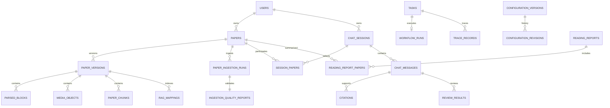

# 科研论文智能阅读系统数据库设计

> 版本：V1.0 
> 状态：开发基线 
> 数据库：PostgreSQL（生产）/ SQLite（仅本地契约测试） 
> 依据：需求文档 V2.0、详细设计文档 V1.1、统一接口规范 V1.0

## 1. 设计目标

数据库是业务事实与审计记录的唯一持久化来源，必须满足：

1. 用户、论文、会话与检索范围严格隔离。
2. 论文解析、OCR、清洗、质量检查和 RAGFlow 导入可恢复、可幂等重试。
3. 最终回答、引用、评审结论和运行配置可追溯、可复现。
4. 写操作通过稳定 ID、事务和幂等记录避免重复提交。
5. 生产模式仅使用版本化迁移管理模式，不以 ORM `create_all` 代替迁移。

## 2. 存储边界

| 存储 | 保存内容 | 不保存内容 |
| --- | --- | --- |
| PostgreSQL | 用户、论文及版本、结构化 Chunk、RAGFlow 映射、会话、消息、任务、引用、评审、配置修订、工作流和追踪 | PDF/图片二进制、向量、明文密钥、高频 SSE 增量 |
| Redis | 任务快照、取消标记、按消息划分的有界 SSE 事件流 | 最终答案和长期审计记录 |
| RAGFlow | 数据集、文档、向量索引与检索 Chunk | 用户权限决策、业务状态机 |
| 对象存储 | PDF、解析媒体、中间产物和导出文件 | 用户权限与业务关系 |

数据库只保存外部对象的业务 ID、受控路径、内容哈希、状态和版本映射。

## 3. 设计决议

### 3.1 会话与论文

统一接口规范使用 `paper_ids`，因此数据库支持一个会话关联一至多篇论文。`session_papers` 是关系完整性的权威记录；`chat_sessions.paper_ids` 是创建时的有序快照，用于保持现有 API 序列化和工作流配置可复现。会话创建后不允许修改论文集合，两者必须在同一事务写入。

MVP 可以只提交一个 `paper_id`，但模式无需为后续多论文对比再次迁移。

### 3.2 问题与答案

统一接口将 `message_id` 定义为一次问题/回答资源，因此一行 `chat_messages` 表示一个问答回合：

- `content` 保存用户原始问题；
- `answer_json` 保存通过验证的完整 `AnswerView`；
- `answer_text` 保存最终答案正文，便于会话摘要与检索；
- `route_type`、模型/提示词版本和检索配置随最终答案冻结。

模型生成失败时仍保留问题和任务状态，成功前不得插入最终引用或评审结果。

### 3.3 论文版本

`papers` 表示用户拥有的论文业务资源；`paper_versions` 保存不可变文件与处理版本。`papers.paper_version_id` 是当前版本指针兼容字段，所有解析产物、媒体对象、Chunk、质量报告和 RAGFlow 映射必须携带相同的 `paper_version_id`。

同一 PDF 可因解析器、清洗规则或 Chunk Schema 变化产生新版本。历史版本不得被当前版本的重试覆盖。

### 3.4 配置版本

`configuration_versions` 保存当前可编辑配置和 ETag；每次创建或修改同时向 `configuration_revisions` 写入不可变修订。工作流运行继续保存实际使用的完整配置快照，确保后台配置更新不改变运行中或历史任务。

### 3.5 JSONB 使用原则

以下数据保留 JSONB：外部服务原始响应、结构化模型输出、失败详情、运行指标和冻结配置。需要外键、唯一性、排序或高频过滤的关系使用普通列或关联表，不能只放在 JSONB 中。

## 4. 核心关系

## 5. 表与职责

### 5.1 身份与安全

| 表 | 职责 | 关键约束 |
| --- | --- | --- |
| `users` | 用户、角色与启用状态 | email 唯一；role 受检查约束 |
| `refresh_tokens` | 刷新令牌哈希、撤销和过期时间 | token_hash 唯一；用户删除时级联清理 |

令牌表只保存不可逆哈希，不保存访问令牌或刷新令牌明文。

### 5.2 论文与入库

| 表 | 职责 | 关键约束 |
| --- | --- | --- |
| `papers` | 论文业务资源、当前状态与当前版本 | `(owner_id, paper_id)` 联合索引；同用户内容哈希索引；软删除 |
| `paper_versions` | 不可变文件与解析/清洗/Chunk Schema 版本 | `(paper_id, version_number)` 唯一 |
| `paper_ingestion_runs` | 每次异步入库运行 | task 唯一；关联论文和论文版本 |
| `parsed_blocks` | MinerU 标准化 Block | `(paper_version_id, block_id)` 唯一 |
| `media_objects` | 图片、流程图和表格的对象级 OCR 状态 | `(paper_version_id, object_id)` 唯一 |
| `paper_chunks` | 应用生成的结构化 Chunk | `(paper_version_id, source_chunk_id)` 唯一 |
| `ingestion_quality_reports` | READY 门禁结果和统计 | 每个任务一份报告 |
| `rag_mappings` | 业务 Chunk 与 RAGFlow Chunk 映射 | `(paper_version_id, source_chunk_id, content_sha256)` 唯一 |

论文状态使用统一接口规范的小写枚举：`uploaded`、`mineru_parsing`、`ocr_processing`、`cleaning`、`quality_check`、`indexing`、`ready`、`failed`，并扩展软删除流程所需的 `deleting`、`deleted`。

只有满足以下条件才能将论文置为 `ready`：

1. 必需媒体对象 OCR 全部成功；
2. 质量报告无阻断项且 `indexable_chunk_count > 0`；
3. 每个可索引 Chunk 均有成功 RAGFlow 映射；
4. 映射失败数为零。

### 5.3 会话、问答和证据

| 表 | 职责 | 关键约束 |
| --- | --- | --- |
| `chat_sessions` | 用户会话、上下文摘要和论文集合快照 | `(user_id, last_message_at)` 索引 |
| `session_papers` | 会话与论文关系 | `(session_id, paper_id)` 主键；保留顺序 |
| `chat_messages` | 问题、核验答案、路由、版本和状态 | `(session_id, created_at)` 索引；task 唯一 |
| `citations` | 原文证据和检索元数据 | `(message_id, evidence_id)` 唯一 |
| `review_results` | A/B 评审和最终裁决字段；`dimension` 为可选摘要字段，完整输出保留在 `opinion_json` | `(message_id, reviewer)` 唯一 |
| `message_feedback` | 用户反馈 | 用户、消息均为外键；类型为 `like|dislike|issue` |

`citations.source_text` 必须是检索返回的原文，不得只保存模型改写文本。评价和评分答案同时保存 `paper` 与 `standard` 来源。

### 5.4 任务、幂等和可复现性

| 表 | 职责 | 关键约束 |
| --- | --- | --- |
| `tasks` | 所有异步任务统一状态 | task_status 检查；message 可选外键 |
| `idempotency_records` | 相同写请求结果重放 | `(user_id, key, method, path)` 唯一 |
| `workflow_runs` | LangGraph 运行和冻结配置 | task 一对一 |
| `trace_records` | 节点耗时、摘要和错误 | request/task/message 索引 |
| `configuration_versions` | 当前配置和 ETag | 当前资源 ID 主键 |
| `configuration_revisions` | 不可变配置历史 | `(configuration_id, version)` 唯一 |
| `qa_evaluations` | 检索/生成分层评测运行与结果 | task 一对一 |

`request_id`、`task_id`、`message_id`、`workflow_run_id` 和 `correlation_id` 各自保留，不能复用为同一概念。

### 5.5 报告与导出

| 表 | 职责 | 关键约束 |
| --- | --- | --- |
| `reading_reports` | 已持久化报告版本 | 归属用户；可关联会话 |
| `reading_report_papers` | 报告与论文关系 | `(report_id, paper_id)` 主键 |
| `report_exports` | Markdown/PDF/DOCX 导出任务与校验和 | task 一对一；格式检查 |

## 6. Chunk 与 OCR 字段契约

`paper_chunks` 直接表达详细设计 V1.1 第 21 章的稳定字段：

- `source_chunk_id`、`content_sha256`；
- `content_type`、`content_role`；
- `section_title`、`section_path_json`；
- `page_start`、`page_end`；
- `source_ref`、`object_id`、`parent_chunk_id`、`prev_chunk_id`、`next_chunk_id`；
- `retrieval_weight`、`quality_flags`、`indexable`；
- `parser_version`、`cleaning_version`。

`media_objects` 保存 bbox、图片哈希、是否必需、OCR 状态、使用过的引擎、置信度、重试次数、归一化文本、原始响应和失败详情。对象类 Chunk 缺少 `source_ref`、页码或父对象关系时不得通过质量门禁。

## 7. 事务与幂等

1. 上传事务同时写入 `papers`、`paper_versions`、`tasks` 和幂等响应；提交后才调度 worker。
2. 创建会话同时写入 `chat_sessions`、`session_papers` 和幂等响应。
3. 提交问题同时写入 `chat_messages`、`tasks`、`workflow_runs` 和幂等响应。
4. 只有验证完成后，最终答案、引用、评审结果和任务成功状态在一个事务中提交。
5. 配置更新同时更新当前配置并插入不可变修订。
6. 数据库唯一约束是并发请求的最终防线；应用层预查询只用于返回友好错误。

## 8. 删除与保留

论文删除采用以下顺序：

1. 设置 `deletion_requested_at` 和 `deleting`，禁止新会话或新问题使用论文；
2. 删除 RAGFlow 文档和对象存储文件；
3. 删除可重建的 Chunk、媒体和映射；
4. 保留论文业务记录、任务、错误和审计信息，设置 `deleted_at` 与 `deleted`；
5. 历史消息和引用保留其证据快照，不依赖被删除的在线 RAGFlow 文档。

## 9. 索引原则

- 所有用户资源列表以 `user_id/owner_id` 为索引首列。
- 时间顺序读取使用 `(session_id, created_at)`、`(task_id, created_at)` 等联合索引。
- 内容哈希和外部映射 ID 建索引，但不得提供跨用户文件存在性查询接口。
- JSONB 仅在确有后台查询需求时增加 GIN 索引；V1.0 不默认创建高成本 GIN 索引。

## 10. 迁移、测试与发布

- Alembic 是唯一生产模式迁移入口：`alembic upgrade head`。
- 生产启动不执行 `Base.metadata.create_all`。
- CI 至少执行：迁移至 head、ORM 与迁移模式一致性、SQLite 契约测试和 PostgreSQL 集成测试。
- 迁移必须支持空库升级和完整降级；破坏性数据迁移需单独备份与回滚方案。

数据库验收至少覆盖：外键、状态检查、联合唯一约束、用户隔离、会话论文关联、论文版本产物隔离、RAGFlow 幂等映射、最终答案原子提交和不可变配置修订。

## 11. 需求追踪

| 文档要求 | 数据库实现 |
| --- | --- |
| 用户/论文隔离 | owner/user 外键、联合索引、服务端范围查询 |
| PDF 分阶段状态 | papers、tasks、paper_ingestion_runs |
| 对象级专项 OCR | media_objects |
| 结构化 Chunk 和父子追踪 | paper_chunks |
| READY 质量门禁 | ingestion_quality_reports + rag_mappings |
| RAGFlow 幂等导入 | 版本、source_chunk_id、内容哈希唯一约束 |
| 连续追问 | chat_sessions.summary + 完整问题/答案回合 |
| 证据与评分可追溯 | citations、review_results |
| 写请求安全重试 | idempotency_records |
| 可复现配置和执行 | configuration_revisions、workflow_runs、trace_records |
| 检索/生成分层评测 | qa_evaluations |
