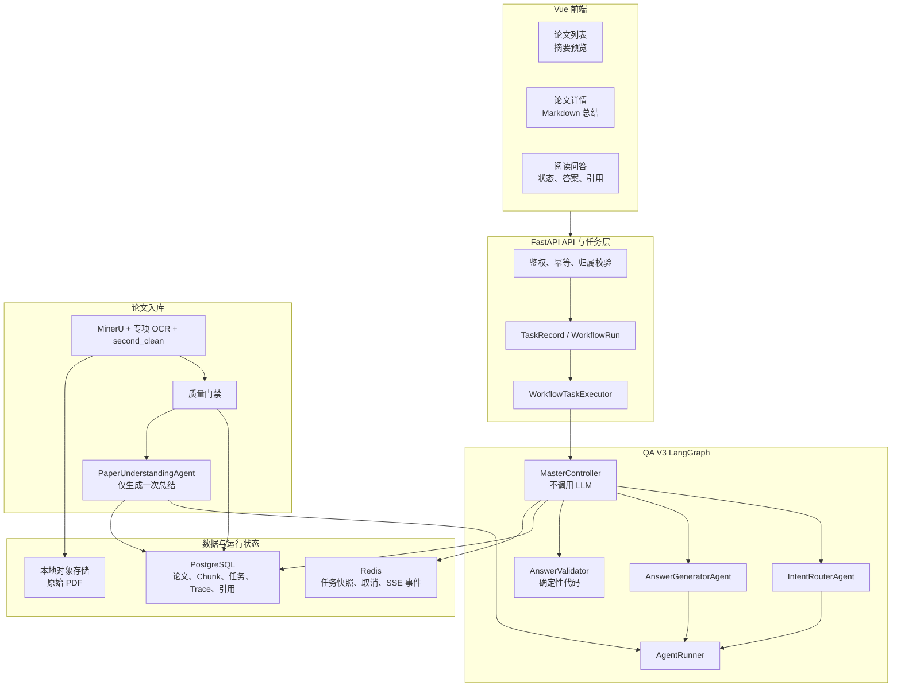
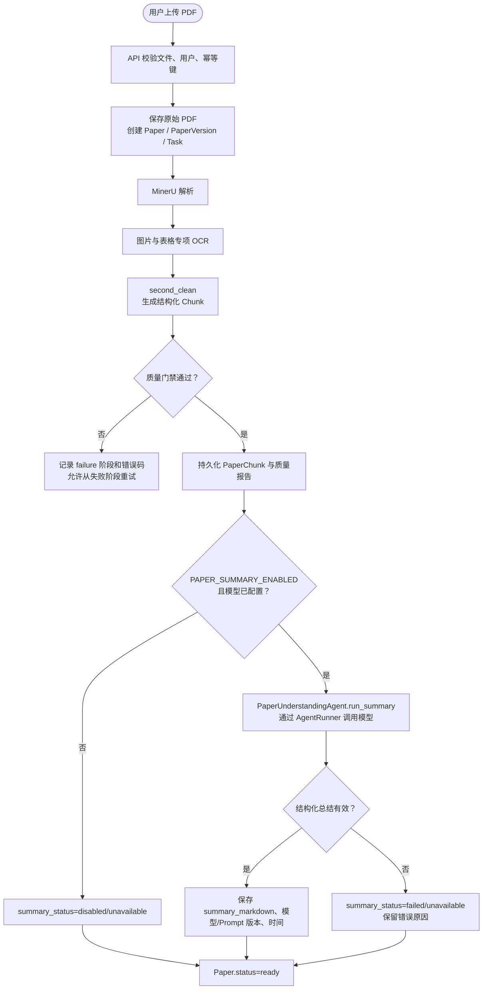
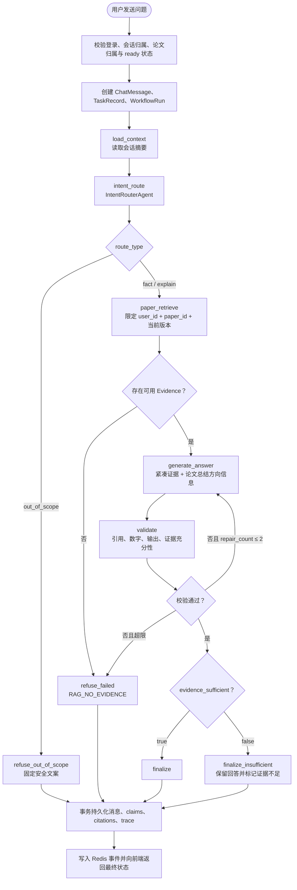
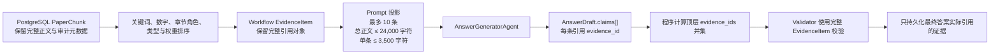
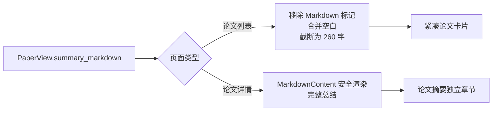

# 论文问答多智能体架构实施与问题修复详细设计

> QA V3 实施验证版

| 项目 | 内容 |
| --- | --- |
| 文档版本 | V1.0 |
| 编制日期 | 2026-07-21 |
| 文档状态 | 已实施、已完成本地端到端验证，待团队合并 |
| 适用范围 | 科研论文智能阅读与格式审查系统——论文入库摘要与阅读问答模块 |
| 依据文档 | `论文问答多智能体架构改进方案_V1.0.md`（架构版本 V3.0） |
| 关联文档 | `docs/7.18/多智能体论文问答与评审系统_详细设计文档_V1.1_实施验证修订版.md` |
| 实现分支 | `feat/qa-architecture-v3` |

# 文档修订记录

| 版本 | 日期 | 修订说明 |
| --- | --- | --- |
| V1.0 | 2026-07-21 | 记录 QA V3 从方案到实现期间完成的架构改造、数据库迁移、运行环境修复、前端摘要展示、路由纠错和性能优化，并给出当前业务流程与验证基线。 |

> 本文档描述当前代码的实际行为。若其与《论文问答多智能体架构改进方案 V1.0》中的预期描述冲突，以本文档和当前代码为实施基线；原方案仍作为设计决策来源保留。

# 1. 编写目的与范围

## 1.1 编写目的

本文档回答三个问题：

1. 从读取 QA V3 改进方案到当前版本，系统暴露了哪些设计或实现问题。
2. 每个问题采用了什么修复方案，为什么这样处理。
3. 当前论文入库、摘要生成、问答、证据校验、结果持久化和前端展示的业务逻辑如何运行。

文档同时作为后续分支合并、联调、回归测试和故障排查的交接依据。

## 1.2 本次范围

- QA V3 多智能体职责拆分和 LangGraph 编排。
- 论文解析后的 Markdown 总结生成与数据库持久化。
- 用户论文的本地 Chunk 检索、证据充分性判断和引用校验。
- SiliconFlow/OpenAI-compatible 模型接入兼容性。
- PostgreSQL、Alembic、Redis 和 Windows 开发环境运行问题。
- 论文摘要前端展示与真实问答性能优化。
- 自动化测试、生产构建和端到端性能验证。

以下内容不在本次范围：格式审查业务重构、公共规范知识库管理、评分与同行评审恢复、生产 Linux 部署和队友分支的冲突合并。

# 2. 实施结论

QA V3 已从“方案”落为可运行代码。当前阅读问答每次正常执行两次模型调用：

1. `IntentRouterAgent` 负责问题分类和独立问题改写。
2. `AnswerGeneratorAgent` 直接读取受控论文证据并生成带引用的结构化回答。

`MasterController` 不调用模型，只负责状态、分支、重试和持久化编排；`AnswerValidator` 不调用模型，只执行确定性校验。`PaperUnderstandingAgent` 已移出问答主链，仅在论文入库后生成一次 Markdown 总结。

| 核心指标 | 原实现/首次实测 | 当前实现/复测 | 结论 |
| --- | ---: | ---: | --- |
| 正常问答 LLM 调用 | 3 次以上，校验失败时继续增加 | 正常 2 次 | 与 QA V3 目标一致 |
| 实测总耗时 | 约 118 秒 | 约 9.8 秒 | 已消除重复超长生成 |
| AnswerGenerator 输入 | 62,300 tokens | 7,732 tokens | 证据上下文已受预算约束 |
| 本地检索耗时 | 52 ms | 45 ms | 数据库检索不是性能瓶颈 |
| 回答校验 | 首轮失败并完整重跑 | 首轮通过 | 重复字段由程序归一化 |
| 后端测试 | 未形成当前基线 | 48 passed，1 skipped | 通过 |
| 前端验证 | 未形成当前基线 | TypeScript + Vite production build 通过 | 通过 |

# 3. 问题、原因与解决方案

## 3.1 问题清单

| 编号 | 问题 | 业务影响 | 根因 | 解决方案 | 当前状态 |
| --- | --- | --- | --- | --- | --- |
| P01 | `ControllerAgent` 同时负责路由与答案合成 | 职责耦合，提示词、模型和错误处理无法独立优化 | 判别任务与生成任务放在同一智能体 | 新增 `IntentRouterAgent`、`AnswerGeneratorAgent` 和无模型调用的 `MasterController` | 已解决 |
| P02 | 问答链路先由模型“理解”，再由另一个模型“合成” | 相同论文内容被模型串行处理两遍，增加延迟并可能丢失细节 | `PaperUnderstandingAgent` 位于每次问答主链 | 新建 QA V3 图，问答直接从 Chunk 到 AnswerGenerator；PaperUnderstanding 只在入库后生成总结 | 已解决 |
| P03 | 模型调用代码散落在各智能体 | 重试、Schema 校验、指标和流式兼容逻辑重复 | 每个 Agent 直接持有 LLM 客户端 | 新增 `AgentRunner`，统一 Prompt 渲染、结构化调用、Metrics 和失败处理；语义转换仍由各 Agent 负责 | 已解决 |
| P04 | 论文解析完成后没有稳定总结 | 用户提问前无法快速判断论文主题，问答也缺少非引用型方向信息 | 数据模型没有总结字段，入库任务未触发总结 Agent | 新增总结 Prompt、总结状态字段和 Alembic 迁移；入库质量通过后生成一次 Markdown 总结 | 已解决 |
| P05 | 检索片段不足时缺少显式业务状态 | 模型可能把“当前没检索到”表述成“整篇论文没有” | Answer Schema 没有证据充分性字段，图中没有不足分支 | 新增 `evidence_sufficient`、`evidence_gap_reason`、positive/negative claim；增加 `finalize_insufficient` | 已解决 |
| P06 | 本地关键词检索过粗 | 中文单字噪声大、数字与专有词易丢失、图表偏好可能排除上下文 | 旧逻辑只做英文词和中文单字命中，媒体偏好是硬过滤 | 改为中英文词组、数字、章节角色、内容类型和 retrieval_weight 综合排序；零命中按页提供受控覆盖 | 已解决 |
| P07 | SiliconFlow 严格 JSON 输出不稳定 | 结构化解析失败，模型可能输出思考内容或拒绝多个 system message | 供应商对 reasoning 和 system message 的实现与标准 OpenAI 行为有差异 | 支持 `LLM_ENABLE_THINKING=false`；把 JSON Schema 指令与原 system prompt 合并为单一 system message | 已解决 |
| P08 | PostgreSQL 启动时出现表已存在、Alembic 却认为未迁移 | `alembic upgrade head` 报 `DuplicateTableError`，数据库状态不可复现 | 开发启动对 PostgreSQL 调用 `create_all`，同时 Alembic 未正确读取 `.env` | `create_all` 仅允许空 SQLite；PostgreSQL 只走 Alembic；Alembic 默认读取 `backend/.env`，显式环境变量优先 | 已解决 |
| P09 | Windows 下 PostgreSQL LangGraph checkpointer 不稳定 | 后端健康但问答任务可能无回复或执行失败 | Psycopg 异步 checkpointer 与 Windows 事件循环/reload 组合不稳定 | Windows 开发环境统一使用无 checkpoint 图；任务、消息、trace、答案和引用仍持久化到 PostgreSQL | 已解决（开发降级） |
| P10 | 明确的论文问题被路由为 `out_of_scope` | 用户问题被错误拒绝，页面显示“超出范围” | 小模型对短中文指代问题分类不稳定 | Prompt 明确“这篇论文/摘要/方法/实验”等始终在范围内；模型误判后由确定性规则覆写为 `fact` | 已解决 |
| P11 | 论文总结在列表/详情中显示为大段原始 Markdown | 页面出现 `#`、`**`，卡片被完整总结撑高，阅读体验差 | 列表使用普通 `
` 直接渲染完整 Markdown；详情页没有专门总结区域 | 列表移除 Markdown 标记并截断为 260 字预览；详情页使用 `MarkdownContent` 渲染完整总结 | 已解决 |
| P12 | 一次简单问答耗时约 118 秒 | 用户长时间只看到加载状态 | 15 个 EvidenceItem 携带原文、OCR/raw metadata 副本，输入达 62,300 tokens；首轮漏填汇总引用字段后又完整生成一次 | 模型输入只投影可引用字段；最多 10 条、总正文 24,000 字符、单条 3,500 字符并取问题相关片段；顶层 `evidence_ids` 由 claim 引用确定性求并集 | 已解决 |
| P13 | 缺少对真实链路的逐节点性能证据 | 无法判断慢在数据库、路由、生成还是校验 | 只观察前端等待时间，没有读取 trace | 使用 PostgreSQL `trace_records` 比较节点 duration、输入/输出 token、重试次数和引用数 | 已解决 |
| P14 | 总结失败可能阻断已经合格的论文入库 | 模型服务波动会使已经解析和清洗成功的论文不可阅读 | 总结被当作入库必需结果 | 总结定义为可选增强；失败记录 `summary_status` 和原因，但通过质量门禁的 Chunk 仍可进入 `ready` | 已解决 |

## 3.2 关键设计取舍

| 决策 | 选择 | 原因 |
| --- | --- | --- |
| 总结是否作为证据 | 否，只用于方向提示 | 总结是模型生成内容，不能替代原始 Chunk |
| 证据不足是否直接拒绝 | 否，返回受支持的有限答案并显式标记不足 | “部分可回答”比统一拒绝更有用，同时不隐藏边界 |
| 校验失败是否无限重试 | 否，最多 2 次 | 防止成本和延迟失控 |
| 顶层 `evidence_ids` 谁维护 | 程序从 claims 求并集 | 该字段是重复索引，不应因模型漏填触发昂贵重生成 |
| EvidenceItem 是否整体发送给模型 | 否，只发送紧凑投影 | provenance/raw OCR 等字段用于审计，不属于模型回答上下文 |
| Windows 开发是否强制 PostgreSQL checkpoint | 否 | 优先保证本地任务可执行；生产仍要求可持久化 checkpoint 的运行环境 |
| 用户论文是否导入 RAGFlow | 否，阅读使用 PostgreSQL 本地 Chunk | 与 V1.2 的阅读/格式审查隔离约束一致 |

# 4. 当前总体架构

## 4.1 分层职责

| 层次 | 当前职责 | 禁止承担的职责 |
| --- | --- | --- |
| 前端 | 展示处理状态、摘要、答案、证据和错误 | 不拼接 Prompt，不决定可信引用 |
| API | 鉴权、幂等、参数与资源归属校验、任务创建 | 不同步执行完整 LLM 工作流 |
| MasterController | 状态流转、条件路由、重试计数、最终组装 | 不调用 LLM，不编写事实答案 |
| AgentRunner | 一次模型调用的机械生命周期 | 不决定 route、不计算业务置信度、不转换 AgentResult |
| 模型 Agent | 路由、总结或答案生成 | 不绕过 AgentRunner，不直接持久化业务实体 |
| Validator | 引用、数字、输出和可回答性校验 | 不进行开放式事实生成 |
| 数据层 | 持久化、隔离、追踪和事件恢复 | 不承担面向用户的自然语言决策 |

# 5. 核心业务逻辑

## 5.1 论文上传、结构化与总结流程

业务规则：

1. 解析、清洗和质量门禁决定论文是否可检索。
2. 总结是可选增强，不是论文 `ready` 的阻断条件。
3. 总结只能用于问答方向提示和 UI 展示，不能作为引用证据。
4. 总结生成记录模型版本、Prompt 版本与生成时间，便于后续重生成和复现。

## 5.2 阅读问答主流程

## 5.3 证据数据流与性能边界

该设计把“模型上下文”和“应用审计对象”分开：数据库及工作流状态仍保留完整证据，模型只接收完成回答所需的最小字段和相关片段。因此，压缩不会删除原始数据，也不会降低引用定位能力。

## 5.4 前端摘要展示流程

# 6. 智能体与编排详细设计

## 6.1 MasterController

| 属性 | 内容 |
| --- | --- |
| 是否调用模型 | 否 |
| 主要职责 | 加载上下文、调用路由、检索论文、调用答案生成、校验、修复计数、最终持久化 |
| 状态输出 | `route_decision`、`paper_evidences`、`paper_summary`、`draft_answer`、`validation`、`repair_count` |
| 错误策略 | 可恢复校验错误最多修复 2 次；终态错误返回稳定错误码和安全文案 |

主控不得依据自身字符串拼接生成论文事实；所有正向事实必须来自 AnswerGenerator 的 claim 并通过 Validator。

## 6.2 IntentRouterAgent

| 输入 | 输出 | 模型规则 |
| --- | --- | --- |
| 原始问题、会话摘要 | `RouteDecision` | 仅做 `fact`、`explain`、`out_of_scope` 分类与独立问题改写 |

对“这篇论文、本文、作者、摘要、方法、实验、数据集、结果、贡献、结论”等显式论文阅读词设确定性保护。若模型仍返回 `out_of_scope`，系统改写为 `fact` 并记录 warning；天气、股票、彩票等明确非论文问题仍走拒绝路径。

## 6.3 PaperUnderstandingAgent

| 属性 | 内容 |
| --- | --- |
| 触发时机 | 入库质量门禁通过后，每篇论文一次 |
| 输入 | 按入库策略选取的论文 Evidence |
| 输出 | `summary_markdown` |
| 是否参与问答 | 否 |
| 失败影响 | 只影响总结状态，不阻断已验证 Chunk 的 `ready` 状态 |

## 6.4 AnswerGeneratorAgent

| 输入 | 输出 |
| --- | --- |
| 原始问题、独立问题、route、紧凑 Evidence、非引用 summary、warnings、可选修复信息 | `AnswerDraft` |

关键规则：

- 只允许使用传入的论文 Evidence 作为事实依据。
- 正向 claim 必须引用一个或多个允许的 `evidence_id`。
- 负向 claim 只能表示“当前检索证据未覆盖”，不能断言整篇论文必然没有。
- 用户要求一句话时，答案应保持一句话，并只输出一至两个核心 claims。
- 顶层 `evidence_ids` 最终由程序从 claims 去重求并集。

## 6.5 AnswerValidator

| 校验项 | 规则 | 失败动作 |
| --- | --- | --- |
| 引用成员关系 | 所有 claim 引用必须属于本次 Evidence 集 | repair |
| 正向 claim 引用 | 每个 positive claim 至少有一个 paper evidence | repair |
| 数字一致性 | 答案数字必须存在于证据或属于允许的推导 | repair |
| 证据不足结构 | `evidence_sufficient=false` 时 gap reason 必填 | repair |
| 输出健康度 | 长度、语言、重复、异常格式符合约束 | repair |

# 7. 数据库与迁移设计

## 7.1 Paper 新增字段

| 字段 | 类型 | 说明 |
| --- | --- | --- |
| `summary_markdown` | Text, nullable | 论文总结正文 |
| `summary_status` | String(32) | `pending / ready / disabled / unavailable / failed` |
| `summary_model_version` | String(128), nullable | 生成时模型配置版本 |
| `summary_prompt_version` | String(128), nullable | 生成时 Prompt 版本 |
| `summary_generated_at` | timezone datetime, nullable | 总结成功生成时间 |

迁移文件：`backend/migrations/versions/20260721_0004_add_paper_summary.py`。

## 7.2 数据库启动原则

- PostgreSQL：应用启动不得调用 `Base.metadata.create_all`，必须先执行 Alembic 迁移。
- SQLite：仅开发和测试可对空库执行 metadata bootstrap。
- Alembic：未显式设置 `DATABASE_URL` 时读取 `backend/.env`；Shell 环境变量优先。
- 本地 `backend/paper_review.db` 是运行数据，不属于团队共享的数据库结构成果，不应作为本次提交内容。

# 8. 异常、降级与状态语义

| 场景 | 系统行为 | 用户可见结果 |
| --- | --- | --- |
| 明确超出论文范围 | 不检索、不调用 AnswerGenerator | 固定范围说明 |
| 未检索到任何可用 Chunk | 终止生成并记录 `RAG_NO_EVIDENCE` | 安全失败说明 |
| 只支持部分回答 | 正常校验并走 `finalize_insufficient` | 有限答案 + 证据不足提示 |
| 引用或数字校验失败 | 最多携带错误信息修复 2 次 | 修复成功后正常显示；超限则失败说明 |
| 总结模型未配置/不可用 | 保存 summary 状态与原因，论文仍可 ready | 原文和检索可用，摘要说明暂不可用 |
| Windows checkpointer 不兼容 | 开发模式跳过 LangGraph PostgreSQL checkpoint | 问答仍执行，业务数据和 trace 仍持久化 |
| Redis 不可用 | 按现有运行时错误策略失败 | 任务错误，不伪造成功状态 |

# 9. 性能问题分析与优化结果

## 9.1 首次真实问答 Trace

问题：`用一句话总结这篇文章解决的问题`

| 节点 | 耗时 | 输入 tokens | 输出 tokens | 结果 |
| --- | ---: | ---: | ---: | --- |
| `load_context` | 9 ms | - | - | succeeded |
| `intent_route` | 3,300 ms | 392 | 70 | succeeded |
| `paper_retrieve` | 52 ms | - | - | succeeded |
| `generate_answer` 第 1 次 | 47,868 ms | 62,300 | 1,034 | succeeded |
| `validate` | 17 ms | - | - | 引用汇总字段缺失，进入 repair |
| `generate_answer` 第 2 次 | 45,344 ms | 63,400 | 1,206 | succeeded |
| `validate + finalize` | 72 ms | - | - | succeeded |

结论：本地检索仅 52 ms，性能瓶颈是超长模型上下文和一次可避免的完整修复调用。

## 9.2 优化后真实问答 Trace

| 节点 | 耗时 | 输入 tokens | 输出 tokens | 结果 |
| --- | ---: | ---: | ---: | --- |
| `load_context` | 8 ms | - | - | succeeded |
| `intent_route` | 1,256 ms | 491 | 62 | succeeded |
| `paper_retrieve` | 45 ms | - | - | succeeded |
| `generate_answer` | 8,318 ms | 7,732 | 561 | succeeded |
| `validate` | 8 ms | - | - | 首轮通过 |
| `finalize` | 34 ms | - | - | succeeded，保存 3 条引用 |

任务数据库时间为 9.77 秒。优化没有依赖缓存命中，也没有绕过引用、数字或输出校验。

# 10. 测试与验收

## 10.1 自动化验证

| 验证项 | 命令/方式 | 结果 |
| --- | --- | --- |
| Python 静态检查 | Ruff，覆盖新增 Agent、Prompt 关联和测试 | 通过 |
| 后端测试 | `python -m pytest -q` | 48 passed，1 skipped |
| QA 工作流专项 | 路由、阅读、修复、证据不足、取消、持久化失败 | 通过 |
| 检索适配器 | 稳定 chunk_id、总结返回、类型归一化 | 通过 |
| 应用启动 | SQLite bootstrap 与 PostgreSQL migration 边界 | 通过 |
| 前端类型检查 | `vue-tsc -b` | 通过 |
| 前端生产构建 | `vite build` | 通过 |
| PostgreSQL | Docker `pg_isready`、Alembic、真实任务写入 | 通过 |
| Redis | Docker `redis-cli ping` | `PONG` |
| 真实模型问答 | SiliconFlow `Qwen/Qwen3.5-9B` | 成功，约 9.8 秒，3 条引用 |

## 10.2 关键回归用例

- 显式论文问题即使被模型误判为 out-of-scope，也必须进入论文检索。
- 真正的天气等范围外问题不得触发论文检索。
- positive claim 缺失引用必须校验失败。
- evidence 不足必须返回非拒绝型有限答案和 gap reason。
- AnswerGenerator 输入不得包含 `metadata.raw_content` 等内部重复字段。
- 模型漏填顶层引用汇总不得导致完整重生成。
- 列表页不得显示原始 Markdown 标记或完整长总结。

# 11. 配置、部署与回退

## 11.1 新增配置

| 配置 | 推荐值 | 说明 |
| --- | --- | --- |
| `QA_ARCHITECTURE_V3_ENABLED` | `true` | 开启当前 QA V3 图；关闭可临时回退旧图 |
| `PAPER_SUMMARY_ENABLED` | `true` | 入库后生成总结；关闭不影响 Chunk 入库 |
| `LLM_ENABLE_THINKING` | SiliconFlow 严格 JSON 场景设为 `false` | 避免 reasoning 内容破坏 Schema 输出 |

## 11.2 合并注意事项

1. 目标分支合并代码后，先核对其最新数据库迁移链，再执行 `alembic upgrade head`。
2. 若队友同时修改 `Paper`、入库任务、QA 图或前端 `PaperView`，需按字段和业务状态逐项合并，不能只选择某一侧整个文件。
3. `backend/paper_review.db`、`.env`、上传文件和 Docker volume 均不是共享成果，不应进入提交。
4. 生产环境应使用 PostgreSQL 与 Redis，并在 Linux 上启用持久化 LangGraph checkpoint；Windows 降级只用于开发。
5. 合并后必须至少重跑后端测试、前端构建和一次真实论文问答。

# 12. 代码追踪表

| 能力 | 主要文件 |
| --- | --- |
| AgentRunner | `backend/app/ai/runner.py` |
| IntentRouterAgent | `backend/app/ai/agents/intent_router.py`、`backend/app/ai/prompts/intent_router/v1.jinja2` |
| AnswerGeneratorAgent | `backend/app/ai/agents/answer_generator.py`、`backend/app/ai/prompts/answer_generator/v1.jinja2` |
| MasterController 与 QA 图 | `backend/app/ai/graph/master_controller.py`、`backend/app/ai/graph/qa_builder.py` |
| V3/旧图切换 | `backend/app/ai/facade.py`、`backend/app/core/config.py` |
| 总结生成 | `backend/app/ai/agents/paper_understanding.py`、`backend/app/ai/prompts/paper_summary/v1.jinja2` |
| 总结数据库字段 | `backend/app/db/models.py`、`backend/migrations/versions/20260721_0004_add_paper_summary.py` |
| 本地检索 | `backend/app/runtime/adapters.py` |
| 入库任务 | `backend/app/workers/ingestion.py` |
| PostgreSQL/Alembic 启动边界 | `backend/app/main.py`、`backend/migrations/env.py` |
| Windows checkpoint | `backend/app/runtime/checkpoints.py` |
| 前端答案状态 | `frontend/src/components/AnswerContext.vue` |
| 前端摘要 | `frontend/src/utils/paperIngestion.ts`、`frontend/src/pages/PaperDetailPage.vue` |
| 测试 | `backend/tests/test_workflow.py`、`test_runtime_adapters.py`、`test_llm_client.py`、`test_ingestion_contract.py`、`test_app_startup.py` |

# 13. 当前边界与后续建议

- 当前约 9.8 秒主要由模型供应商生成耗时构成；若目标低于 5 秒，可为 IntentRouter 单独配置更小模型或为明显论文问题增加完全确定性的快速路由，但需重新评估跟进问题改写质量。
- 当前本地检索是确定性关键词与元数据加权，不是向量检索；复杂同义表达仍可能需要查询扩展或 embedding 召回。
- Windows 开发模式没有 LangGraph checkpoint 恢复能力；进程中断后依赖 Task/Message/Trace 数据排查，不能从图中间节点继续。
- 总结内容已经过结构化输出约束，但仍属于模型生成内容；UI 应将其标识为“论文总结”，不能标识为“原文摘要”。
- 分支合并前不主动吸收队友代码，避免在本分支中替团队决定冲突取舍；由集成者基于最新目标分支完成三方合并。
