# A Simple Framework for Contrastive Learning of Visual Representations

Ting Chen $^{1}$ Simon Kornblith $^{1}$ Mohammad Norouzi $^{1}$ Geoffrey Hinton $^{1}$

## Abstract

This paper presents SimCLR: a simple framework for contrastive learning of visual representations. We simplify recently proposed contrastive self-supervised learning algorithms without requiring specialized architectures or a memory bank. In order to understand what enables the contrastive prediction tasks to learn useful representations, we systematically study the major components of our framework. We show that (1) composition of data augmentations plays a critical role in defining effective predictive tasks, (2) introducing a learnable nonlinear transformation between the representation and the contrastive loss substantially improves the quality of the learned representations, and (3) contrastive learning benefits from larger batch sizes and more training steps compared to supervised learning. By combining these findings, we are able to considerably outperform previous methods for self-supervised and semi-supervised learning on ImageNet. A linear classifier trained on self-supervised representations learned by SimCLR achieves 76.5% top-1 accuracy, which is a 7% relative improvement over previous state-of-the-art, matching the performance of a supervised ResNet-50. When fine-tuned on only 1% of the labels, we achieve 85.8% top-5 accuracy, outperforming AlexNet with 100× fewer labels. $^{1}$

## 1. Introduction

Learning effective visual representations without human supervision is a long-standing problem. Most mainstream approaches fall into one of two classes: generative or discriminative. Generative approaches learn to generate or otherwise model pixels in the input space (Hinton et al., 2006; Kingma & Welling, 2013; Goodfellow et al., 2014).

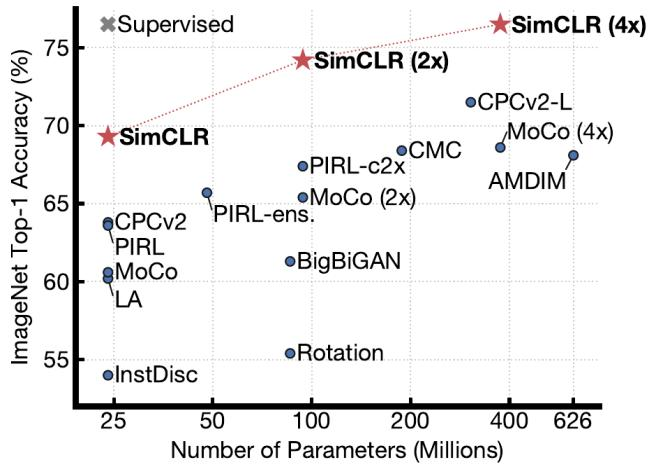  
Figure 1. ImageNet Top-1 accuracy of linear classifiers trained on representations learned with different self-supervised methods (pretrained on ImageNet). Gray cross indicates supervised ResNet-50. Our method, SimCLR, is shown in bold.

However, pixel-level generation is computationally expensive and may not be necessary for representation learning. Discriminative approaches learn representations using objective functions similar to those used for supervised learning, but train networks to perform pretext tasks where both the inputs and labels are derived from an unlabeled dataset. Many such approaches have relied on heuristics to design pretext tasks (Doersch et al., 2015; Zhang et al., 2016; Noroozi & Favaro, 2016; Gidaris et al., 2018), which could limit the generality of the learned representations. Discriminative approaches based on contrastive learning in the latent space have recently shown great promise, achieving state-of-the-art results (Hadsell et al., 2006; Dosovitskiy et al., 2014; Oord et al., 2018; Bachman et al., 2019).

In this work, we introduce a simple framework for contrastive learning of visual representations, which we call SimCLR. Not only does SimCLR outperform previous work (Figure 1), but it is also simpler, requiring neither specialized architectures (Bachman et al., 2019; Hénaff et al., 2019) nor a memory bank (Wu et al., 2018; Tian et al., 2019; He et al., 2019; Misra & van der Maaten, 2019).

In order to understand what enables good contrastive representation learning, we systematically study the major components of our framework and show that:

\- Composition of multiple data augmentation operations is crucial in defining the contrastive prediction tasks that yield effective representations. In addition, unsupervised contrastive learning benefits from stronger data augmentation than supervised learning.

\- Introducing a learnable nonlinear transformation between the representation and the contrastive loss substantially improves the quality of the learned representations.

\- Representation learning with contrastive cross entropy loss benefits from normalized embeddings and an appropriately adjusted temperature parameter.

\- Contrastive learning benefits from larger batch sizes and longer training compared to its supervised counterpart. Like supervised learning, contrastive learning benefits from deeper and wider networks.

We combine these findings to achieve a new state-of-the-art in self-supervised and semi-supervised learning on ImageNet ILSVRC-2012 (Russakovsky et al., 2015). Under the linear evaluation protocol, SimCLR achieves 76.5% top-1 accuracy, which is a 7% relative improvement over previous state-of-the-art (Hénaff et al., 2019). When fine-tuned with only 1% of the ImageNet labels, SimCLR achieves 85.8% top-5 accuracy, a relative improvement of 10% (Hénaff et al., 2019). When fine-tuned on other natural image classification datasets, SimCLR performs on par with or better than a strong supervised baseline (Kornblith et al., 2019) on 10 out of 12 datasets.

## 2. Method

## 2.1. The Contrastive Learning Framework

Inspired by recent contrastive learning algorithms (see Section 7 for an overview), SimCLR learns representations by maximizing agreement between differently augmented views of the same data example via a contrastive loss in the latent space. As illustrated in Figure 2, this framework comprises the following four major components.

\- A stochastic data augmentation module that transforms any given data example randomly resulting in two correlated views of the same example, denoted $\tilde{\boldsymbol{x}}_i$ and $\tilde{\boldsymbol{x}}_j$ , which we consider as a positive pair. In this work, we sequentially apply three simple augmentations: random cropping followed by resize back to the original size, random color distortions, and random Gaussian blur. As shown in Section 3, the combination of random crop and color distortion is crucial to achieve a good performance.

\- A neural network base encoder $f(\cdot)$ that extracts representation vectors from augmented data examples. Our framework allows various choices of the network architecture without any constraints. We opt for simplicity and adopt the commonly used ResNet (He et al., 2016)

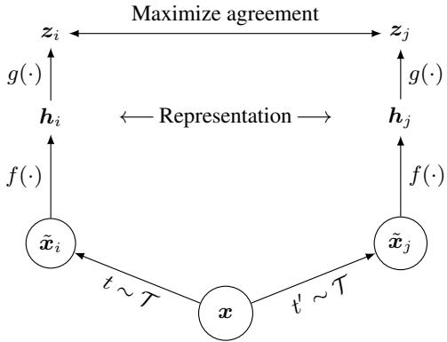  
Figure 2. A simple framework for contrastive learning of visual representations. Two separate data augmentation operators are sampled from the same family of augmentations ( $t \sim T$ and $t' \sim T$ ) and applied to each data example to obtain two correlated views. A base encoder network $f(\cdot)$ and a projection head $g(\cdot)$ are trained to maximize agreement using a contrastive loss. After training is completed, we throw away the projection head $g(\cdot)$ and use encoder $f(\cdot)$ and representation h for downstream tasks.

to obtain $\boldsymbol{h}_{i}=f(\tilde{\boldsymbol{x}}_{i})=\operatorname{ResNet}(\tilde{\boldsymbol{x}}_{i})$ where $h_{i}\in R^{d}$ is the output after the average pooling layer.

\- A small neural network projection head $g(\cdot)$ that maps representations to the space where contrastive loss is applied. We use a MLP with one hidden layer to obtain $z_{i} = g(\boldsymbol{h}_{i}) = W^{(2)}\sigma (W^{(1)}\boldsymbol{h}_{i})$ where $\sigma$ is a ReLU nonlinearity. As shown in section 4, we find it beneficial to define the contrastive loss on $z_{i}$ 's rather than $h_i$ 's.

\- A contrastive loss function defined for a contrastive prediction task. Given a set $\{\tilde{\boldsymbol{x}}_k\}$ including a positive pair of examples $\tilde{\boldsymbol{x}}_i$ and $\tilde{\boldsymbol{x}}_j$ , the contrastive prediction task aims to identify $\tilde{\boldsymbol{x}}_j$ in $\{\tilde{\boldsymbol{x}}_k\}_{k\neq i}$ for a given $\tilde{\boldsymbol{x}}_i$ .

We randomly sample a minibatch of N examples and define the contrastive prediction task on pairs of augmented examples derived from the minibatch, resulting in 2N data points. We do not sample negative examples explicitly. Instead, given a positive pair, similar to (Chen et al., 2017), we treat the other $2(N-1)$ augmented examples within a minibatch as negative examples. Let $\text{sim}(\boldsymbol{u},\boldsymbol{v}) = \boldsymbol{u}^{\top}\boldsymbol{v}/\|\boldsymbol{u}\|\|\boldsymbol{v}\|$ denote the dot product between $\ell_{2}$ normalized u and v (i.e. cosine similarity). Then the loss function for a positive pair of examples $(i,j)$ is defined as

$$
\ell_ {i, j} = - \log \frac {\exp (\mathrm{sim} (\pmb {z} _ {i} , \pmb {z} _ {j}) / \tau)}{\sum_ {k = 1} ^ {2 N} \mathbb {1} _ {[ k \neq i ]} \exp (\mathrm{sim} (\pmb {z} _ {i} , \pmb {z} _ {k}) / \tau)},\tag{1}
$$

where $1_{[k\neq i]}\in\{0,1\}$ is an indicator function evaluating to 1 iff $k\neq i$ and $\tau$ denotes a temperature parameter. The final loss is computed across all positive pairs, both $(i,j)$ and $(j,i)$ , in a mini-batch. This loss has been used in previous work (Sohn, 2016; Wu et al., 2018; Oord et al., 2018); for convenience, we term it NT-Xent (the normalized temperature-scaled cross entropy loss).

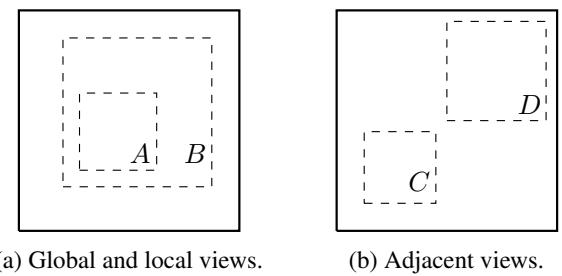

Algorithm 1 SimCLR's main learning algorithm.

input: batch size N, constant τ, structure of f, g, T.
for sampled minibatch  $\{x_{k}\}_{k=1}^{N}$  do
    for all  $k \in \{1, \ldots, N\}$  do
    draw two augmentation functions  $t \sim T$ ,  $t' \sim T$ 
    # the first augmentation
    $\tilde{x}_{2k-1} = t(x_{k})$ $h_{2k-1} = f(\tilde{x}_{2k-1})$  # representation
    $z_{2k-1} = g(h_{2k-1})$  # projection
    # the second augmentation
    $\tilde{x}_{2k} = t'(x_{k})$ $h_{2k} = f(\tilde{x}_{2k})$  # representation
    $z_{2k} = g(h_{2k})$  # projection
end for
for all  $i \in \{1, \ldots, 2N\}$  and  $j \in \{1, \ldots, 2N\}$  do
    $s_{i,j} = z_{i}^{\top} z_{j}/(\|z_{i}\| \|z_{j}\|)$  # pairwise similarity
end for
define  $\ell(i,j)$  as  $\ell(i,j) = -\log \frac{\exp(s_{i,j}/\tau)}{\sum_{k=1}^{2N} 1_{[k \neq i]} \exp(s_{i,k}/\tau)}$ $L = \frac{1}{2N} \sum_{k=1}^{N} [\ell(2k-1, 2k) + \ell(2k, 2k-1)]$ 
    update networks f and g to minimize L
end for
return encoder network  $f(\cdot)$ , and throw away  $g(\cdot)$ 

Algorithm 1 summarizes the proposed method.

## 2.2. Training with Large Batch Size

To keep it simple, we do not train the model with a memory bank (Wu et al., 2018; He et al., 2019). Instead, we vary the training batch size N from 256 to 8192. A batch size of 8192 gives us 16382 negative examples per positive pair from both augmentation views. Training with large batch size may be unstable when using standard SGD/Momentum with linear learning rate scaling (Goyal et al., 2017). To stabilize the training, we use the LARS optimizer (You et al., 2017) for all batch sizes. We train our model with Cloud TPUs, using 32 to 128 cores depending on the batch size. $^{2}$

Global BN. Standard ResNets use batch normalization (Ioffe & Szegedy, 2015). In distributed training with data parallelism, the BN mean and variance are typically aggregated locally per device. In our contrastive learning, as positive pairs are computed in the same device, the model can exploit the local information leakage to improve prediction accuracy without improving representations. We address this issue by aggregating BN mean and variance over all devices during the training. Other approaches include shuffling data examples across devices (He et al., 2019), or replacing BN with layer norm (Hénaff et al., 2019).

Figure 3. Solid rectangles are images, dashed rectangles are random crops. By randomly cropping images, we sample contrastive prediction tasks that include global to local view $(B \rightarrow A)$ or adjacent view $(D \rightarrow C)$ prediction.

## 2.3. Evaluation Protocol

Here we lay out the protocol for our empirical studies, which aim to understand different design choices in our framework.

Dataset and Metrics. Most of our study for unsupervised pretraining (learning encoder network f without labels) is done using the ImageNet ILSVRC-2012 dataset (Russakovsky et al., 2015). Some additional pretraining experiments on CIFAR-10 (Krizhevsky & Hinton, 2009) can be found in Appendix B.9. We also test the pretrained results on a wide range of datasets for transfer learning. To evaluate the learned representations, we follow the widely used linear evaluation protocol (Zhang et al., 2016; Oord et al., 2018; Bachman et al., 2019; Kolesnikov et al., 2019), where a linear classifier is trained on top of the frozen base network, and test accuracy is used as a proxy for representation quality. Beyond linear evaluation, we also compare against state-of-the-art on semi-supervised and transfer learning.

Default setting. Unless otherwise specified, for data augmentation we use random crop and resize (with random flip), color distortions, and Gaussian blur (for details, see Appendix A). We use ResNet-50 as the base encoder network, and a 2-layer MLP projection head to project the representation to a 128-dimensional latent space. As the loss, we use NT-Xent, optimized using LARS with learning rate of $4.8 (= 0.3 \times \text{BatchSize}/256)$ and weight decay of $10^{-6}$ . We train at batch size 4096 for 100 epochs. $^{3}$ Furthermore, we use linear warmup for the first 10 epochs, and decay the learning rate with the cosine decay schedule without restarts (Loshchilov & Hutter, 2016).

## 3. Data Augmentation for Contrastive Representation Learning

Data augmentation defines predictive tasks. While data augmentation has been widely used in both supervised and unsupervised representation learning (Krizhevsky et al.,

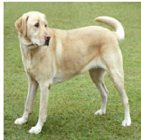  
(a) Original

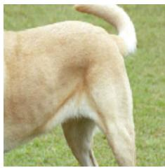  
(b) Crop and resize

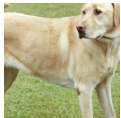

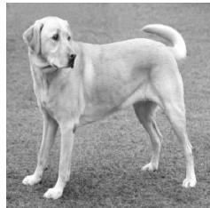  
(c) Crop, resize (and flip) (d) Color distort. (drop) (e) Color distort. (jitter)

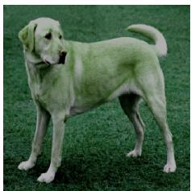

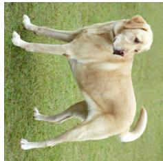  
(f) Rotate $\{90^{\circ}, 180^{\circ}, 270^{\circ}\}$

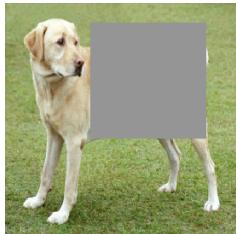  
(g) Cutout

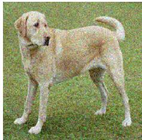  
(h) Gaussian noise

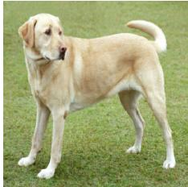  
(i) Gaussian blur

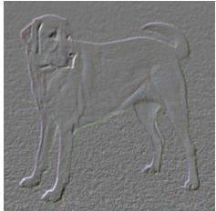  
(j) Sobel filtering  
Figure 4. Illustrations of the studied data augmentation operators. Each augmentation can transform data stochastically with some internal parameters (e.g. rotation degree, noise level). Note that we only test these operators in ablation, the augmentation policy used to train our models only includes random crop (with flip and resize), color distortion, and Gaussian blur. (Original image cc-by: Von.grzanka)

2012; Hénaff et al., 2019; Bachman et al., 2019), it has not been considered as a systematic way to define the contrastive prediction task. Many existing approaches define contrastive prediction tasks by changing the architecture. For example, Hjelm et al. (2018); Bachman et al. (2019) achieve global-to-local view prediction via constraining the receptive field in the network architecture, whereas Oord et al. (2018); Hénaff et al. (2019) achieve neighboring view prediction via a fixed image splitting procedure and a context aggregation network. We show that this complexity can be avoided by performing simple random cropping (with resizing) of target images, which creates a family of predictive tasks subsuming the above mentioned two, as shown in Figure 3. This simple design choice conveniently decouples the predictive task from other components such as the neural network architecture. Broader contrastive prediction tasks can be defined by extending the family of augmentations and composing them stochastically.

## 3.1. Composition of data augmentation operations is crucial for learning good representations

To systematically study the impact of data augmentation, we consider several common augmentations here. One type of augmentation involves spatial/geometric transformation of data, such as cropping and resizing (with horizontal flipping), rotation (Gidaris et al., 2018) and cutout (De-Vries & Taylor, 2017). The other type of augmentation involves appearance transformation, such as color distortion (including color dropping, brightness, contrast, saturation, hue) (Howard, 2013; Szegedy et al., 2015), Gaussian blur, and Sobel filtering. Figure 4 visualizes the augmentations that we study in this work.

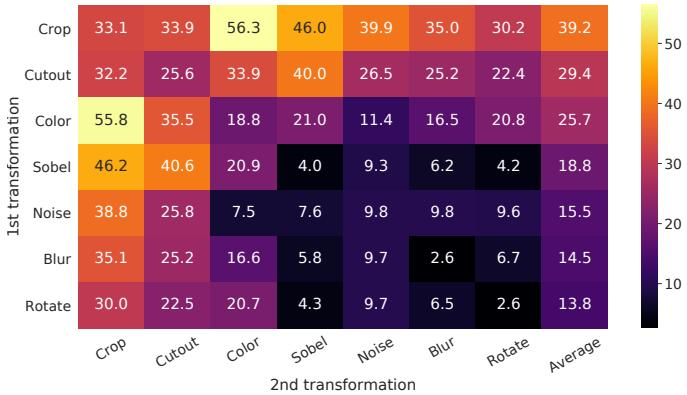  
Figure 5. Linear evaluation (ImageNet top-1 accuracy) under individual or composition of data augmentations, applied only to one branch. For all columns but the last, diagonal entries correspond to single transformation, and off-diagonals correspond to composition of two transformations (applied sequentially). The last column reflects the average over the row.

To understand the effects of individual data augmentations and the importance of augmentation composition, we investigate the performance of our framework when applying augmentations individually or in pairs. Since ImageNet images are of different sizes, we always apply crop and resize images (Krizhevsky et al., 2012; Szegedy et al., 2015), which makes it difficult to study other augmentations in the absence of cropping. To eliminate this confound, we consider an asymmetric data transformation setting for this ablation. Specifically, we always first randomly crop images and resize them to the same resolution, and we then apply the targeted transformation(s) only to one branch of the framework in Figure 2, while leaving the other branch as the identity (i.e. $t(\boldsymbol{x}_i) = \boldsymbol{x}_i$ ). Note that this asymmetric data augmentation hurts the performance. Nonetheless, this setup should not substantively change the impact of individual data augmentations or their compositions.

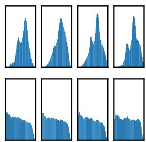  
(a) Without color distortion.

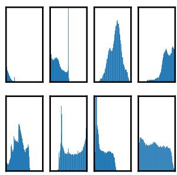  
(b) With color distortion.

Figure 6. Histograms of pixel intensities (over all channels) for different crops of two different images (i.e. two rows). The image for the first row is from Figure 4. All axes have the same range.

<table><tr><td rowspan="2">Methods</td><td colspan="5">Color distortion strength</td><td rowspan="2">AutoAug</td></tr><tr><td>1/8</td><td>1/4</td><td>1/2</td><td>1</td><td>1 (+Blur)</td></tr><tr><td>SimCLR</td><td>59.6</td><td>61.0</td><td>62.6</td><td>63.2</td><td>64.5</td><td>61.1</td></tr><tr><td>Supervised</td><td>77.0</td><td>76.7</td><td>76.5</td><td>75.7</td><td>75.4</td><td>77.1</td></tr></table>

Table 1. Top-1 accuracy of unsupervised ResNet-50 using linear evaluation and supervised ResNet- $50^{5}$ , under varied color distortion strength (see Appendix A) and other data transformations. Strength 1 (+Blur) is our default data augmentation policy.

Figure 5 shows linear evaluation results under individual and composition of transformations. We observe that no single transformation suffices to learn good representations, even though the model can almost perfectly identify the positive pairs in the contrastive task. When composing augmentations, the contrastive prediction task becomes harder, but the quality of representation improves dramatically. Appendix B.2 provides a further study on composing broader set of augmentations.

One composition of augmentations stands out: random cropping and random color distortion. We conjecture that one serious issue when using only random cropping as data augmentation is that most patches from an image share a similar color distribution. Figure 6 shows that color histograms alone suffice to distinguish images. Neural nets may exploit this shortcut to solve the predictive task. Therefore, it is critical to compose cropping with color distortion in order to learn generalizable features.

## 3.2. Contrastive learning needs stronger data augmentation than supervised learning

To further demonstrate the importance of the color augmentation, we adjust the strength of color augmentation as shown in Table 1. Stronger color augmentation substantially improves the linear evaluation of the learned unsupervised models. In this context, AutoAugment (Cubuk et al., 2019), a sophisticated augmentation policy found using supervised learning, does not work better than simple cropping + (stronger) color distortion. When training supervised models with the same set of augmentations, we observe that stronger color augmentation does not improve or even hurts their performance. Thus, our experiments show that unsupervised contrastive learning benefits from stronger (color) data augmentation than supervised learning. Although previous work has reported that data augmentation is useful for self-supervised learning (Doersch et al., 2015; Bachman et al., 2019; Hénaff et al., 2019; Asano et al., 2019), we show that data augmentation that does not yield accuracy benefits for supervised learning can still help considerably with contrastive learning.

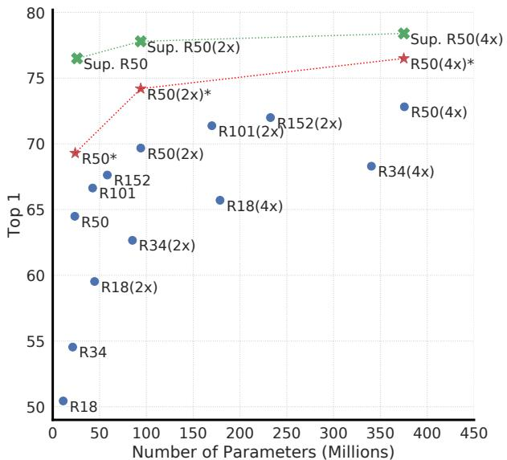  
Figure 7. Linear evaluation of models with varied depth and width. Models in blue dots are ours trained for 100 epochs, models in red stars are ours trained for 1000 epochs, and models in green crosses are supervised ResNets trained for 90 epochs $^{7}$ (He et al., 2016).

## 4. Architectures for Encoder and Head

## 4.1. Unsupervised contrastive learning benefits (more) from bigger models

Figure 7 shows, perhaps unsurprisingly, that increasing depth and width both improve performance. While similar findings hold for supervised learning (He et al., 2016), we find the gap between supervised models and linear classifiers trained on unsupervised models shrinks as the model size increases, suggesting that unsupervised learning benefits more from bigger models than its supervised counterpart.

A Simple Framework for Contrastive Learning of Visual Representations

<table><tr><td>Name</td><td>Negative loss function</td><td>Gradient w.r.t. u</td></tr><tr><td>NT-Xent</td><td> $\boldsymbol{u}^{T}\boldsymbol{v}^{+}/\tau - \log \sum_{\boldsymbol{v} \in \{\boldsymbol{v}^{+}, \boldsymbol{v}^{-}\}} \exp(\boldsymbol{u}^{T}\boldsymbol{v}/\tau)$ </td><td> $(1 - \frac{\exp(\boldsymbol{u}^{T}\boldsymbol{v}^{+}/\tau)}{Z(\boldsymbol{u})})/\tau \boldsymbol{v}^{+} - \sum_{\boldsymbol{v}^{-}} \frac{\exp(\boldsymbol{u}^{T}\boldsymbol{v}^{-}/\tau)}{Z(\boldsymbol{u})}/\tau \boldsymbol{v}^{-}$ </td></tr><tr><td>NT-Logistic</td><td> $\log \sigma(\boldsymbol{u}^{T}\boldsymbol{v}^{+}/\tau) + \log \sigma(-\boldsymbol{u}^{T}\boldsymbol{v}^{-}/\tau)$ </td><td> $(\sigma(-\boldsymbol{u}^{T}\boldsymbol{v}^{+}/\tau))/\tau \boldsymbol{v}^{+} - \sigma(\boldsymbol{u}^{T}\boldsymbol{v}^{-}/\tau)/\tau \boldsymbol{v}^{-}$ </td></tr><tr><td>Margin Triplet</td><td> $-\max(\boldsymbol{u}^{T}\boldsymbol{v}^{-}-\boldsymbol{u}^{T}\boldsymbol{v}^{+}+m,0)$ </td><td> $\boldsymbol{v}^{+}-\boldsymbol{v}^{-} \text{ if } \boldsymbol{u}^{T}\boldsymbol{v}^{+}-\boldsymbol{u}^{T}\boldsymbol{v}^{-}< m \text{ else } \boldsymbol{0}$ </td></tr></table>

Table 2. Negative loss functions and their gradients. All input vectors, i.e. $\boldsymbol{u}, \boldsymbol{v}^{+}, \boldsymbol{v}^{-}$ , are $\ell_2$ normalized. NT-Xent is an abbreviation for "Normalized Temperature-scaled Cross Entropy". Different loss functions impose different weightings of positive and negative examples.

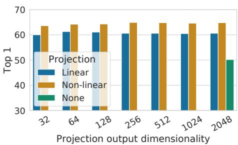  
Figure 8. Linear evaluation of representations with different projection heads $g(\cdot)$ and various dimensions of $z = g(h)$ . The representation h (before projection) is 2048-dimensional here.

## 4.2. A nonlinear projection head improves the representation quality of the layer before it

We then study the importance of including a projection head, i.e. $g(\boldsymbol{h})$ . Figure 8 shows linear evaluation results using three different architecture for the head: (1) identity mapping; (2) linear projection, as used by several previous approaches (Wu et al., 2018); and (3) the default nonlinear projection with one additional hidden layer (and ReLU activation), similar to Bachman et al. (2019). We observe that a nonlinear projection is better than a linear projection (+3%), and much better than no projection (>10%). When a projection head is used, similar results are observed regardless of output dimension. Furthermore, even when nonlinear projection is used, the layer before the projection head, h, is still much better (>10%) than the layer after, $z = g(\boldsymbol{h})$ , which shows that the hidden layer before the projection head is a better representation than the layer after.

We conjecture that the importance of using the representation before the nonlinear projection is due to loss of information induced by the contrastive loss. In particular, $z = g(\boldsymbol{h})$ is trained to be invariant to data transformation. Thus, g can remove information that may be useful for the downstream task, such as the color or orientation of objects. By leveraging the nonlinear transformation $g(\cdot)$ , more information can be formed and maintained in h. To verify this hypothesis, we conduct experiments that use either h or $g(\boldsymbol{h})$ to learn to predict the transformation applied during the pretraining. Here we set $g(h) = W^{(2)}\sigma(W^{(1)}h)$ , with the same input and output dimensionality (i.e. 2048). Table 3 shows h contains much more information about the transformation applied, while $g(\boldsymbol{h})$ loses information. Further analysis can

<table><tr><td rowspan="2">What to predict?</td><td rowspan="2">Random guess</td><td colspan="2">Representation</td></tr><tr><td>h</td><td>g(h)</td></tr><tr><td>Color vs grayscale</td><td>80</td><td>99.3</td><td>97.4</td></tr><tr><td>Rotation</td><td>25</td><td>67.6</td><td>25.6</td></tr><tr><td>Orig. vs corrupted</td><td>50</td><td>99.5</td><td>59.6</td></tr><tr><td>Orig. vs Sobel filtered</td><td>50</td><td>96.6</td><td>56.3</td></tr></table>

Table 3. Accuracy of training additional MLPs on different representations to predict the transformation applied. Other than crop and color augmentation, we additionally and independently add rotation (one of $\{0^{\circ}, 90^{\circ}, 180^{\circ}, 270^{\circ}\}$ ), Gaussian noise, and Sobel filtering transformation during the pretraining for the last three rows. Both h and $g(h)$ are of the same dimensionality, i.e. 2048.

be found in Appendix B.4.

## 5. Loss Functions and Batch Size

## 5.1. Normalized cross entropy loss with adjustable temperature works better than alternatives

We compare the NT-Xent loss against other commonly used contrastive loss functions, such as logistic loss (Mikolov et al., 2013), and margin loss (Schroff et al., 2015). Table 2 shows the objective function as well as the gradient to the input of the loss function. Looking at the gradient, we observe 1) $\ell_2$ normalization (i.e. cosine similarity) along with temperature effectively weights different examples, and an appropriate temperature can help the model learn from hard negatives; and 2) unlike cross-entropy, other objective functions do not weigh the negatives by their relative hardness. As a result, one must apply semi-hard negative mining (Schroff et al., 2015) for these loss functions: instead of computing the gradient over all loss terms, one can compute the gradient using semi-hard negative terms (i.e., those that are within the loss margin and closest in distance, but farther than positive examples).

To make the comparisons fair, we use the same $\ell_{2}$ normalization for all loss functions, and we tune the hyperparameters, and report their best results. $^{8}$ Table 4 shows that, while (semi-hard) negative mining helps, the best result is still much worse than our default NT-Xent loss.

A Simple Framework for Contrastive Learning of Visual Representations

<table><tr><td>Margin</td><td>NT-Logi.</td><td>Margin (sh)</td><td>NT-Logi.(sh)</td><td>NT-Xent</td></tr><tr><td>50.9</td><td>51.6</td><td>57.5</td><td>57.9</td><td>63.9</td></tr></table>

Table 4. Linear evaluation (top-1) for models trained with different loss functions. “sh” means using semi-hard negative mining.

<table><tr><td> $\ell_2$ norm?</td><td> $\tau$ </td><td>Entropy</td><td>Contrastive acc.</td><td>Top 1</td></tr><tr><td rowspan="4">Yes</td><td>0.05</td><td>1.0</td><td>90.5</td><td>59.7</td></tr><tr><td>0.1</td><td>4.5</td><td>87.8</td><td>64.4</td></tr><tr><td>0.5</td><td>8.2</td><td>68.2</td><td>60.7</td></tr><tr><td>1</td><td>8.3</td><td>59.1</td><td>58.0</td></tr><tr><td rowspan="2">No</td><td>10</td><td>0.5</td><td>91.7</td><td>57.2</td></tr><tr><td>100</td><td>0.5</td><td>92.1</td><td>57.0</td></tr></table>

Table 5. Linear evaluation for models trained with different choices of $\ell_{2}$ norm and temperature $\tau$ for NT-Xent loss. The contrastive distribution is over 4096 examples.

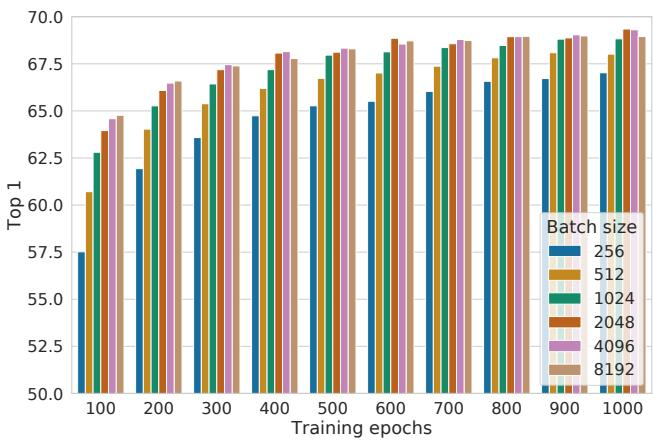  
Figure 9. Linear evaluation models (ResNet-50) trained with different batch size and epochs. Each bar is a single run from scratch. $^{10}$

We next test the importance of the $\ell_{2}$ normalization (i.e. cosine similarity vs dot product) and temperature $\tau$ in our default NT-Xent loss. Table 5 shows that without normalization and proper temperature scaling, performance is significantly worse. Without $\ell_{2}$ normalization, the contrastive task accuracy is higher, but the resulting representation is worse under linear evaluation.

## 5.2. Contrastive learning benefits (more) from larger batch sizes and longer training

Figure 9 shows the impact of batch size when models are trained for different numbers of epochs. We find that, when the number of training epochs is small (e.g. 100 epochs), larger batch sizes have a significant advantage over the smaller ones. With more training steps/epochs, the gaps between different batch sizes decrease or disappear, provided the batches are randomly resampled. In contrast to supervised learning (Goyal et al., 2017), in contrastive learning, larger batch sizes provide more negative examples, facilitating convergence (i.e. taking fewer epochs and steps for a given accuracy). Training longer also provides more negative examples, improving the results. In Appendix B.1, results with even longer training steps are provided.

<table><tr><td>Method</td><td>Architecture</td><td>Param (M)</td><td>Top 1</td><td>Top 5</td></tr><tr><td colspan="5">Methods using ResNet-50:</td></tr><tr><td>Local Agg.</td><td>ResNet-50</td><td>24</td><td>60.2</td><td>-</td></tr><tr><td>MoCo</td><td>ResNet-50</td><td>24</td><td>60.6</td><td>-</td></tr><tr><td>PIRL</td><td>ResNet-50</td><td>24</td><td>63.6</td><td>-</td></tr><tr><td>CPC v2</td><td>ResNet-50</td><td>24</td><td>63.8</td><td>85.3</td></tr><tr><td>SimCLR (ours)</td><td>ResNet-50</td><td>24</td><td>69.3</td><td>89.0</td></tr><tr><td colspan="5">Methods using other architectures:</td></tr><tr><td>Rotation</td><td>RevNet-50 (4×)</td><td>86</td><td>55.4</td><td>-</td></tr><tr><td>BigBiGAN</td><td>RevNet-50 (4×)</td><td>86</td><td>61.3</td><td>81.9</td></tr><tr><td>AMDIM</td><td>Custom-ResNet</td><td>626</td><td>68.1</td><td>-</td></tr><tr><td>CMC</td><td>ResNet-50 (2×)</td><td>188</td><td>68.4</td><td>88.2</td></tr><tr><td>MoCo</td><td>ResNet-50 (4×)</td><td>375</td><td>68.6</td><td>-</td></tr><tr><td>CPC v2</td><td>ResNet-161 (*)</td><td>305</td><td>71.5</td><td>90.1</td></tr><tr><td>SimCLR (ours)</td><td>ResNet-50 (2×)</td><td>94</td><td>74.2</td><td>92.0</td></tr><tr><td>SimCLR (ours)</td><td>ResNet-50 (4×)</td><td>375</td><td>76.5</td><td>93.2</td></tr></table>

Table 6. ImageNet accuracies of linear classifiers trained on representations learned with different self-supervised methods.

<table><tr><td rowspan="3">Method</td><td rowspan="3">Architecture</td><td colspan="2">Label fraction</td></tr><tr><td>1%</td><td>10%</td></tr><tr><td colspan="2">Top 5</td></tr><tr><td>Supervised baseline</td><td>ResNet-50</td><td>48.4</td><td>80.4</td></tr><tr><td colspan="4">Methods using other label-propagation:</td></tr><tr><td>Pseudo-label</td><td>ResNet-50</td><td>51.6</td><td>82.4</td></tr><tr><td>VAT+Entropy Min.</td><td>ResNet-50</td><td>47.0</td><td>83.4</td></tr><tr><td>UDA (w. RandAug)</td><td>ResNet-50</td><td>-</td><td>88.5</td></tr><tr><td>FixMatch (w. RandAug)</td><td>ResNet-50</td><td>-</td><td>89.1</td></tr><tr><td>S4L (Rot+VAT+En. M.)</td><td>ResNet-50 (4×)</td><td>-</td><td>91.2</td></tr><tr><td colspan="4">Methods using representation learning only:</td></tr><tr><td>InstDisc</td><td>ResNet-50</td><td>39.2</td><td>77.4</td></tr><tr><td>BigBiGAN</td><td>RevNet-50 (4×)</td><td>55.2</td><td>78.8</td></tr><tr><td>PIRL</td><td>ResNet-50</td><td>57.2</td><td>83.8</td></tr><tr><td>CPC v2</td><td>ResNet-161(*)</td><td>77.9</td><td>91.2</td></tr><tr><td>SimCLR (ours)</td><td>ResNet-50</td><td>75.5</td><td>87.8</td></tr><tr><td>SimCLR (ours)</td><td>ResNet-50 (2×)</td><td>83.0</td><td>91.2</td></tr><tr><td>SimCLR (ours)</td><td>ResNet-50 (4×)</td><td>85.8</td><td>92.6</td></tr></table>

Table 7. ImageNet accuracy of models trained with few labels.

## 6. Comparison with State-of-the-art

In this subsection, similar to Kolesnikov et al. (2019); He et al. (2019), we use ResNet-50 in 3 different hidden layer widths (width multipliers of $1\times$ , $2\times$ , and $4\times$ ). For better convergence, our models here are trained for 1000 epochs.

Linear evaluation. Table 6 compares our results with previous approaches (Zhuang et al., 2019; He et al., 2019; Misra & van der Maaten, 2019; Hénaff et al., 2019; Kolesnikov et al., 2019; Donahue & Simonyan, 2019; Bachman et al.,

A Simple Framework for Contrastive Learning of Visual Representations

<table><tr><td></td><td>Food</td><td>CIFAR10</td><td>CIFAR100</td><td>Birdsnap</td><td>SUN397</td><td>Cars</td><td>Aircraft</td><td>VOC2007</td><td>DTD</td><td>Pets</td><td>Caltech-101</td><td>Flowers</td></tr><tr><td colspan="13">Linear evaluation:</td></tr><tr><td>SimCLR (ours)</td><td>76.9</td><td>95.3</td><td>80.2</td><td>48.4</td><td>65.9</td><td>60.0</td><td>61.2</td><td>84.2</td><td>78.9</td><td>89.2</td><td>93.9</td><td>95.0</td></tr><tr><td>Supervised</td><td>75.2</td><td>95.7</td><td>81.2</td><td>56.4</td><td>64.9</td><td>68.8</td><td>63.8</td><td>83.8</td><td>78.7</td><td>92.3</td><td>94.1</td><td>94.2</td></tr><tr><td colspan="13">Fine-tuned:</td></tr><tr><td>SimCLR (ours)</td><td>89.4</td><td>98.6</td><td>89.0</td><td>78.2</td><td>68.1</td><td>92.1</td><td>87.0</td><td>86.6</td><td>77.8</td><td>92.1</td><td>94.1</td><td>97.6</td></tr><tr><td>Supervised</td><td>88.7</td><td>98.3</td><td>88.7</td><td>77.8</td><td>67.0</td><td>91.4</td><td>88.0</td><td>86.5</td><td>78.8</td><td>93.2</td><td>94.2</td><td>98.0</td></tr><tr><td>Random init</td><td>88.3</td><td>96.0</td><td>81.9</td><td>77.0</td><td>53.7</td><td>91.3</td><td>84.8</td><td>69.4</td><td>64.1</td><td>82.7</td><td>72.5</td><td>92.5</td></tr></table>

Table 8. Comparison of transfer learning performance of our self-supervised approach with supervised baselines across 12 natural image classification datasets, for ResNet-50 (4×) models pretrained on ImageNet. Results not significantly worse than the best (p > 0.05, permutation test) are shown in bold. See Appendix B.8 for experimental details and results with standard ResNet-50.

2019; Tian et al., 2019) in the linear evaluation setting (see Appendix B.6). Table 1 shows more numerical comparisons among different methods. We are able to use standard networks to obtain substantially better results compared to previous methods that require specifically designed architectures. The best result obtained with our ResNet-50 (4×) can match the supervised pretrained ResNet-50.

Semi-supervised learning. We follow Zhai et al. (2019) and sample 1% or 10% of the labeled ILSVRC-12 training datasets in a class-balanced way ( $\sim$ 12.8 and $\sim$ 128 images per class respectively). $^{[11]}$ We simply fine-tune the whole base network on the labeled data without regularization (see Appendix B.5). Table 7 shows the comparisons of our results against recent methods (Zhai et al., 2019; Xie et al., 2019; Sohn et al., 2020; Wu et al., 2018; Donahue & Simonyan, 2019; Misra & van der Maaten, 2019; Hénaff et al., 2019). The supervised baseline from (Zhai et al., 2019) is strong due to intensive search of hyper-parameters (including augmentation). Again, our approach significantly improves over state-of-the-art with both 1% and 10% of the labels. Interestingly, fine-tuning our pretrained ResNet-50 ( $2\times,4\times$ ) on full ImageNet are also significantly better than training from scratch (up to 2%, see Appendix B.2).

Transfer learning. We evaluate transfer learning performance across 12 natural image datasets in both linear evaluation (fixed feature extractor) and fine-tuning settings. Following Kornblith et al. (2019), we perform hyperparameter tuning for each model-dataset combination and select the best hyperparameters on a validation set. Table 8 shows results with the ResNet-50 (4×) model. When fine-tuned, our self-supervised model significantly outperforms the supervised baseline on 5 datasets, whereas the supervised baseline is superior on only 2 (i.e. Pets and Flowers). On the remaining 5 datasets, the models are statistically tied. Full experimental details as well as results with the standard ResNet-50 architecture are provided in Appendix B.8.

## 7. Related Work

The idea of making representations of an image agree with each other under small transformations dates back to Becker & Hinton (1992). We extend it by leveraging recent advances in data augmentation, network architecture and contrastive loss. A similar consistency idea, but for class label prediction, has been explored in other contexts such as semi-supervised learning (Xie et al., 2019; Berthelot et al., 2019).

Handcrafted pretext tasks. The recent renaissance of self-supervised learning began with artificially designed pretext tasks, such as relative patch prediction (Doersch et al., 2015), solving jigsaw puzzles (Noroozi & Favaro, 2016), colorization (Zhang et al., 2016) and rotation prediction (Gidaris et al., 2018; Chen et al., 2019). Although good results can be obtained with bigger networks and longer training (Kolesnikov et al., 2019), these pretext tasks rely on somewhat ad-hoc heuristics, which limits the generality of learned representations.

Contrastive visual representation learning. Dating back to Hadsell et al. (2006), these approaches learn representations by contrasting positive pairs against negative pairs. Along these lines, Dosovitskiy et al. (2014) proposes to treat each instance as a class represented by a feature vector (in a parametric form). Wu et al. (2018) proposes to use a memory bank to store the instance class representation vector, an approach adopted and extended in several recent papers (Zhuang et al., 2019; Tian et al., 2019; He et al., 2019; Misra & van der Maaten, 2019). Other work explores the use of in-batch samples for negative sampling instead of a memory bank (Doersch & Zisserman, 2017; Ye et al., 2019; Ji et al., 2019).

Recent literature has attempted to relate the success of their methods to maximization of mutual information between latent representations (Oord et al., 2018; Hénaff et al., 2019; Hjelm et al., 2018; Bachman et al., 2019). However, it is not clear if the success of contrastive approaches is determined by the mutual information, or by the specific form of the contrastive loss (Tschannen et al., 2019).

We note that almost all individual components of our framework have appeared in previous work, although the specific instantiations may be different. The superiority of our framework relative to previous work is not explained by any single design choice, but by their composition. We provide a comprehensive comparison of our design choices with those of previous work in Appendix C.

## 8. Conclusion

In this work, we present a simple framework and its instantiation for contrastive visual representation learning. We carefully study its components, and show the effects of different design choices. By combining our findings, we improve considerably over previous methods for self-supervised, semi-supervised, and transfer learning.

Our approach differs from standard supervised learning on ImageNet only in the choice of data augmentation, the use of a nonlinear head at the end of the network, and the loss function. The strength of this simple framework suggests that, despite a recent surge in interest, self-supervised learning remains undervalued.

## Acknowledgements

We would like to thank Xiaohua Zhai, Rafael Müller and Yani Ioannou for their feedback on the draft. We are also grateful for general support from Google Research teams in Toronto and elsewhere.

## References

Asano, Y. M., Rupprecht, C., and Vedaldi, A. A critical analysis of self-supervision, or what we can learn from a single image. arXiv preprint arXiv:1904.13132, 2019.

Bachman, P., Hjelm, R. D., and Buchwalter, W. Learning representations by maximizing mutual information across views. In Advances in Neural Information Processing Systems, pp. 15509–15519, 2019.

Becker, S. and Hinton, G. E. Self-organizing neural network that discovers surfaces in random-dot stereograms. Nature, 355(6356):161–163, 1992.

Berg, T., Liu, J., Lee, S. W., Alexander, M. L., Jacobs, D. W., and Belhumeur, P. N. Birdsnap: Large-scale fine-grained visual categorization of birds. In IEEE Conference on Computer Vision and Pattern Recognition (CVPR), pp. 2019–2026. IEEE, 2014.

Berthelot, D., Carlini, N., Goodfellow, I., Papernot, N., Oliver, A., and Raffel, C. A. Mixmatch: A holistic approach to semi-supervised learning. In Advances in Neural Information Processing Systems, pp. 5050–5060, 2019.

Bossard, L., Guillaumin, M., and Van Gool, L. Food-101–mining discriminative components with random forests. In European conference on computer vision, pp. 446–461. Springer, 2014.

Chen, T., Sun, Y., Shi, Y., and Hong, L. On sampling strategies for neural network-based collaborative filtering. In Proceedings of the 23rd ACM SIGKDD International Conference on Knowledge Discovery and Data Mining, pp. 767–776, 2017.

Chen, T., Zhai, X., Ritter, M., Lucic, M., and Houlsby, N. Self-supervised gans via auxiliary rotation loss. In Proceedings of the IEEE Conference on Computer Vision and Pattern Recognition, pp. 12154–12163, 2019.

Cimpoi, M., Maji, S., Kokkinos, I., Mohamed, S., and Vedaldi, A. Describing textures in the wild. In IEEE Conference on Computer Vision and Pattern Recognition (CVPR), pp. 3606–3613. IEEE, 2014.

Cubuk, E. D., Zoph, B., Mane, D., Vasudevan, V., and Le, Q. V. Autoaugment: Learning augmentation strategies from data. In Proceedings of the IEEE conference on computer vision and pattern recognition, pp. 113–123, 2019.

DeVries, T. and Taylor, G. W. Improved regularization of convolutional neural networks with cutout. arXiv preprint arXiv:1708.04552, 2017.

Doersch, C. and Zisserman, A. Multi-task self-supervised visual learning. In Proceedings of the IEEE International Conference on Computer Vision, pp. 2051–2060, 2017.

Doersch, C., Gupta, A., and Efros, A. A. Unsupervised visual representation learning by context prediction. In Proceedings of the IEEE International Conference on Computer Vision, pp. 1422–1430, 2015.

Donahue, J. and Simonyan, K. Large scale adversarial representation learning. In Advances in Neural Information Processing Systems, pp. 10541–10551, 2019.

Donahue, J., Jia, Y., Vinyals, O., Hoffman, J., Zhang, N., Tzeng, E., and Darrell, T. Decaf: A deep convolutional activation feature for generic visual recognition. In International Conference on Machine Learning, pp. 647–655, 2014.

Dosovitskiy, A., Springenberg, J. T., Riedmiller, M., and Brox, T. Discriminative unsupervised feature learning with convolutional neural networks. In Advances in neural information processing systems, pp. 766–774, 2014.

Everingham, M., Van Gool, L., Williams, C. K., Winn, J., and Zisserman, A. The pascal visual object classes (voc) challenge. International Journal of Computer Vision, 88(2):303–338, 2010.

Fei-Fei, L., Fergus, R., and Perona, P. Learning generative visual models from few training examples: An incremental bayesian approach tested on 101 object categories. In IEEE Conference on Computer Vision and Pattern Recognition (CVPR) Workshop on Generative-Model Based Vision, 2004.

Gidaris, S., Singh, P., and Komodakis, N. Unsupervised representation learning by predicting image rotations. arXiv preprint arXiv:1803.07728, 2018.

Goodfellow, I., Pouget-Abadie, J., Mirza, M., Xu, B., Warde-Farley, D., Ozair, S., Courville, A., and Bengio, Y. Generative adversarial nets. In Advances in neural information processing systems, pp. 2672–2680, 2014.

Goyal, P., Dollár, P., Girshick, R., Noordhuis, P., Wesolowski, L., Kyrola, A., Tulloch, A., Jia, Y., and He, K. Accurate, large minibatch sgd: Training imagenet in 1 hour. arXiv preprint arXiv:1706.02677, 2017.

Hadsell, R., Chopra, S., and LeCun, Y. Dimensionality reduction by learning an invariant mapping. In 2006 IEEE Computer Society Conference on Computer Vision and Pattern Recognition (CVPR'06), volume 2, pp. 1735–1742. IEEE, 2006.

He, K., Zhang, X., Ren, S., and Sun, J. Deep residual learning for image recognition. In Proceedings of the IEEE conference on computer vision and pattern recognition, pp. 770–778, 2016.

He, K., Fan, H., Wu, Y., Xie, S., and Girshick, R. Momentum contrast for unsupervised visual representation learning. arXiv preprint arXiv:1911.05722, 2019.

Hénaff, O. J., Razavi, A., Doersch, C., Eslami, S., and Oord, A. v. d. Data-efficient image recognition with contrastive predictive coding. arXiv preprint arXiv:1905.09272, 2019.

Hinton, G. E., Osindero, S., and Teh, Y.-W. A fast learning algorithm for deep belief nets. Neural computation, 18(7):1527-1554, 2006.

Hjelm, R. D., Fedorov, A., Lavoie-Marchildon, S., Grewal, K., Bachman, P., Trischler, A., and Bengio, Y. Learning deep representations by mutual information estimation and maximization. arXiv preprint arXiv:1808.06670, 2018.

Howard, A. G. Some improvements on deep convolutional neural network based image classification. arXiv preprint arXiv:1312.5402, 2013.

Ioffe, S. and Szegedy, C. Batch normalization: Accelerating deep network training by reducing internal covariate shift. arXiv preprint arXiv:1502.03167, 2015.

Ji, X., Henriques, J. F., and Vedaldi, A. Invariant information clustering for unsupervised image classification and segmentation. In Proceedings of the IEEE International Conference on Computer Vision, pp. 9865–9874, 2019.

Kingma, D. P. and Welling, M. Auto-encoding variational bayes. arXiv preprint arXiv:1312.6114, 2013.

Kolesnikov, A., Zhai, X., and Beyer, L. Revisiting self-supervised visual representation learning. In Proceedings of the IEEE conference on Computer Vision and Pattern Recognition, pp. 1920–1929, 2019.

Kornblith, S., Shlens, J., and Le, Q. V. Do better ImageNet models transfer better? In Proceedings of the IEEE conference on computer vision and pattern recognition, pp. 2661–2671, 2019.

Krause, J., Deng, J., Stark, M., and Fei-Fei, L. Collecting a large-scale dataset of fine-grained cars. In Second Workshop on Fine-Grained Visual Categorization, 2013.

Krizhevsky, A. and Hinton, G. Learning multiple layers of features from tiny images. Technical report, University of Toronto, 2009. URL https://www.cs.toronto.edu/\~kriz/learning-features-2009-TR.pdf.

Krizhevsky, A., Sutskever, I., and Hinton, G. E. Imagenet classification with deep convolutional neural networks. In Advances in neural information processing systems, pp. 1097–1105, 2012.

Loshchilov, I. and Hutter, F. Sgdr: Stochastic gradient descent with warm restarts. arXiv preprint arXiv:1608.03983, 2016.

Maaten, L. v. d. and Hinton, G. Visualizing data using t-sne. Journal of machine learning research, 9(Nov):2579–2605, 2008.

Maji, S., Kannala, J., Rahtu, E., Blaschko, M., and Vedaldi, A. Fine-grained visual classification of aircraft. Technical report, 2013.

Mikolov, T., Chen, K., Corrado, G., and Dean, J. Efficient estimation of word representations in vector space. arXiv preprint arXiv:1301.3781, 2013.

Misra, I. and van der Maaten, L. Self-supervised learning of pretext-invariant representations. arXiv preprint arXiv:1912.01991, 2019.

Nilsback, M.-E. and Zisserman, A. Automated flower classification over a large number of classes. In Computer Vision, Graphics & Image Processing, 2008. ICVGIP'08. Sixth Indian Conference on, pp. 722–729. IEEE, 2008.

Noroozi, M. and Favaro, P. Unsupervised learning of visual representations by solving jigsaw puzzles. In European Conference on Computer Vision, pp. 69–84. Springer, 2016.

Oord, A. v. d., Li, Y., and Vinyals, O. Representation learning with contrastive predictive coding. arXiv preprint arXiv:1807.03748, 2018.

Parkhi, O. M., Vedaldi, A., Zisserman, A., and Jawahar, C. Cats and dogs. In IEEE Conference on Computer Vision and Pattern Recognition (CVPR), pp. 3498–3505. IEEE, 2012.

Russakovsky, O., Deng, J., Su, H., Krause, J., Satheesh, S., Ma, S., Huang, Z., Karpathy, A., Khosla, A., Bernstein, M., et al. Imagenet large scale visual recognition challenge. International journal of computer vision, 115(3):211–252, 2015.

Schroff, F., Kalenichenko, D., and Philbin, J. Facenet: A unified embedding for face recognition and clustering. In Proceedings of the IEEE conference on computer vision and pattern recognition, pp. 815–823, 2015.

Simonyan, K. and Zisserman, A. Very deep convolutional networks for large-scale image recognition. arXiv preprint arXiv:1409.1556, 2014.

Sohn, K. Improved deep metric learning with multi-class n-pair loss objective. In Advances in neural information processing systems, pp. 1857–1865, 2016.

Sohn, K., Berthelot, D., Li, C.-L., Zhang, Z., Carlini, N., Cubuk, E. D., Kurakin, A., Zhang, H., and Raffel, C. Fixmatch: Simplifying semi-supervised learning with consistency and confidence. arXiv preprint arXiv:2001.07685, 2020.

Szegedy, C., Liu, W., Jia, Y., Sermanet, P., Reed, S., Anguelov, D., Erhan, D., Vanhoucke, V., and Rabinovich, A. Going deeper with convolutions. In Proceedings of the IEEE conference on computer vision and pattern recognition, pp. 1–9, 2015.

Tian, Y., Krishnan, D., and Isola, P. Contrastive multiview coding. arXiv preprint arXiv:1906.05849, 2019.

Tschannen, M., Djolonga, J., Rubenstein, P. K., Gelly, S., and Lucic, M. On mutual information maximization for representation learning. arXiv preprint arXiv:1907.13625, 2019.

Wu, Z., Xiong, Y., Yu, S. X., and Lin, D. Unsupervised feature learning via non-parametric instance discrimination. In Proceedings of the IEEE Conference on Computer Vision and Pattern Recognition, pp. 3733–3742, 2018.

Xiao, J., Hays, J., Ehinger, K. A., Oliva, A., and Torralba, A. Sun database: Large-scale scene recognition from abbey to zoo. In IEEE Conference on Computer Vision and Pattern Recognition (CVPR), pp. 3485–3492. IEEE, 2010.

Xie, Q., Dai, Z., Hovy, E., Luong, M.-T., and Le, Q. V. Unsupervised data augmentation. arXiv preprint arXiv:1904.12848, 2019.

Ye, M., Zhang, X., Yuen, P. C., and Chang, S.-F. Unsupervised embedding learning via invariant and spreading instance feature. In Proceedings of the IEEE Conference on Computer Vision and Pattern Recognition, pp. 6210–6219, 2019.

You, Y., Gitman, I., and Ginsburg, B. Large batch training of convolutional networks. arXiv preprint arXiv:1708.03888, 2017.

Zhai, X., Oliver, A., Kolesnikov, A., and Beyer, L. S41: Self-supervised semi-supervised learning. In The IEEE International Conference on Computer Vision (ICCV), October 2019.

Zhang, R., Isola, P., and Efros, A. A. Colorful image colorization. In European conference on computer vision, pp. 649–666. Springer, 2016.

Zhuang, C., Zhai, A. L., and Yamins, D. Local aggregation for unsupervised learning of visual embeddings. In Proceedings of the IEEE International Conference on Computer Vision, pp. 6002–6012, 2019.