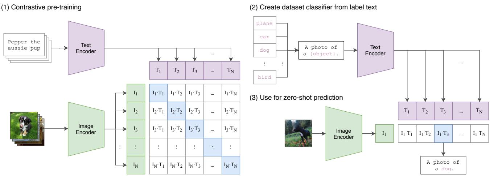
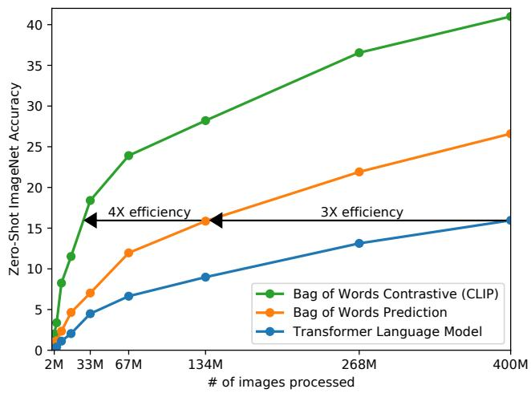
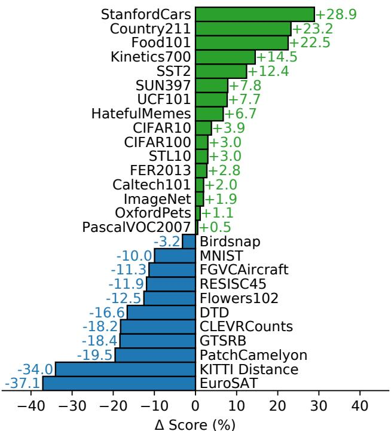
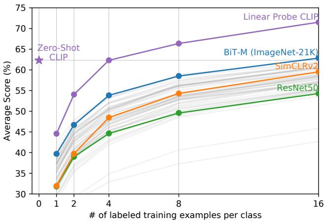
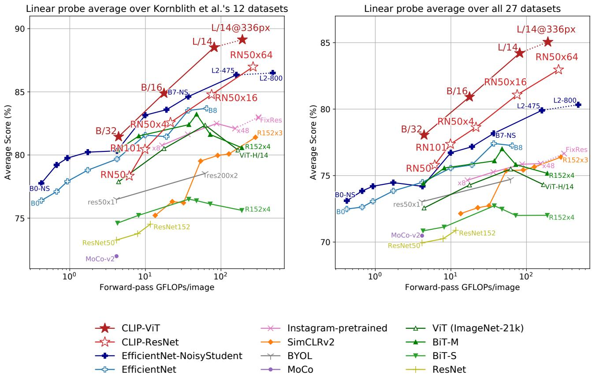
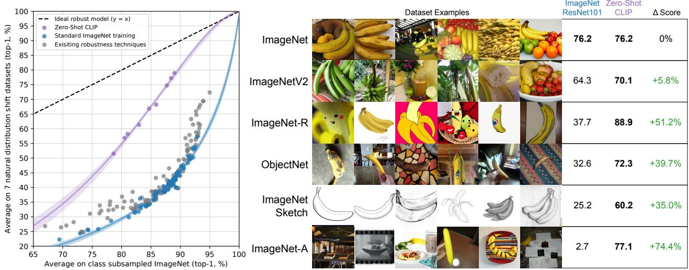

# Learning Transferable Visual Models From Natural Language Supervision

Alec Radford $^{*1}$ Jong Wook Kim $^{*1}$ Chris Hallacy $^{1}$ Aditya Ramesh $^{1}$ Gabriel Goh $^{1}$ Sandhini Agarwal $^{1}$ Girish Sastry $^{1}$ Amanda Askell $^{1}$ Pamela Mishkin $^{1}$ Jack Clark $^{1}$ Gretchen Krueger $^{1}$ Ilya Sutskever $^{1}$

## Abstract

SOTA computer vision systems are trained to predict a fixed set of predetermined object categories. This restricted form of supervision limits their generality and usability since additional labeled data is needed to specify any other visual concept. Learning directly from raw text about images is a promising alternative which leverages a much broader source of supervision. We demonstrate that the simple pre-training task of predicting which caption goes with which image is an efficient and scalable way to learn SOTA image representations from scratch on a dataset of 400 million (image, text) pairs collected from the internet. After pre-training, natural language is used to reference learned visual concepts (or describe new ones) enabling zero-shot transfer of the model to downstream tasks. We study performance on over 30 different computer vision datasets, spanning tasks such as OCR, action recognition in videos, geo-localization, and many types of fine-grained object classification. The model transfers non-trivially to most tasks and is often competitive with a fully supervised baseline without the need for any dataset specific training. For instance, we match the accuracy of the original ResNet50 on ImageNet zero-shot without needing to use any of the 1.28 million training examples it was trained on. We release our code and pre-trained model weights at https://github.com/OpenAI/CLIP.

## 1. Introduction and Motivating Work

Pre-training methods which learn directly from raw text have revolutionized NLP over the last few years (Dai & Le, 2015; Peters et al., 2018; Howard & Ruder, 2018; Radford et al., 2018; Devlin et al., 2018; Raffel et al., 2019). The development of “text-to-text” as a standardized input-output interface (McCann et al., 2018; Radford et al., 2019; Raffel et al., 2019) has enabled task-agnostic architectures to zero-shot transfer to downstream datasets. Flagship systems like GPT-3 (Brown et al., 2020) are now competitive across many tasks with bespoke models while requiring little to no dataset specific training data.

These results suggest that the aggregate supervision accessible to modern pre-training methods within web-scale collections of text surpasses that of high-quality crowd-labeled NLP datasets. However, in other fields such as computer vision it is still standard practice to pre-train models on crowd-labeled datasets such as ImageNet (Deng et al., 2009). Could scalable pre-training methods which learn directly from web text result in a similar breakthrough in computer vision? Prior work is encouraging.

Joulin et al. (2016) demonstrated that CNNs trained to predict words in image captions can learn representations competitive with ImageNet training. Li et al. (2017) then extended this approach to predicting phrase n-grams in addition to individual words and demonstrated the ability of their system to zero-shot transfer to other image classification datasets. Adopting more recent architectures and pre-training approaches, VirTex (Desai & Johnson, 2020), ICMLM (Bulent Sariyildiz et al., 2020), and ConVIRT (Zhang et al., 2020) have recently demonstrated the potential of transformer-based language modeling, masked language modeling, and contrastive objectives to learn image representations from text.

However, the aforementioned models still under-perform current SOTA computer vision models such as Big Transfer (Kolesnikov et al., 2019) and the weakly supervised ResNeXt (Mahajan et al., 2018). A crucial difference is scale. While Mahajan et al. (2018) and Kolesnikov et al. (2019) trained for accelerator years on millions to billions of images, VirTex, ICMLM, and ConVIRT trained for accelerator days on one to two hundred thousand images. We close this gap and study the behaviors of image models trained from natural language supervision at large scale. We demonstrate that a simplified version of ConVIRT trained from scratch, which we call CLIP, for Contrastive Language-Image Pre-training, is an efficient and scalable method of learning from natural language supervision. We find that

  
Figure 1. Summary of our approach. While standard image models jointly train an image feature extractor and a linear classifier to predict some label, CLIP jointly trains an image encoder and a text encoder to predict the correct pairings of a batch of (image, text) training examples. At test time the learned text encoder synthesizes a zero-shot linear classifier by embedding the names or descriptions of the target dataset's classes.

CLIP learns to perform a wide set of tasks during pre-training including OCR, geo-localization, action recognition, and outperforms the best publicly available ImageNet model while being more computationally efficient. We also find that zero-shot CLIP models are much more robust than equivalent accuracy supervised ImageNet models.

## 2. Approach

At the core of our work is the idea of learning perception from the supervision contained in natural language paired with images. In the following subsections we detail our specific approach.

## 2.1. Creating a Sufficiently Large Dataset

Existing work has mainly used three datasets, MS-COCO (Lin et al., 2014), Visual Genome (Krishna et al., 2017), and YFCC100M (Thomee et al., 2016). While MS-COCO and Visual Genome are high quality crowd-labeled datasets, they are small by modern standards with approximately 100,000 training photos each. By comparison, other computer vision systems are trained on up to 3.5 billion Instagram photos (Mahajan et al., 2018). YFCC100M, at 100 million photos, is a possible alternative, but the metadata for each image is sparse and of varying quality. Many images use automatically generated filenames like 20160716\_113957.JPG as “titles” or contain “descriptions” of camera exposure settings. After filtering to keep only images with natural language titles and/or descriptions in English, the dataset shrunk by a factor of 6 to only 15 million photos. This is approximately the same size as ImageNet.

A major motivation for natural language supervision is the large quantities of data of this form available publicly on the internet. To test this we constructed a new dataset of 400 million (image, text) pairs collected from a variety of publicly available sources on the Internet. To attempt to cover as broad a set of visual concepts as possible, we search for (image, text) pairs as part of the construction process whose text includes one of a set of 500,000 queries. We approximately class balance the results by including up to 20,000 (image, text) pairs per query. The resulting dataset has a similar total word count as the WebText dataset used to train GPT-2. We refer to this dataset as WIT for WebImageText. $^{1}$

## 2.2. Selecting an Efficient Pre-Training Method

Our initial approach, similar to VirTex, jointly trained an image CNN and text transformer from scratch to predict the caption of an image. However, we encountered difficulties efficiently scaling this method. In Figure 2 we show that a 63 million parameter transformer language model, which already uses twice the compute of its ResNet50 image encoder, learns to recognize ImageNet classes three times slower than an approach similar to Joulin et al. (2016) that predicts a bag-of-words encoding of the same text.

Recent work in contrastive representation learning has found that contrastive objectives can outperform the equivalent predictive objective (Tian et al., 2019). Noting this finding, we explored training a system to solve the potentially easier proxy task of predicting only which text as a whole is paired with which image and not the exact words of that text. Starting with the same bag-of-words encoding baseline, we swapped the predictive objective for a contrastive objective in Figure 2, observed a further 4x efficiency improvement in the rate of zero-shot transfer to ImageNet.

  
Figure 2. CLIP is much more efficient at zero-shot transfer than our image caption baseline. Although highly expressive, we found that transformer-based language models are relatively weak at zero-shot ImageNet classification. Here, we see that it learns 3x slower than a baseline which predicts a bag-of-words (BoW) encoding of the text (Joulin et al., 2016). Swapping the prediction objective for the contrastive objective of CLIP further improves efficiency another 4x.

Given a batch of N (image, text) pairs, CLIP is trained to predict which of the $N \times N$ possible (image, text) pairings across a batch actually occurred. To do this, CLIP learns a multi-modal embedding space by jointly training an image encoder and text encoder to maximize the cosine similarity of the image and text embeddings of the N real pairs in the batch while minimizing the cosine similarity of the embeddings of the $N^{2} - N$ incorrect pairings. We optimize a symmetric cross entropy loss over these similarity scores. In Figure 3 we include pseudocode for the core of an implementation of CLIP. This batch construction technique and objective was first introduced as the multi-class N-pair loss Sohn (2016) and was recently adapted for contrastive (text, image) representation learning in the domain of medical imaging by Zhang et al. (2020).

Since over-fitting is not a major concern, the details of training CLIP are simplified compared to Zhang et al. (2020). We train CLIP from scratch instead of initializing with pretrained weights. We remove the non-linear projection between the representation and the contrastive embedding space. We use only a linear projection to map from each encoder's representation to the multi-modal embedding space.

```python
# image_encoder - ResNet or Vision Transformer
# text_encoder - CBOW or Text Transformer
# I[n, h, w, c] - minibatch of aligned images
# T[n, l] - minibatch of aligned texts
# W_i[d_i, d_e] - learned proj of image to embed
# W_t[d_t, d_e] - learned proj of text to embed
# t - learned temperature parameter

# extract feature representations of each modality
I_f = image_encoder(I) #[n, d_i]
T_f = text_encoder(T) #[n, d_t]

# joint multimodal embedding [n, d_e]
I_e = l2_normalize(np.dot(I_f, W_i), axis=1)
T_e = l2_normalize(np.dot(T_f, W_t), axis=1)

# scaled pairwise cosine similarities [n, n]
logits = np.dot(I_e, T_e.T) * np.exp(t)

# symmetric loss function
labels = np.arange(n)
loss_i = cross_entropy_loss(logits, labels, axis=0)
loss_t = cross_entropy_loss(logits, labels, axis=1)
loss = (loss_i + loss_t)/2
```  
Figure 3. Numpy-like pseudocode for the core of an implementation of CLIP.

We also remove the text transformation function $t_{u}$ which samples a single sentence at uniform from the text since many of the (image, text) pairs in CLIP's pre-training dataset are only a single sentence. We also simplify the image transformation function $t_{v}$ . A random square crop from resized images is the only data augmentation used during training. Finally, the temperature parameter which controls the range of the logits in the softmax, $\tau$ , is directly optimized during training as a log-parameterized multiplicative scalar to avoid turning as a hyper-parameter.

## 2.3. Choosing and Scaling a Model

We consider two different architectures for the image encoder. For the first, we use ResNet50 (He et al., 2016a) as the base architecture for the image encoder due to its widespread adoption and proven performance. We make several modifications to the original version using the ResNetD improvements from He et al. (2019) and the antialiased rect-2 blur pooling from Zhang (2019). We also replace the global average pooling layer with an attention pooling mechanism. The attention pooling is implemented as a single layer of “transformer-style” multi-head QKV attention where the query is conditioned on the global average-pooled representation of the image. For the second architecture, we experiment with the recently introduced Vision Transformer (ViT) (Dosovitskiy et al., 2020). We closely follow their implementation with only the minor modification of adding an additional layer normalization to the combined patch and position embeddings before the transformer and use a slightly different initialization scheme.

The text encoder is a Transformer (Vaswani et al., 2017) with the architecture modifications described in Radford et al. (2019). As a base size we use a 12-layer 512-wide model with 8 attention heads. The transformer operates on a lower-cased byte pair encoding (BPE) representation of the text (Sennrich et al., 2015). The text sequence is bracketed with [SOS] and [EOS] tokens and the activations of the highest layer of the transformer at the [EOS] token are used as the feature representation of the text which is layer normalized and then linearly projected into the multi-modal embedding space. Masked self-attention was used in the text encoder to preserve the ability to add language modeling as an auxiliary objective, though exploration of this is left as future work.

While previous computer vision research has often scaled models by increasing the width (Mahajan et al., 2018) or depth (He et al., 2016a) in isolation, for the ResNet image encoders we adapt the approach of Tan & Le (2019) which found that allocating additional compute across all of width, depth, and resolution outperforms allocating it to only one dimension. We use a simple variant which allocates additional compute equally to increasing the width, depth, and resolution of the model. For the text encoder, we only scale the width of the model to be proportional to the calculated increase in width of the ResNet and do not scale the depth at all, as we found CLIP's performance to be less sensitive to the text encoder.

## 2.4. Pre-training

We train a series of 5 ResNets and 3 Vision Transformers. For the ResNets we train a ResNet50, a ResNet101, and then 3 more which follow EfficientNet-style model scaling and use approximately 4x, 16x, and 64x the compute of a ResNet50. They are denoted as RN50x4, RN50x16, and RN50x64 respectively. For the Vision Transformers we train a ViT-B/32, a ViT-B/16, and a ViT-L/14. The largest ResNet model, RN50x64, took 18 days to train on 592 V100 GPUs while the largest Vision Transformer took 12 days on 256 V100 GPUs. For the ViT-L/14 we also pre-train at a higher 336 pixel resolution for one additional epoch to boost performance similar to FixRes (Touvron et al., 2019). We denote this model as ViT-L/14@336px. Unless otherwise specified, all results reported in this paper as “CLIP” use this model which we found to perform best. Full model hyperparameters and details are in supplementary material.

## 2.5. Using CLIP

CLIP is pre-trained to predict if an image and a text snippet are paired together in WIT. To apply CLIP to downstream tasks, we reuse this capability and study the zero-shot transfer performance of CLIP on standard computer vision datasets. Similar to Radford et al. (2019) we motivate this as a way of measuring the task learning capability of a system (as opposed to its representation learning capability). For each dataset, we use the names of all the classes in the dataset as the set of potential text pairings and predict the most probable (image, text) pair according to CLIP. We additionally experiment with providing CLIP with text prompts to help specify the task as well as ensembling multiple of these templates in order to boost performance. However, since the vast majority of unsupervised and self-supervised computer vision research focuses on representation learning, we also investigate this for CLIP using the common linear probe protocol.

<table><tr><td></td><td>aYahoo</td><td>ImageNet</td><td>SUN</td></tr><tr><td>Visual N-Grams</td><td>72.4</td><td>11.5</td><td>23.0</td></tr><tr><td>CLIP</td><td>98.4</td><td>76.2</td><td>58.5</td></tr></table>

Table 1. Comparing CLIP to prior zero-shot transfer image classification work. CLIP improves performance on all three datasets by a large amount. This improvement reflects many differences since the development of Visual N-Grams (Li et al., 2017).

## 3. Analysis

## 3.1. Initial Comparison to Visual N-Grams

To our knowledge, Visual N-Grams (Li et al., 2017) first studied zero-shot transfer to existing image classification datasets in the manner described above. It is also the only other work we are aware of that has studied zero-shot transfer to standard image classification datasets using a task agnostic pre-trained model. In Table 1 we compare Visual N-Grams to CLIP. The best CLIP model improves accuracy on ImageNet from a proof of concept 11.5% to 76.2% and matches the performance of the original ResNet50 despite using none of the 1.28 million crowd-labeled training examples. Additionally, the top-5 accuracy of CLIP models are noticeably higher and this model has a 95% top-5 accuracy, matching Inception-V4 (Szegedy et al., 2016). The ability to match the performance of a strong, fully supervised baseline in a zero-shot setting suggests CLIP is a significant step towards flexible and practical zero-shot computer vision classifiers. This comparison is not direct because many differences between CLIP and Visual N-Grams were not controlled for. As a closer comparison, we trained a CLIP ResNet50 on the same YFCC100M dataset that Visual N-Grams was trained on and found it matched their reported ImageNet performance within a V100 GPU day. This baseline was also trained from scratch instead of being initialized from pre-trained ImageNet weights as in Visual N-Grams.

  
Zero-Shot CLIP vs. Linear Probe on ResNet50  
Figure 4. Zero-shot CLIP is competitive with a fully supervised baseline. Across a 27 dataset eval suite, a zero-shot CLIP classifier outperforms a fully supervised linear classifier fitted on ResNet50 features on 16 datasets, including ImageNet.

## 3.2. Zero-Shot Performance

In computer vision, zero-shot learning usually refers to the study of generalizing to unseen object categories in image classification (Lampert et al., 2009). We instead use the term in a broader sense and study generalization to unseen datasets. We motivate this as a proxy for performing unseen tasks, as aspired to in the zero-data learning paper of Larochelle et al. (2008). While much research in the field of unsupervised learning focuses on the representation learning capabilities of machine learning systems, we motivate studying zero-shot transfer as a way of measuring the task-learning capabilities of machine learning systems. In this view, a dataset evaluates performance on a task on a specific distribution. However, many popular computer vision datasets were created by the research community primarily as benchmarks to guide the development of generic image classification methods rather than measuring performance on a specific task. To our knowledge, Visual N-Grams (Li et al., 2017) first studied zero-shot transfer to existing image classification datasets in the manner described above

To conduct a more comprehensive analysis, we implement a much larger evaluation suite detailed in the supplementary material. In total we expand from the 3 datasets reported in Visual N-Grams to include over 30 datasets and compare to over 50 existing computer vision systems to contextualize results. To start, we look at how well CLIP's zero-shot classifiers perform when compared to the a simple off-the-shelf baseline: fitting a fully supervised, regularized, logistic regression classifier on the features of the canonical ResNet50. In Figure 4 we show this comparison across 27 datasets.

Zero-shot CLIP outperforms this baseline slightly and wins on 16 of the 27 datasets. The dataset zero-shot CLIP improves by the most is STL10, a dataset designed to encourage unsupervised learning by containing only a limited number of labeled examples. Zero-shot CLIP, without using any training examples, achieves 99.3% on this dataset which appears to be a new SOTA. On fine-grained classification tasks, we observe a wide spread in performance. On two of these datasets, Stanford Cars and Food101, zero-shot CLIP outperforms logistic regression on ResNet50 features by over 20% while on Flowers102 and FGVCAircraft, zero-shot CLIP underperforms by over 10%. We suspect these differences are primarily due to varying amounts of per-task supervision between WIT and ImageNet. On “general” object classification datasets such as ImageNet, CIFAR10, and PascalVOC2007 performance is relatively similar with a slight advantage for zero-shot CLIP. Zero-shot CLIP significantly outperforms a ResNet50 on two datasets measuring action recognition in videos. On Kinetics700, CLIP outperforms a ResNet50 by 14.5%. Zero-shot CLIP also outperforms a ResNet50’s features by 7.7% on UCF101. We speculate this is due to natural language providing wider supervision for visual concepts involving verbs, compared to the noun-centric object supervision in ImageNet.

Looking at where zero-shot CLIP notably underperforms, we see that zero-shot CLIP is quite weak on several specialized, complex, or abstract tasks such as satellite image classification (EuroSAT and RESISC45), lymph node tumor detection (PatchCamelyon), counting objects in synthetic scenes (CLEVRCounts), self-driving related tasks such as German traffic sign recognition (GTSRB), recognizing distance to the nearest car (KITTI Distance). These results highlight the poor capability of zero-shot CLIP on more complex tasks. By contrast, non-expert humans can robustly perform several of these tasks, such as counting, satellite image classification, and traffic sign recognition, suggesting significant room for improvement. However, we caution that it is unclear whether measuring zero-shot transfer, as opposed to few-shot transfer, is a meaningful evaluation for difficult tasks that a learner has no prior experience with, such as lymph node tumor classification for almost all humans (and possibly CLIP).

While comparing zero-shot performance to fully supervised models contextualizes the task-learning capabilities of CLIP, comparing to few-shot methods is a more direct comparison, since zero-shot is its limit. In Figure 5, we visualize how zero-shot CLIP compares to few-shot logistic regression on the features of many image models including the best publicly available ImageNet models, self-supervised learning methods, and CLIP itself. While one might expect zero-shot to underperform one-shot, we instead find that zero-shot CLIP matches the performance of 4-shot logistic regression on the same feature space. This is likely due to a key difference between the zero-shot and few-shot approach. First, CLIP's zero-shot classifier is generated via natural language which allows for visual concepts to be directly specified (“communicated”). By contrast, “normal” supervised learning must infer concepts indirectly from training examples. Context-less example-based learning has the drawback that many different hypotheses can be consistent with the data, especially in the one-shot case. A single image often contains many different visual concepts. Although a capable learner is able to exploit visual cues and heuristics, such as assuming that the concept being demonstrated is the primary object in an image, there is no guarantee.

  
Figure 5. Zero-shot CLIP outperforms few-shot linear probes. Zero-shot CLIP matches the average performance of a 4-shot linear classifier trained on the same feature space and nearly matches the best results of a 16-shot linear classifier across publicly available models. For both BiT-M and SimCLRv2, the best performing model is highlighted. Light gray lines are other models in the eval suite. The 20 datasets with at least 16 examples per class were used in this analysis.

When comparing zero-shot CLIP to few-shot logistic regression on the features of other models, zero-shot CLIP roughly matches the performance of the best performing 16-shot classifier in our evaluation suite, which uses the features of a BiT-M ResNet152x2 trained on ImageNet-21K. We are certain that a BiT-L model trained on JFT-300M would perform even better but these models have not been publicly released. That a BiT-M ResNet152x2 performs best in a 16-shot setting is somewhat surprising since, as analyzed in Section 3.3, the Noisy Student EfficientNet-L2 outperforms it in a fully supervised setting by almost 5% on average across 27 datasets.

## 3.3. Representation Learning

While we have focused on studying the task-learning capabilities of CLIP through zero-shot transfer, it is more common to study the representation learning capabilities of a model. We use a linear probe evaluation protocol because it requires minimal hyper-parameter tuning and has standardized evaluation procedures. Please see the supplementary material for further details on evaluation.

Figure 6 summarizes our findings. To minimize selection effects that could raise concerns of confirmation or reporting bias, we first study performance on the 12 dataset evaluation suite from Kornblith et al. (2019). Models trained with CLIP scale very well with compute and our largest model slightly outperforms the best existing model (a Noisy Student EfficientNet-L2) on both overall score and compute efficiency. We also find that CLIP vision transformers are about 3x more compute efficient than CLIP ResNets, which allows higher overall performance within our compute budget. These results replicate the findings of Dosovitskiy et al. (2020) which reported that vision transformers are more compute efficient than convnets when trained on sufficiently large datasets. Our best overall model ViT-L/14@336px outperforms the best existing model across this evaluation suite by an average of 2.6%.

CLIP models learn a wider set of tasks than has previously been demonstrated in a single computer vision model trained end-to-end from random initialization. These tasks include geo-localization, optical character recognition, facial emotion recognition, and action recognition. None of these tasks are measured in the evaluation suite of Kornblith et al. (2019). This could be argued to be a form of selection bias in Kornblith et al. (2019)'s study towards tasks that overlap with ImageNet. To address this, we also measure performance on a broader 27 dataset evaluation suite. This evaluation suite, detailed in Appendix A includes datasets representing the aforementioned tasks, German Traffic Signs Recognition Benchmark (Stallkamp et al., 2011), as well as several other datasets adapted from VTAB (Zhai et al., 2019). On this broader evaluation suite, the benefits of CLIP are more clear. All CLIP models, regardless of scale, outperform all evaluated systems in terms of compute efficiency. The improvement in average score of the best model over previous systems increases from $2.6\%$ to $5\%$ .

## 3.4. Robustness to Natural Distribution Shift

In 2015, it was announced that a deep learning model exceeded human performance on the ImageNet test set (He et al., 2015). However, research in the subsequent years has repeatedly found that these models still make many simple mistakes (Dodge & Karam, 2017; Geirhos et al., 2018; Alcorn et al., 2019), and new benchmarks testing these systems has often found their performance to be much lower than both human accuracy and ImageNet performance (Recht et al., 2019; Barbu et al., 2019). Taori et al. (2020) is a recent comprehensive study moving towards quantifying and understanding this for ImageNet models. Taori et al. (2020) study how the performance of ImageNet models change when evaluated on natural distribution shifts. They measure performance on a set of 7 distribution shifts. Taori et al. (2020) find that accuracy under distribution shift increases predictably with ImageNet accuracy and is well modeled as a linear function of logit-transformed accuracy. Taori et al. (2020) use this finding to propose that robustness analysis should distinguish between effective and relative robustness. Effective robustness measures improvements in accuracy under distribution shift above what is predicted by the documented relationship between in-distribution and out-of-distribution accuracy. Relative robustness captures any improvement in out-of-distribution accuracy. Taori et al. (2020) argue that robustness techniques should aim to improve both effective robustness and relative robustness.

  
Figure 6. Linear probe performance of CLIP models in comparison with SOTA computer vision models, including EfficientNet (Tan & Le, 2019; Xie et al., 2020), MoCo (Chen et al., 2020b), Instagram-pretrained ResNeXt models (Mahajan et al., 2018; Touvron et al., 2019), BiT (Kolesnikov et al., 2019), ViT (Dosovitskiy et al., 2020), SimCLRv2 (Chen et al., 2020a), BYOL (Grill et al., 2020), and the original ResNet models (He et al., 2016b). (Left) Scores are averaged over 12 datasets studied by Kornblith et al. (2019). (Right) Scores are averaged over 27 datasets that contain a wider variety of distributions. Dotted lines indicate models fine-tuned or evaluated on images at a higher-resolution than pre-training. Please see supplementary material for individual model scores for each dataset.

However, almost all models studied in Taori et al. (2020) are trained or fine-tuned on the ImageNet dataset. Is training or adapting to the ImageNet dataset distribution the cause of the observed robustness gap? Intuitively, a zero-shot model should not be able to exploit spurious correlations or patterns that hold only on a specific distribution, since it is not trained on that distribution. Thus it is possible that zero-shot models exhibit higher effective robustness. In Figure 7, we compare the performance of zero-shot CLIP with existing ImageNet models on natural distribution shifts. All zero-shot CLIP models improve effective robustness by a large amount and reduce the gap between ImageNet accuracy and accuracy under distribution shift by up to 75%. Zero-shot CLIP models trace a completely distinct robustness frontier from all 204 prior models studied in Taori et al. (2020). These results suggest that the recent shift towards large-scale task and dataset agnostic pre-training combined with a reorientation towards zero-shot transfer evaluation (as advocated by Yogatama et al. (2019) and Linzen (2020)) promotes the development of more robust systems and provides a more accurate assessment of true model performance.

  
Figure 7. Zero-shot CLIP is much more robust to distribution shift than standard ImageNet models. (Left) An ideal robust model (dashed line) performs equally well on the ImageNet distribution and on other natural image distributions. Zero-shot CLIP models shrink this “robustness gap” by up to 75%. Linear fits on logit transformed values are shown with bootstrap estimated 95% confidence intervals. (Right) Visualizing distribution shift for bananas, a class shared across 5 of the 7 natural distribution shift datasets. The performance of the best zero-shot CLIP model is compared with a model that has the same performance on the ImageNet validation set, ResNet101.

## 4. Data Overlap Analysis

A concern with pre-training on a very large internet dataset is unintentional overlap with downstream evals. We conducted de-duplication analysis to investigate this with full details in the supplementary material. Out of 35 datasets studied, 9 datasets have no detected overlap at all. There is a median overlap of 2.2% and an average overlap of 3.2%. Due to this small amount of overlap, overall accuracy is rarely shifted by more than 0.1% with only 7 datasets above this threshold. Of these, only 2 are statistically significant after Bonferroni correction. The max detected improvement is only 0.6% on Birdsnap. This echos the findings of similar duplicate analysis in previous work on large scale pre-training. Mahajan et al. (2018) and Kolesnikov et al. (2019) detected similar overlap rates for their models and also observed minimal changes in overall performance.

## 5. Broader Impacts

CLIP allows people to design their own classifiers and removes the need for task-specific training data. How these classes are designed heavily influences both model performance and model biases. For example, we find that when given a set of labels including Fairface race labels (Kärkkäinen & Joo, 2019) and a handful of egregious terms such as “criminal” and “animal” the model tends to classify images of people aged 0–20 in the egregious category at a rate of 32.3%. However, when we add the class “child” to the list of possible classes, this behaviour drops to 8.7%. We also found discrepancies across gender and race for people categorized into the ‘crime’ and ‘non-human’ categories, highlighting the potential for disparate impact even when extreme care is taken for thoughtful class design.

Additionally, given that CLIP does not need task-specific training data, it can unlock certain niche tasks with greater ease. Some of these tasks may raise privacy or surveillance related risks, which we explore by testing CLIP's performance on celebrity identification using the CelebA dataset (Liu et al., 2018). CLIP has a top-1 accuracy of 59.2% for “in the wild” celebrity image classification when choosing from 100 candidates and of 43.3% when choosing from 1000 possible choices. Although it’s noteworthy to achieve these results with task agnostic pre-training, this performance is not competitive with widely available production level models. We explore challenges that CLIP poses in our supplemental materials and hope that this work motivates future research on the characterization of the capabilities, shortcomings, and biases of such models.

## 6. Limitations

The performance of zero-shot CLIP is often just competitive with the supervised baseline of a linear classifier on ResNet-50 features. This baseline is now well below the overall SOTA. Significant work is still needed to improve the task learning and transfer capabilities of CLIP. We estimate around a 1000x increase in compute is required for zero-shot CLIP to reach overall SOTA performance across our evaluation suite. This is infeasible to train with current hardware. Further research into improving upon the computational and data efficiency of CLIP will be necessary.

Despite our emphasis on zero-shot transfer, we repeatedly queried performance on validation sets to guide development. This is unrealistic for true zero-shot scenarios. Similar concerns have been raised in the field of semi-supervised learning (Oliver et al., 2018). Another potential issue is our selection of evaluation datasets. While we report results on Kornblith et al. (2019)'s 12 dataset evaluation suite as a standardized collection, our main analysis uses a somewhat haphazard collection of 27 datasets that is undeniably co-adapted with the capabilities of CLIP. A new benchmark of tasks designed to evaluate broad zero-shot transfer capabilities would help address this issue.

We emphasize that specifying image classifiers through natural language is a flexible interface but this has its own limitations. Many complex tasks can be difficult to specify just through text. Actual training examples are undeniably useful but CLIP does not optimize for few-shot performance directly. We fall back to fitting linear classifiers on top of CLIP's features. This results in a counter-intuitive drop in performance when transitioning from a zero-shot to a few-shot setting.

## 7. Related Work

The idea of learning to perform computer vision tasks from natural language supervision is by no means new. Rather, our main contribution is studying its behavior at large scale. Over 20 years ago Mori et al. (1999) explored improving content based image retrieval by training a model to predict the nouns and adjectives in text paired with images. Quattoni et al. (2007) demonstrated it was possible to learn more data efficient image representations via manifold learning in the weight space of classifiers trained to predict words in image captions. Srivastava & Salakhutdinov (2012) explored deep representation learning by training multimodal Deep Boltzmann Machines on top of low-level image and text tag features. More recent work inspiring CLIP is described in the Introduction.

Learning from collections of internet images is commonly investigated in webly supervised learning with Fergus et al. (2005) demonstrating the ability to train competitive computer vision classifiers by treating image search engine results as supervision. Of this line of work, Learning Everything about Anything: Webly-Supervised Visual Concept Learning (Divvala et al., 2014) has a notably similar ambition and goal as CLIP.

Developments in zero-shot computer vision (Larochelle et al., 2008; Lampert et al., 2009) were essential for CLIP. Socher et al. (2013a) demonstrated that connecting image and language representations enabled zero-shot transfer to unseen classes on CIFAR10 and Frome et al. (2013) improved and scaled this finding to ImageNet. The idea of generating a classifier from natural language dates back to at least Elhoseiny et al. (2013) and a form similar to CLIP's zero-shot classifier was explored in Lei Ba et al. (2015).

Natural language supervision has also been explored for tasks beyond image classification including video understanding (Ramanathan et al., 2013; Miech et al., 2019), Reinforcement Learning (Hermann et al., 2017), and a burst of recent work on learning joint models of vision and language (Lu et al., 2019; Tan & Bansal, 2019; Chen et al., 2019; Li et al., 2020b; Yu et al., 2020) for complex joint tasks beyond those studied here including visual question answering.

## 8. Conclusion

We have investigated whether it is possible to transfer the success of task-agnostic web-scale pre-training in NLP to another domain. We find that adopting this formula results in similar behaviors emerging in the field of computer vision and discuss the social implications of this line of research. In order to optimize their training objective, CLIP models learn to perform a wide variety of tasks during pre-training. This task learning can then be leveraged via natural language prompting to enable zero-shot transfer to many existing datasets. At sufficient scale, the performance of this approach can be competitive with task-specific supervised models although there is still room for much improvement.

## ACKNOWLEDGMENTS

We’d like to thank the millions of people involved in creating the data CLIP is trained on. We’d also like to thank Susan Zhang for her work on image conditional language models while at OpenAI, Ishaan Gulrajani for catching an error in the pseudocode, and Irene Solaiman, Miles Brundage, and Gillian Hadfield for their thoughtful feedback on the broader impacts section of the paper. We are also grateful to the Acceleration and Supercomputing teams at OpenAI for their critical work on software and hardware infrastructure this project used. Finally, we’d also like to thank the developers of the many software packages used throughout this project including, but not limited, to Numpy (Harris et al., 2020), SciPy (Virtanen et al., 2020), ftfy (Speer, 2019), TensorFlow (Abadi et al., 2016), PyTorch (Paszke et al., 2019), pandas (pandas development team, 2020), and scikit-learn (Pedregosa et al., 2011).

## References

Abadi, M., Barham, P., Chen, J., Chen, Z., Davis, A., Dean, J., Devin, M., Ghemawat, S., Irving, G., Isard, M., et al. Tensorflow: A system for large-scale machine learning. In 12th {USENIX} symposium on operating systems design and implementation ( $\{OSDI\}$ 16), pp. 265–283, 2016.

Alayrac, J.-B., Recasens, A., Schneider, R., Arandjelović,

R., Ramapuram, J., De Fauw, J., Smaira, L., Dieleman, S., and Zisserman, A. Self-supervised multimodal versatile networks. arXiv preprint arXiv:2006.16228, 2020.

Alcorn, M. A., Li, Q., Gong, Z., Wang, C., Mai, L., Ku, W.-S., and Nguyen, A. Strike (with) a pose: Neural networks are easily fooled by strange poses of familiar objects. In Proceedings of the IEEE Conference on Computer Vision and Pattern Recognition, pp. 4845–4854, 2019.

Assiri, Y. Stochastic optimization of plain convolutional neural networks with simple methods. arXiv preprint arXiv:2001.08856, 2020.

Barbu, A., Mayo, D., Alverio, J., Luo, W., Wang, C., Gutfreund, D., Tenenbaum, J., and Katz, B. Objectnet: A large-scale bias-controlled dataset for pushing the limits of object recognition models. In Advances in Neural Information Processing Systems, pp. 9453–9463, 2019.

Bechmann, A. and Bowker, G. C. Unsupervised by any other name: Hidden layers of knowledge production in artificial intelligence on social media. Big Data & Society, 6(1):205395171881956, January 2019. doi: 10.1177/2053951718819569. URL https://doi.org/10.1177/2053951718819569.

Blaise Aguera y Arcas, M. M. and Todorov, A. Physiognomy's new clothes. 2017. URL https://medium.com/@blaisea/physiognomys-new-clothes-f2d4b59fdd6a.

Bolukbasi, T., Chang, K.-W., Zou, J. Y., Saligrama, V., and Kalai, A. T. Man is to computer programmer as woman is to homemaker? debiasing word embeddings. Advances in neural information processing systems, 29:4349–4357, 2016.

Bowker, G. C. and Star, S. L. Sorting things out: Classification and its consequences. MIT press, 2000.

Brown, T. B., Mann, B., Ryder, N., Subbiah, M., Kaplan, J., Dhariwal, P., Neelakantan, A., Shyam, P., Sastry, G., Askell, A., et al. Language models are few-shot learners. arXiv preprint arXiv:2005.14165, 2020.

Browne, S. Dark Matters: Surveillance of Blackness. Duke University Press, 2015.

Bulent Sariyildiz, M., Perez, J., and Larlus, D. Learning visual representations with caption annotations. arXiv e-prints, pp. arXiv–2008, 2020.

Buolamwini, J. and Gebru, T. Gender shades: Intersectional accuracy disparities in commercial gender classification. In Conference on fairness, accountability and transparency, pp. 77–91, 2018.

Carreira, J., Noland, E., Hillier, C., and Zisserman, A. A short note on the kinetics-700 human action dataset. arXiv preprint arXiv:1907.06987, 2019.

Chen, T., Kornblith, S., Swersky, K., Norouzi, M., and Hinton, G. Big self-supervised models are strong semi-supervised learners. arXiv preprint arXiv:2006.10029, 2020a.

Chen, X., Fan, H., Girshick, R., and He, K. Improved baselines with momentum contrastive learning. arXiv preprint arXiv:2003.04297, 2020b.

Chen, Y.-C., Li, L., Yu, L., Kholy, A. E., Ahmed, F., Gan, Z., Cheng, Y., and Liu, J. Uniter: Learning universal image-text representations. arXiv preprint arXiv:1909.11740, 2019.

Cheng, G., Han, J., and Lu, X. Remote sensing image scene classification: Benchmark and state of the art. Proceedings of the IEEE, 105(10):1865–1883, 2017.

Church, K. W. and Hanks, P. Word association norms, mutual information, and lexicography. Computational Linguistics, 16(1):22–29, 1990. URL https://www.aclweb.org/anthology/J90-1003.

Coates, A., Ng, A., and Lee, H. An analysis of single-layer networks in unsupervised feature learning. In Proceedings of the fourteenth international conference on artificial intelligence and statistics, pp. 215–223, 2011.

Crawford, K. The trouble with bias. NIPS 2017 Keynote, 2017. URL https://www.youtube.com/watch?v=fMym\_BKWQzk.

Dai, A. M. and Le, Q. V. Semi-supervised sequence learning. In Advances in neural information processing systems, pp. 3079–3087, 2015.

D'Amour, A., Heller, K., Moldovan, D., Adlam, B., Alipanahi, B., Beutel, A., Chen, C., Deaton, J., Eisenstein, J., Hoffman, M. D., et al. Underspecification presents challenges for credibility in modern machine learning. arXiv preprint arXiv:2011.03395, 2020.

Deng, J., Dong, W., Socher, R., Li, L.-J., Li, K., and Fei-Fei, L. ImageNet: A Large-Scale Hierarchical Image Database. In CVPR09, 2009.

Deng, J., Berg, A. C., Satheesh, S., Su, H., Khosla, A., and Fei-Fei, L. Ilsvrc 2012, 2012. URL http://www.image-net.org/challenges/LSVRC/2012/.

Desai, K. and Johnson, J. Virtex: Learning visual representations from textual annotations. arXiv preprint arXiv:2006.06666, 2020.

Devlin, J., Chang, M.-W., Lee, K., and Toutanova, K. Bert: Pre-training of deep bidirectional transformers for language understanding. arXiv preprint arXiv:1810.04805, 2018.

Divvala, S. K., Farhadi, A., and Guestrin, C. Learning everything about anything: Webly-supervised visual concept learning. In Proceedings of the IEEE Conference on Computer Vision and Pattern Recognition, pp. 3270–3277, 2014.

Dodge, S. and Karam, L. A study and comparison of human and deep learning recognition performance under visual distortions. In 2017 26th international conference on computer communication and networks (ICCCN), pp. 1–7. IEEE, 2017.

Dosovitskiy, A., Beyer, L., Kolesnikov, A., Weissenborn, D., Zhai, X., Unterthiner, T., Dehghani, M., Minderer, M., Heigold, G., Gelly, S., et al. An image is worth 16x16 words: Transformers for image recognition at scale. arXiv preprint arXiv:2010.11929, 2020.

Elhoseiny, M., Saleh, B., and Elgammal, A. Write a classifier: Zero-shot learning using purely textual descriptions. In Proceedings of the IEEE International Conference on Computer Vision, pp. 2584–2591, 2013.

Fergus, R., Fei-Fei, L., Perona, P., and Zisserman, A. Learning object categories from google's image search. In Tenth IEEE International Conference on Computer Vision (ICCV'05) Volume 1, volume 2, pp. 1816–1823. IEEE, 2005.

Frome, A., Corrado, G. S., Shlens, J., Bengio, S., Dean, J., Ranzato, M., and Mikolov, T. Devise: A deep visual-semantic embedding model. In Advances in neural information processing systems, pp. 2121–2129, 2013.

Gan, Z., Chen, Y.-C., Li, L., Zhu, C., Cheng, Y., and Liu, J. Large-scale adversarial training for vision-and-language representation learning. arXiv preprint arXiv:2006.06195, 2020.

Gao, T., Fisch, A., and Chen, D. Making pre-trained language models better few-shot learners. arXiv preprint arXiv:2012.15723, 2020.

Garvie, C., May 2019. URL https://www.flawedfacedata.com/.

Geiger, A., Lenz, P., and Urtasun, R. Are we ready for autonomous driving? the kitti vision benchmark suite. In Conference on Computer Vision and Pattern Recognition (CVPR), 2012.

Geirhos, R., Rubisch, P., Michaelis, C., Bethge, M., Wichmann, F. A., and Brendel, W. Imagenet-trained cnns are

biased towards texture; increasing shape bias improves accuracy and robustness. arXiv preprint arXiv:1811.12231, 2018.

Goodfellow, I. J., Erhan, D., Carrier, P. L., Courville, A., Mirza, M., Hamner, B., Cukierski, W., Tang, Y., Thaler, D., Lee, D.-H., et al. Challenges in representation learning: A report on three machine learning contests. Neural Networks, 64:59–63, 2015.

Google. Google cloud api: Celebrity recognition. URL https://cloud.google.com/vision/docs/celebrity-recognition.

Grill, J.-B., Strub, F., Altché, F., Tallec, C., Richemond, P. H., Buchatskaya, E., Doersch, C., Pires, B. A., Guo, Z. D., Azar, M. G., et al. Bootstrap your own latent: A new approach to self-supervised learning. arXiv preprint arXiv:2006.07733, 2020.

Harris, C. R., Millman, K. J., van der Walt, S. J., Gommers, R., Virtanen, P., Cournapeau, D., Wieser, E., Taylor, J., Berg, S., Smith, N. J., Kern, R., Picus, M., Hoyer, S., van Kerkwijk, M. H., Brett, M., Haldane, A., Fernández del Río, J., Wiebe, M., Peterson, P., Gérard-Marchant, P., Sheppard, K., Reddy, T., Weckesser, W., Abbasi, H., Gohlke, C., and Oliphant, T. E. Array programming with NumPy. Nature, 585:357–362, 2020. doi: 10.1038/s41586-020-2649-2.

Hays, J. and Efros, A. A. Im2gps: estimating geographic information from a single image. In 2008 ieee conference on computer vision and pattern recognition, pp. 1–8. IEEE, 2008.

He, K., Zhang, X., Ren, S., and Sun, J. Delving deep into rectifiers: Surpassing human-level performance on imagenet classification. In Proceedings of the IEEE international conference on computer vision, pp. 1026–1034, 2015.

He, K., Zhang, X., Ren, S., and Sun, J. Deep residual learning for image recognition. In Proceedings of the IEEE conference on computer vision and pattern recognition, pp. 770–778, 2016a.

He, K., Zhang, X., Ren, S., and Sun, J. Deep residual learning for image recognition. In Proceedings of the IEEE conference on computer vision and pattern recognition, pp. 770–778, 2016b.

He, K., Fan, H., Wu, Y., Xie, S., and Girshick, R. Momentum contrast for unsupervised visual representation learning. In Proceedings of the IEEE/CVF Conference on Computer Vision and Pattern Recognition, pp. 9729–9738, 2020.

He, T., Zhang, Z., Zhang, H., Zhang, Z., Xie, J., and Li, M. Bag of tricks for image classification with convolutional neural networks. In Proceedings of the IEEE Conference on Computer Vision and Pattern Recognition, pp. 558–567, 2019.

Helber, P., Bischke, B., Dengel, A., and Borth, D. Eurosat: A novel dataset and deep learning benchmark for land use and land cover classification. IEEE Journal of Selected Topics in Applied Earth Observations and Remote Sensing, 12(7):2217–2226, 2019.

Henaff, O. Data-efficient image recognition with contrastive predictive coding. In International Conference on Machine Learning, pp. 4182–4192. PMLR, 2020.

Hendrycks, D. and Gimpel, K. Gaussian error linear units (gelus). arXiv preprint arXiv:1606.08415, 2016.

Hendrycks, D., Liu, X., Wallace, E., Dziedzic, A., Krishnan, R., and Song, D. Pretrained transformers improve out-of-distribution robustness. arXiv preprint arXiv:2004.06100, 2020.

Hermann, K. M., Hill, F., Green, S., Wang, F., Faulkner, R., Soyer, H., Szepesvari, D., Czarnecki, W. M., Jaderberg, M., Teplyashin, D., et al. Grounded language learning in a simulated 3d world. arXiv preprint arXiv:1706.06551, 2017.

Hestness, J., Narang, S., Ardalani, N., Diamos, G., Jun, H., Kianinejad, H., Patwary, M., Ali, M., Yang, Y., and Zhou, Y. Deep learning scaling is predictable, empirically. arXiv preprint arXiv:1712.00409, 2017.

Hongsuck Seo, P., Weyand, T., Sim, J., and Han, B. Cplanet: Enhancing image geolocalization by combinatorial partitioning of maps. In Proceedings of the European Conference on Computer Vision (ECCV), pp. 536–551, 2018.

Howard, J. and Ruder, S. Universal language model fine-tuning for text classification. arXiv preprint arXiv:1801.06146, 2018.

Ioffe, S. and Szegedy, C. Batch normalization: Accelerating deep network training by reducing internal covariate shift. arXiv preprint arXiv:1502.03167, 2015.

Jaderberg, M., Simonyan, K., Vedaldi, A., and Zisserman, A. Deep structured output learning for unconstrained text recognition. arXiv preprint arXiv:1412.5903, 2014.

Jaderberg, M., Simonyan, K., Zisserman, A., et al. Spatial transformer networks. Advances in neural information processing systems, 28:2017–2025, 2015.

Johnson, J., Hariharan, B., van der Maaten, L., Fei-Fei, L., Lawrence Zitnick, C., and Girshick, R. Clevr: A diagnostic dataset for compositional language and elementary

visual reasoning. In Proceedings of the IEEE Conference on Computer Vision and Pattern Recognition, pp. 2901–2910, 2017.

Joulin, A., Van Der Maaten, L., Jabri, A., and Vasilache, N. Learning visual features from large weakly supervised data. In European Conference on Computer Vision, pp. 67–84. Springer, 2016.

Kalfaoglu, M., Kalkan, S., and Alatan, A. A. Late temporal modeling in 3d cnn architectures with bert for action recognition. arXiv preprint arXiv:2008.01232, 2020.

Kaplan, J., McCandlish, S., Henighan, T., Brown, T. B., Chess, B., Child, R., Gray, S., Radford, A., Wu, J., and Amodei, D. Scaling laws for neural language models. arXiv preprint arXiv:2001.08361, 2020.

Keyes, O. The misgendering machines: Trans/hci implications of automatic gender recognition. Proceedings of the ACM on Human-Computer Interaction, 2(CSCW):1–22, 2018.

Kiela, D., Firooz, H., Mohan, A., Goswami, V., Singh, A., Ringshia, P., and Testuggine, D. The hateful memes challenge: Detecting hate speech in multimodal memes. arXiv preprint arXiv:2005.04790, 2020.

Kolesnikov, A., Beyer, L., Zhai, X., Puigcerver, J., Yung, J., Gelly, S., and Houlsby, N. Large scale learning of general visual representations for transfer. arXiv preprint arXiv:1912.11370, 2019.

Kornblith, S., Shlens, J., and Le, Q. V. Do better imagenet models transfer better? In Proceedings of the IEEE conference on computer vision and pattern recognition, pp. 2661–2671, 2019.

Krishna, R., Zhu, Y., Groth, O., Johnson, J., Hata, K., Kravitz, J., Chen, S., Kalantidis, Y., Li, L.-J., Shamma, D. A., et al. Visual genome: Connecting language and vision using crowdsourced dense image annotations. International journal of computer vision, 123(1):32–73, 2017.

Kärkkäinen, K. and Joo, J. Fairface: Face attribute dataset for balanced race, gender, and age, 2019.

Lake, B. M., Ullman, T. D., Tenenbaum, J. B., and Gershman, S. J. Building machines that learn and think like people, 2016.

Lampert, C. H., Nickisch, H., and Harmeling, S. Learning to detect unseen object classes by between-class attribute transfer. In 2009 IEEE Conference on Computer Vision and Pattern Recognition, pp. 951–958. IEEE, 2009.

Larochelle, H., Erhan, D., and Bengio, Y. Zero-data learning of new tasks. 2008.

LeCun, Y. The mnist database of handwritten digits. http://yann.lecun.com/exdb/mnist/.

Lei Ba, J., Swersky, K., Fidler, S., et al. Predicting deep zero-shot convolutional neural networks using textual descriptions. In Proceedings of the IEEE International Conference on Computer Vision, pp. 4247–4255, 2015.

Li, A., Jabri, A., Joulin, A., and van der Maaten, L. Learning visual n-grams from web data. In Proceedings of the IEEE International Conference on Computer Vision, pp. 4183–4192, 2017.

Li, G., Duan, N., Fang, Y., Gong, M., and Jiang, D. Unicoder-vl: A universal encoder for vision and language by cross-modal pre-training. 2020a.

Li, X., Yin, X., Li, C., Hu, X., Zhang, P., Zhang, L., Wang, L., Hu, H., Dong, L., Wei, F., et al. Oscar: Object-semantics aligned pre-training for vision-language tasks. arXiv preprint arXiv:2004.06165, 2020b.

Lin, T.-Y., Maire, M., Belongie, S., Hays, J., Perona, P., Ramanan, D., Dollár, P., and Zitnick, C. L. Microsoft coco: Common objects in context. In European conference on computer vision, pp. 740–755. Springer, 2014.

Linzen, T. How can we accelerate progress towards human-like linguistic generalization? arXiv preprint arXiv:2005.00955, 2020.

Lippe, P., Holla, N., Chandra, S., Rajamanickam, S., Antoniou, G., Shutova, E., and Yannakoudakis, H. A multimodal framework for the detection of hateful memes. arXiv preprint arXiv:2012.12871, 2020.

Liu, Z., Luo, P., Wang, X., and Tang, X. Large-scale celeb-faces attributes (celeba) dataset. Retrieved August, 15 (2018):11, 2018.

Lu, J., Batra, D., Parikh, D., and Lee, S. Vilbert: Pretraining task-agnostic visiolinguistic representations for vision-and-language tasks. In Advances in Neural Information Processing Systems, pp. 13–23, 2019.

Lu, Z., Xiong, X., Li, Y., Stroud, J., and Ross, D. Leveraging weakly supervised data and pose representation for action recognition, 2020. URL https://www.youtube.com/watch?v=KOQFxbPPLOE&t=1390s.

Mahajan, D., Girshick, R., Ramanathan, V., He, K., Paluri, M., Li, Y., Bharambe, A., and van der Maaten, L. Exploring the limits of weakly supervised pretraining. In Proceedings of the European Conference on Computer Vision (ECCV), pp. 181–196, 2018.

McCann, B., Keskar, N. S., Xiong, C., and Socher, R. The natural language decathlon: Multitask learning as question answering. arXiv preprint arXiv:1806.08730, 2018.

Miech, A., Zhukov, D., Alayrac, J.-B., Tapaswi, M., Laptev, I., and Sivic, J. Howto100m: Learning a text-video embedding by watching hundred million narrated video clips. In Proceedings of the IEEE international conference on computer vision, pp. 2630–2640, 2019.

Miech, A., Alayrac, J.-B., Laptev, I., Sivic, J., and Zisserman, A. Rareact: A video dataset of unusual interactions. arXiv preprint arXiv:2008.01018, 2020a.

Miech, A., Alayrac, J.-B., Smaira, L., Laptev, I., Sivic, J., and Zisserman, A. End-to-end learning of visual representations from uncurated instructional videos. In Proceedings of the IEEE/CVF Conference on Computer Vision and Pattern Recognition, pp. 9879–9889, 2020b.

Miller, G. A. Wordnet: a lexical database for english. Communications of the ACM, 38(11):39–41, 1995.

Miller, J., Krauth, K., Recht, B., and Schmidt, L. The effect of natural distribution shift on question answering models. arXiv preprint arXiv:2004.14444, 2020.

Mishra, A., Alahari, K., and Jawahar, C. Scene text recognition using higher order language priors. 2012.

Mori, Y., Takahashi, H., and Oka, R. Image-to-word transformation based on dividing and vector quantizing images with words. Citeseer, 1999.

Muller-Budack, E., Pustu-Iren, K., and Ewerth, R. Geolocation estimation of photos using a hierarchical model and scene classification. In Proceedings of the European Conference on Computer Vision (ECCV), pp. 563–579, 2018.

Netzer, Y., Wang, T., Coates, A., Bissacco, A., Wu, B., and Ng, A. Y. Reading digits in natural images with unsupervised feature learning. 2011.

Noble, S. U. Algorithms of oppression: How search engines reinforce racism. 2018.

Nosek, B. A., Banaji, M. R., and Greenwald, A. G. Harvesting implicit group attitudes and beliefs from a demonstration web site. Group Dynamics: Theory, Research, and Practice, 6(1):101, 2002.

Oh, S., Hoogs, A., Perera, A., Cuntoor, N., Chen, C.-C., Lee, J. T., Mukherjee, S., Aggarwal, J., Lee, H., Davis, L., et al. A large-scale benchmark dataset for event recognition in surveillance video. In CVPR 2011, pp. 3153–3160. IEEE, 2011.

Oliver, A., Odena, A., Raffel, C. A., Cubuk, E. D., and Goodfellow, I. Realistic evaluation of deep semi-supervised learning algorithms. Advances in neural information processing systems, 31:3235–3246, 2018.

pandas development team, T. pandas-dev/pandas: Pandas, February 2020. URL https://doi.org/10.5281/zenodo.3509134.

Parkhi, O. M., Vedaldi, A., Zisserman, A., and Jawahar, C. V. Cats and dogs. In IEEE Conference on Computer Vision and Pattern Recognition, 2012.

Paszke, A., Gross, S., Massa, F., Lerer, A., Bradbury, J., Chanan, G., Killeen, T., Lin, Z., Gimelshein, N., Antiga, L., Desmaison, A., Kopf, A., Yang, E., DeVito, Z., Raison, M., Tejani, A., Chilamkurthy, S., Steiner, B., Fang, L., Bai, J., and Chintala, S. Pytorch: An imperative style, high-performance deep learning library. In Wallach, H., Larochelle, H., Beygelzimer, A., d'Alché-Buc, F., Fox, E., and Garnett, R. (eds.), Advances in Neural Information Processing Systems 32, pp. 8024–8035, 2019.

Pedregosa, F., Varoquaux, G., Gramfort, A., Michel, V., Thirion, B., Grisel, O., Blondel, M., Prettenhofer, P., Weiss, R., Dubourg, V., Vanderplas, J., Passos, A., Cournapeau, D., Brucher, M., Perrot, M., and Duchesnay, E. Scikit-learn: Machine learning in Python. Journal of Machine Learning Research, 12:2825–2830, 2011.

Pennington, J., Socher, R., and Manning, C. D. Glove: Global vectors for word representation. In Proceedings of the 2014 conference on empirical methods in natural language processing (EMNLP), pp. 1532–1543, 2014.

Peters, M. E., Neumann, M., Iyyer, M., Gardner, M., Clark, C., Lee, K., and Zettlemoyer, L. Deep contextualized word representations. arXiv preprint arXiv:1802.05365, 2018.

Qi, D., Su, L., Song, J., Cui, E., Bharti, T., and Sacheti, A. Imagebert: Cross-modal pre-training with large-scale weak-supervised image-text data. arXiv preprint arXiv:2001.07966, 2020.

Quattoni, A., Collins, M., and Darrell, T. Learning visual representations using images with captions. In 2007 IEEE Conference on Computer Vision and Pattern Recognition, pp. 1–8. IEEE, 2007.

Radford, A., Narasimhan, K., Salimans, T., and Sutskever, I. Improving language understanding by generative pre-training, 2018.

Radford, A., Wu, J., Child, R., Luan, D., Amodei, D., and Sutskever, I. Language models are unsupervised multitask learners. 2019.

Raffel, C., Shazeer, N., Roberts, A., Lee, K., Narang, S., Matena, M., Zhou, Y., Li, W., and Liu, P. J. Exploring the limits of transfer learning with a unified text-to-text transformer. arXiv preprint arXiv:1910.10683, 2019.

Raji, I. D., Gebru, T., Mitchell, M., Buolamwini, J., Lee, J., and Denton, E. Saving face: Investigating the ethical concerns of facial recognition auditing, 2020.

Ramanathan, V., Liang, P., and Fei-Fei, L. Video event understanding using natural language descriptions. In Proceedings of the IEEE International Conference on Computer Vision, pp. 905–912, 2013.

Recht, B., Roelofs, R., Schmidt, L., and Shankar, V. Do imagenet classifiers generalize to imagenet? arXiv preprint arXiv:1902.10811, 2019.

Salimans, T. and Kingma, D. P. Weight normalization: A simple reparameterization to accelerate training of deep neural networks. In Advances in neural information processing systems, pp. 901–909, 2016.

Scheuerman, M. K., Paul, J. M., and Brubaker, J. R. How computers see gender: An evaluation of gender classification in commercial facial analysis services. Proceedings of the ACM on Human-Computer Interaction, 3(CSCW):1–33, 2019.

Schwemmer, C., Knight, C., Bello-Pardo, E. D., Oklobdzija, S., Schoonvelde, M., and Lockhart, J. W. Diagnosing gender bias in image recognition systems. Socius, 6:2378023120967171, 2020.

Sennrich, R., Haddow, B., and Birch, A. Neural machine translation of rare words with subword units. arXiv preprint arXiv:1508.07909, 2015.

Singh, A., Natarajan, V., Shah, M., Jiang, Y., Chen, X., Batra, D., Parikh, D., and Rohrbach, M. Towards vqa models that can read. In Proceedings of the IEEE Conference on Computer Vision and Pattern Recognition, pp. 8317–8326, 2019.

Socher, R., Ganjoo, M., Manning, C. D., and Ng, A. Zero-shot learning through cross-modal transfer. In Advances in neural information processing systems, pp. 935–943, 2013a.

Socher, R., Perelygin, A., Wu, J., Chuang, J., Manning, C. D., Ng, A. Y., and Potts, C. Recursive deep models for semantic compositionality over a sentiment treebank. In Proceedings of the 2013 conference on empirical methods in natural language processing, pp. 1631–1642, 2013b.

Sohn, K. Improved deep metric learning with multi-class n-pair loss objective. In Advances in neural information processing systems, pp. 1857–1865, 2016.

Solaiman, I., Brundage, M., Clark, J., Askell, A., Herbert-Voss, A., Wu, J., Radford, A., Krueger, G., Kim, J. W., Kreps, S., McCain, M., Newhouse, A., Blazakis, J., McGuffie, K., and Wang, J. Release strategies and the social impacts of language models, 2019.

Soomro, K., Zamir, A. R., and Shah, M. Ucf101: A dataset of 101 human actions classes from videos in the wild. arXiv preprint arXiv:1212.0402, 2012.

Speer, R. ftfy. Zenodo, 2019. URL https://doi.org/10.5281/zenodo.2591652. Version 5.5.

Srivastava, N. and Salakhutdinov, R. Multimodal learning with deep boltzmann machines. In NIPS, 2012.

Stallkamp, J., Schlipsing, M., Salmen, J., and Igel, C. The German Traffic Sign Recognition Benchmark: A multi-class classification competition. In IEEE International Joint Conference on Neural Networks, pp. 1453–1460, 2011.

Szegedy, C., Ioffe, S., Vanhoucke, V., and Alemi, A. Inception-v4, inception-resnet and the impact of residual connections on learning. arXiv preprint arXiv:1602.07261, 2016.

Tan, H. and Bansal, M. Lxmert: Learning cross-modality encoder representations from transformers. arXiv preprint arXiv:1908.07490, 2019.

Tan, M. and Le, Q. V. Efficientnet: Rethinking model scaling for convolutional neural networks. arXiv preprint arXiv:1905.11946, 2019.

Taori, R., Dave, A., Shankar, V., Carlini, N., Recht, B., and Schmidt, L. Measuring robustness to natural distribution shifts in image classification. arXiv preprint arXiv:2007.00644, 2020.

Thomee, B., Shamma, D. A., Friedland, G., Elizalde, B., Ni, K., Poland, D., Borth, D., and Li, L.-J. Yfcc100m: The new data in multimedia research. Communications of the ACM, 59(2):64–73, 2016.

Tian, Y., Krishnan, D., and Isola, P. Contrastive multiview coding. arXiv preprint arXiv:1906.05849, 2019.

Tian, Y., Wang, Y., Krishnan, D., Tenenbaum, J. B., and Isola, P. Rethinking few-shot image classification: a good embedding is all you need? arXiv preprint arXiv:2003.11539, 2020.

Touvron, H., Vedaldi, A., Douze, M., and Jégou, H. Fixing the train-test resolution discrepancy. In Advances in neural information processing systems, pp. 8252–8262, 2019.

Varadarajan, J. and Odobez, J.-M. Topic models for scene analysis and abnormality detection. In 2009 IEEE 12th International Conference on Computer Vision Workshops, ICCV Workshops, pp. 1338–1345. IEEE, 2009.

Vaswani, A., Shazeer, N., Parmar, N., Uszkoreit, J., Jones, L., Gomez, A. N., Kaiser, Ł., and Polosukhin, I. Attention is all you need. In Advances in neural information processing systems, pp. 5998–6008, 2017.

Veeling, B. S., Linmans, J., Winkens, J., Cohen, T., and Welling, M. Rotation equivariant CNNs for digital pathology. June 2018.

Virtanen, P., Gommers, R., Oliphant, T. E., Haberland, M., Reddy, T., Cournapeau, D., Burovski, E., Peterson, P., Weckesser, W., Bright, J., van der Walt, S. J., Brett, M., Wilson, J., Millman, K. J., Mayorov, N., Nelson, A. R. J., Jones, E., Kern, R., Larson, E., Carey, C. J., Polat, I., Feng, Y., Moore, E. W., VanderPlas, J., Laxalde, D., Perktold, J., Cimrman, R., Henriksen, I., Quintero, E. A., Harris, C. R., Archibald, A. M., Ribeiro, A. H., Pedregosa, F., van Mulbregt, P., and SciPy 1.0 Contributors. SciPy 1.0: Fundamental Algorithms for Scientific Computing in Python. Nature Methods, 17:261–272, 2020. doi:10.1038/s41592-019-0686-2.

Vo, N., Jacobs, N., and Hays, J. Revisiting im2gps in the deep learning era. In Proceedings of the IEEE International Conference on Computer Vision, pp. 2621–2630, 2017.

Wang, A., Singh, A., Michael, J., Hill, F., Levy, O., and Bowman, S. R. Glue: A multi-task benchmark and analysis platform for natural language understanding. arXiv preprint arXiv:1804.07461, 2018.

Wang, H., Lu, P., Zhang, H., Yang, M., Bai, X., Xu, Y., He, M., Wang, Y., and Liu, W. All you need is boundary: Toward arbitrary-shaped text spotting. In Proceedings of the AAAI Conference on Artificial Intelligence, volume 34, pp. 12160–12167, 2020.

Weyand, T., Kostrikov, I., and Philbin, J. Planet-photo geolocation with convolutional neural networks. In European Conference on Computer Vision, pp. 37–55. Springer, 2016.

Wu, Y., Kirillov, A., Massa, F., Lo, W.-Y., and Girshick, R. Detectron2. https://github.com/facebookresearch/detectron2, 2019.

Xie, Q., Luong, M.-T., Hovy, E., and Le, Q. V. Self-training with noisy student improves imagenet classification. In Proceedings of the IEEE/CVF Conference on Computer Vision and Pattern Recognition, pp. 10687–10698, 2020.

Yang, Z., Lu, Y., Wang, J., Yin, X., Florencio, D., Wang, L., Zhang, C., Zhang, L., and Luo, J. Tap: Text-aware pre-training for text-vqa and text-caption. arXiv preprint arXiv:2012.04638, 2020.

Yogatama, D., d'Autume, C. d. M., Connor, J., Kocisky, T., Chrzanowski, M., Kong, L., Lazaridou, A., Ling, W., Yu, L., Dyer, C., et al. Learning and evaluating general linguistic intelligence. arXiv preprint arXiv:1901.11373, 2019.

Yu, F., Tang, J., Yin, W., Sun, Y., Tian, H., Wu, H., and Wang, H. Ernie-vil: Knowledge enhanced vision-language representations through scene graph. arXiv preprint arXiv:2006.16934, 2020.

Zeiler, M. D. and Fergus, R. Visualizing and understanding convolutional networks. In European conference on computer vision, pp. 818–833. Springer, 2014.

Zhai, X., Puigcerver, J., Kolesnikov, A., Ruyssen, P., Riquelme, C., Lucic, M., Djolonga, J., Pinto, A. S., Neumann, M., Dosovitskiy, A., et al. A large-scale study of representation learning with the visual task adaptation benchmark. arXiv preprint arXiv:1910.04867, 2019.

Zhang, R. Making convolutional networks shift-invariant again. arXiv preprint arXiv:1904.11486, 2019.

Zhang, Y., Jiang, H., Miura, Y., Manning, C. D., and Langlotz, C. P. Contrastive learning of medical visual representations from paired images and text. arXiv preprint arXiv:2010.00747, 2020.

Zuboff, S. Big other: surveillance capitalism and the prospects of an information civilization. Journal of Information Technology, 30(1):75–89, 2015.