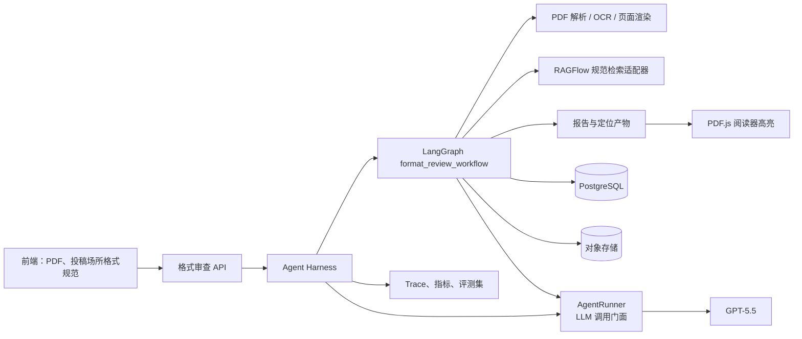
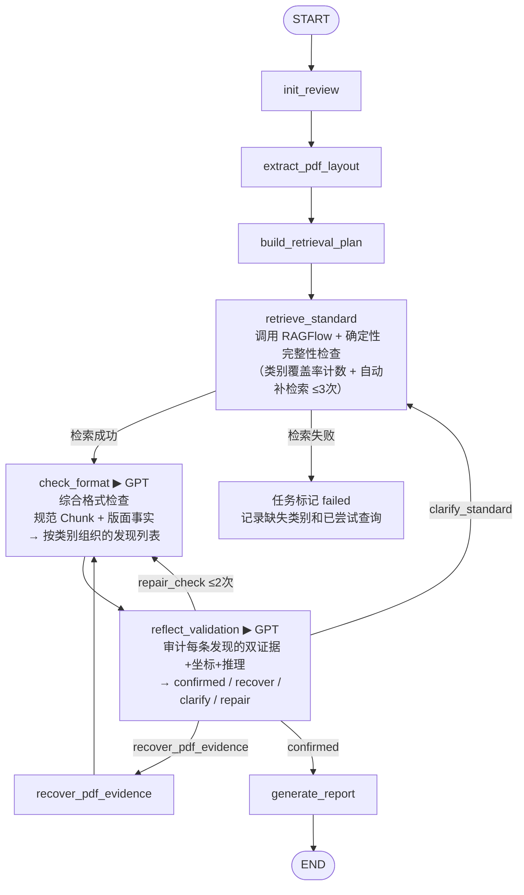
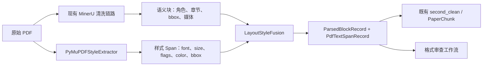
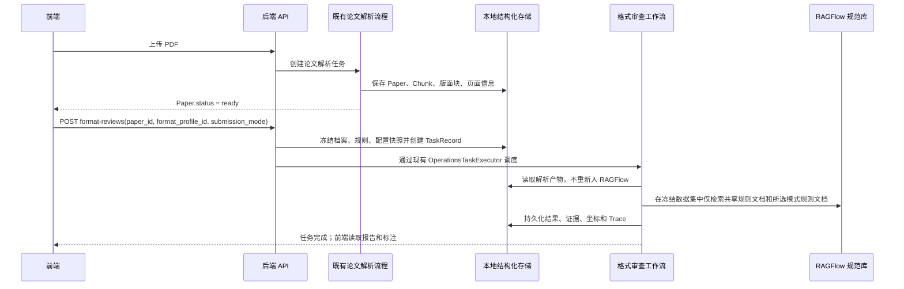

# 论文格式审查模块详细设计

| 项目 | 内容 |
| --- | --- |
| 文档版本 | V1.0 |
| 编制日期 | 2026-07-21 |
| 状态 | 设计基线 |
| 适用范围 | 科研论文智能阅读与格式审查系统 |
| 相关文档 | `docs/统一接口规范_V1.0.md`、`docs/7.18/多智能体论文问答与评审系统_详细设计文档_V1.1_实施验证修订版.md` |

## 1. 概述

### 1.1 建设目标

格式审查模块面向投稿前的论文格式自检。用户上传 PDF，并选择目标投稿场所、规范版本和投稿模式。系统从 RAGFlow 中该投稿场所和规范版本对应的数据集内，只检索通用规则文档与用户所选投稿模式规则文档中的格式规则（以结构化 Chunk 形式存储的规则条文，每条含章节来源、检索关键词和清洗后的规则原文），对论文的整体版面与格式进行综合检查，输出按类别组织的、带规范依据、页码、坐标和修改建议的综合报告。不再逐规则拆分校验——GPT-5.5 基于完整的适用规则上下文对论文做一次性综合判断。

本模块使用 GPT-5.5 执行结构识别、规则语义理解、歧义处理和反思决策；使用 PDF 解析、OCR、页面渲染等确定性工具提供字体、字号、坐标和版面事实。LangGraph 负责工作流状态、条件路由、受限回环和断点恢复；Harness 负责模型与工具调用的约束、追踪、评测和成本治理。

### 1.2 范围

纳入本期的审查范围覆盖论文的整体格式与版面：页面尺寸与页边距、标题与正文的字体字号层级、图表的编号与位置、参考文献的格式、以及投稿场所格式规范中明确规定的其他可观察版面要求。系统基于完整的投稿场所格式规范做一次性综合判断，不按规则逐条拆分。

不纳入本期的内容包括：

- 论文创新性、实验充分性、结论正确性、语言质量和其他学术内容审查。
- 从 PDF 中不可恢复的 Word 模板样式、修订记录、域代码和文件属性要求。
- 人工复核任务、人工审批流或人工改稿。证据不足时系统返回“无法可靠判断”，不以猜测替代结论。

### 1.3 约束与原则

1. 前端仅接受 PDF；后端仍须校验文件魔数、MIME 类型、大小、页数和访问权限。
2. 用户只传递 `paper_id`、`format_profile_id` 与该档案允许的 `submission_mode`；不得传递 RAGFlow 的数据集、文档或检索参数。
3. 一次审查固定一个投稿场所格式规范版本、投稿模式、规则文档组合、模型版本和提示词版本，避免同一报告前后依据不一致。
4. 每条不合规发现必须同时具有标准证据（投稿场所格式规范原文引用）和论文证据（页码与坐标定位）；每个论文证据必须能定位到页码与坐标。
5. 数值型版式事实以解析器输出为准，GPT-5.5 不得生成或修改字体、字号、行距、坐标等事实值。
6. 所有循环均由结构化状态与上限控制，禁止通过自然语言提示词形成无界重试。

## 2. 总体架构



### 2.1 分层职责

| 层次 | 职责 | 不承担的职责 |
| --- | --- | --- |
| 前端 | PDF 上传、投稿场所选择、任务进度、报告与原文高亮展示 | 直接访问 RAGFlow、拼接模型提示词、计算格式结论 |
| API 与任务层 | 鉴权、文件校验、创建异步任务、查询/取消任务 | 编排细节和 LLM 推理 |
| AgentRunner | 接收智能体的 LLM 调用请求，统一执行 Prompt 渲染、通过 HTTP 客户端调用模型、结构化输出校验、失败重试和 Metrics 收集；不做业务决策 | 业务语义判断和 Prompt 内容生成 |
| Agent Harness | 模型与工具调用治理、追踪、限额、评测 | 业务路由、规则判断和具体的 LLM 调用执行细节 |
| LangGraph | 状态持久化、节点调度、并行校验、条件边、循环上限、恢复 | PDF 底层解析与规则数据维护 |
| 解析工具层 | 从 PDF/OCR 产生带坐标的客观事实 | 判断投稿场所格式规则适用性 |
| RAGFlow | 投稿场所格式标准的存储、切分和检索 | 用户授权、工作流路由、最终合规判定 |
| GPT-5.5 节点 | 结构归类、规则编译、反思、复杂格式判断和建议生成 | 无证据数值判断、越权访问外部系统 |

### 2.2 Harness 设计

Harness 是 LangGraph 运行时外层的受控执行环境，不是额外的业务智能体。其最小能力如下：

| 能力 | 设计要求 |
| --- | --- |
| 工具网关 | 只暴露 `parse_pdf_layout`、`render_pages`、`run_ocr`、`search_standard`、`get_standard_parent`、`create_annotations` 等允许工具；工具调用参数按 Pydantic/JSON Schema 校验。 |
| 模型配置与调用治理 | 冻结 GPT-5.5 的模型、温度、最大输出、结构化输出 Schema 和调用预算；由 AgentRunner 按该配置发起调用，并记录模型与提示词版本。 |
| 上下文装配 | 为每次 `check_format` 冻结输入 token 预算和选择策略：纳入目标类别的完整规范规则、对应的解析事实和双证据锚点，禁止将整篇 PDF 或不相关投稿场所格式规范无差别塞入上下文。超出预算时不得静默截断规则或事实；只能按互不重叠的规则类别分批检查，或将无法完整装配的类别标记为 `unverifiable`。 |
| 循环治理 | 按节点类型维护次数、超时、令牌预算和成本预算；超限后走确定的降级路径。 |
| 可观测性 | 为每次节点执行记录 `workflow_run_id`、输入摘要、工具调用、输出摘要、路由决定、耗时、令牌和异常。 |
| 质量控制 | 在离线评测集上执行回归；生产环境保存抽样结果和用户反馈，不将用户 PDF 用于未授权训练。 |

### 2.3 AgentRunner 调用门面

AgentRunner 是智能体与 LLM 之间的统一调用门面，负责单次模型调用的机械生命周期，不做业务决策。每个需要调用 GPT-5.5 的智能体通过 AgentRunner 发起请求，而不是直接持有 `StructuredLlm` 实例。

**职责（仅机械层）：** 接收智能体的调用请求 → 渲染指定版本的 `Prompt` 模板 → 通过 `OpenAICompatibleClient` 发起调用 → 校验结构化输出 Schema → 失败时执行修复重试 → 收集 Metrics → 返回 `tuple[TModel, ModelCallMetrics]`。不参与任何语义层处理：不将模型输出转换为 `AgentResult`、不提取 `Claim`、不计算置信度、不拼接证据列表——这些都是智能体的职责。

**不承担的职责：** 不决定调用哪个模型（由 Harness 提供配置快照）、不判断何时该调用（由智能体和 LangGraph 节点控制）、不修改 Prompt 内容（由智能体和 Prompt 模板决定）。

| 维度 | 设计 |
| --- | --- |
| 输入 | `prompt_name`、模板变量字典、Pydantic 输出 Schema |
| 模型配置来源 | Harness 提供的 `ModelConfigSnapshot`（模型名、温度、最大 token、超时） |
| 失败处理 | 结构化输出校验失败 → 一次修复重试（含 Schema 提示词）；HTTP 级重试由 `OpenAICompatibleClient` 内部完成 |
| 日志与追踪 | 每次调用自动记录延迟、token 用量、重试次数；异常由 Harness 的 `TraceRecord` 统一持久化 |
| 输出 | `tuple[TModel, ModelCallMetrics]`：原始结构化输出 + 调用指标；不做任何语义转换，不生成 `AgentResult`、不提取 `Claim`、不计算置信度 |
| 特殊模式 | 支持流式输出（`invoke_structured_stream`），智能体可传入 `on_content` 回调 |

AgentRunner 与 Harness 的分工：

|      | AgentRunner | Agent Harness |
| --- | --- | --- |
| 管理层级 | 单次 LLM 调用的生命周期 | 整个工作流的 LLM 使用治理 |
| 关注点 | 渲染 → 调用 → 校验 → 重试 → Metrics | 模型配置快照、工具网关、循环上限、token 预算、Trace |
| 调 LLM | 通过 HTTP 客户端发起单次受控调用 | 不直接发起调用，只提供配置与治理约束 |

**机械层与语义层的边界：** AgentRunner 管"调得对不对"——模型是否正常返回、Schema 是否校验通过、消耗了多少 token。智能体管"结果是什么意思"——输出里的哪些字段是 Claim、如何计算置信度、如何组装 `AgentResult`。AgentRunner 的返回值是 `tuple[TModel, ModelCallMetrics]`，不做 domain 转换。

**可行性确认：** AgentRunner 在两个模块中均可行且有明确收益。

- **论文阅读模块：** 现有代码中 `ControllerAgent`、`PaperUnderstandingAgent`、`ReviewAgentA`、`ReviewAgentB` 各自重复相同的 Prompt 渲染 + LLM 调用 + 异常处理模式。改进方案中的 `IntentRouterAgent` 和 `AnswerGeneratorAgent` 同样需要这些逻辑。AgentRunner 将四份（未来六份）重复代码收拢为一处，横切关注点（重试策略、Metrics 收集、流式输出）只需维护一份。
- **格式审查模块：** 当前 `format_review.py` 的 `_review_with_model` 使用手工构造 `ChatMessage` + 直接调用 `OpenAICompatibleClient`——没有 Schema 修复重试、没有统一 Metrics、没有流式支持。新设计中，`retrieve_standard` 是确定性工具节点，不调用 LLM；`check_format` 与 `reflect_validation` 若各写一套 LLM 调用逻辑，维护负担会随节点扩展而增加。AgentRunner 让这些模型节点只需声明“用什么 Prompt、输出什么 Schema”，调用生命周期自动管理。

两个模块共享同一个 AgentRunner 实例，模型配置由 Harness 统一注入。AgentRunner 不增加额外的 LLM 调用次数，也不改变现有智能体的业务语义——仅是消除了机械层代码的重复。

所有需要调用 GPT-5.5 的智能体（`IntentRouterAgent`、`PaperUnderstandingAgent`、`AnswerGeneratorAgent`，以及格式审查的格式检查、校验反思节点）均通过 AgentRunner 发起请求，不再各自持有 LLM 客户端引用。

## 3. 投稿场所格式规范与规则模型

### 3.1 格式规范档案

系统以 `format_profile` 表示用户可选择的投稿场所格式规范，不向前端暴露 RAGFlow 内部 ID。一个档案固定对应一个投稿场所和规范版本；用户在创建审查时另行选择该规范支持的投稿模式，例如匿名初稿或终稿。

**数据隔离：** 每个 `venue_id + format_version` 组合映射一个独立的 RAGFlow `dataset_id`。同一数据集不得混入其他投稿场所或规范版本的规则；规范更新创建新的版本和数据集，不在既有数据集中混存。数据集内部将通用规则与各投稿模式的规则分为服务端受控的规范文档。每个 `submission_mode` 映射到一个模式专用文档，通用规则映射到共享文档；检索时只读取“共享文档 + 用户选定模式文档”，避免匿名初稿和终稿的冲突规则同时进入判断上下文。

**前端交互：** 用户在上传 PDF 后，从可用投稿场所格式规范列表中选择目标投稿场所、规范版本和投稿模式（如“ICML 2026 / initial_submission”）。前端发送 `POST /format-reviews` 时携带 `format_profile_id` 与 `submission_mode`，后端校验该模式属于档案允许范围、冻结配置快照并映射到对应的 RAGFlow 数据集和服务端文档集合。用户不接触 RAGFlow 内部 ID、文档 ID 和检索参数。

```text
format_profile
  ├─ profile_id: venue-a-2026
  ├─ venue_id: venue-a
  ├─ format_version: 2026-07
  ├─ dataset_id: 服务端维护的 RAGFlow 独立数据集
  ├─ allowed_submission_modes: initial_submission, camera_ready
  ├─ shared_document_id: 服务端维护的通用规则文档
  ├─ mode_document_mapping: 服务端维护的投稿模式规则文档映射
  ├─ enabled: true
  └─ rule_categories: page, title, abstract, body, heading, figure, table, formula, reference
```

规范源 JSONL 的每条规则必须带有 `venue_id`、`format_version`、`submission_mode`、`target_document`、`canonical_rule_id`、`rule_category`、`source_document_id`、`section_path`、`effective_from`、`status`。其中前两项是数据集范围不变量；`submission_mode` 取 `shared` 或一个具体投稿模式，`target_document` 指出规则导入的共享或模式专用文档；`canonical_rule_id` 用于把多个规则片段还原为同一条规范规则。当前 RAGFlow Chunk 接口不保存任意自定义 Chunk 元数据，因此这些字段须同时写入系统侧版本化规则清单；RAGFlow 文档只保存 `venue_id`、`format_version`、`submission_mode` 和 `rule_scope` 等文档级元数据。规范入库时必须校验规则清单，并在审查快照中冻结该清单版本。检索适配器仅查询当前档案的 `dataset_id`，以冻结的共享文档 ID 和所选模式文档 ID 作为硬过滤条件；它依据返回的 `document_id` 和系统侧规则清单校验范围与完整性。

### 3.2 综合格式检查

系统不做逐规则拆分。`retrieve_standard` 节点完成检索和确定性完整性检查后，检索到的规范 Chunk 集合（含章节结构和规则原文）与论文版面事实一同送入 `check_format` 节点。GPT-5.5 基于检索到的规范 Chunk 集合，对论文做一次性综合格式判断，输出按类别组织的发现列表。

综合检查的优势：

- **上下文完整：** GPT-5.5 在判断"一级标题字号是否合规"时，同时能看到规范对二级标题、正文、图表题注的字号要求，避免孤立规则导致的矛盾判断。
- **跨区域关联：** 例如规范要求"图表题注字号比正文小一号"——这种跨元素的关联规则在逐条检查中难以表达，在综合检查中自然成立。
- **规则可追溯：** 模型在完整的适用规则集合内判断检查重点；系统侧规则清单负责证明该集合是否完整，避免把“未召回”误当成“没有规则”。

RAGFlow 中每个 Chunk 包含章节引用、检索关键词和清洗后的规则原文（如“The paper title should be set in 14 point bold type”），不是完整的 LaTeX 模板文档。

GPT-5.5 的判断仍受硬约束：数值事实（字体、字号、坐标）来自解析器，GPT 不得编造或修改；每个不合规发现必须同时引用标准证据和论文证据；无法可靠判断的方面标记为 `unverifiable`。

## 4. LangGraph 工作流设计

### 4.1 状态定义

`FormatReviewState` 是工作流唯一的跨节点协议。大对象保存到对象存储，状态只保存 URI、摘要、ID 和必要的结构化事实。

```json
{
  "task_id": "task-uuid",
  "format_review_id": "review-uuid",
  "paper_id": "paper-uuid",
  "profile_snapshot": {
    "profile_id": "venue-a-2026",
    "venue_id": "venue-a",
    "format_version": "2026-07",
    "submission_mode": "initial_submission",
    "shared_document_id": "ragflow-shared-document-id",
    "mode_document_id": "ragflow-selected-mode-document-id",
    "rule_manifest_version": "mode_split_v1"
  },
  "document": {
    "source_kind": "native_pdf",
    "layout_uri": "object://review/layout.json",
    "page_image_uris": [],
    "quality": { "text_confidence": 0.99, "layout_confidence": 0.97 }
  },
  "retrieval_plan": { "attempt": 0, "dataset_id": "", "document_ids": [], "submission_mode": "", "target_categories": [], "queries": [] },
  "retrieved_sources": [],
  "coverage_report": { "covered": [], "missing": [], "attempt": 0 },
  "check_candidates": [],
  "confirmed_findings": [],
  "unverifiable_aspects": [],
  "counters": { "standard_retrieval": 0, "pdf_evidence_recovery": 0, "validation_repair": 0 },
  "run_events": []
}
```

### 4.2 节点与条件边



| 节点 | 输入 | 输出 | 关键约束 |
| --- | --- | --- | --- |
| `init_review` | `paper_id`、`format_profile_id`、`submission_mode` | 冻结的规范/配置快照 | 验证论文归属、档案启用状态、投稿模式属于档案允许范围、文件为 PDF。 |
| `extract_pdf_layout` | PDF URI | 页面、文本块、字体、字号、坐标、结构候选 | 原生 PDF 优先解析；扫描页转 OCR 分支。 |
| `build_retrieval_plan` | 规范档案、投稿模式与待审查类别 | 首轮检索计划（含已冻结的 `dataset_id`、共享/模式专用 `document_ids`、投稿模式、查询语句和目标类别列表） | 见第 5 节检索计划示例。 |
| `retrieve_standard` | 检索计划 | 规范 Chunk 集合、由规则清单解析出的规则 ID、覆盖率报告 | 调用 RAGFlow API；以冻结的 `document_ids` 限定检索范围，并由系统侧规则清单做确定性覆盖检查。覆盖不足则自动补检索（最多 3 次）；不调用 GPT 做反思。 |
| `check_format` | 规范 Chunk 集合（含章节来源和规则原文） + 论文版面事实 | 按类别组织的格式发现列表（含合规/不合规/无法判定） | 数值事实必须引用解析块 ID；GPT 不得自行填入或修改数值；每个不合规发现必须有双证据。 |
| `reflect_validation` | 候选发现、双证据 | 确认结果或回退命令 | 审计证据完整性与定位；不重复检查投稿场所和规范版本归属（由独立数据集保证），并确认引用规则适用于已冻结的投稿模式。 |
| `generate_report` | 确认发现与不可判定项 | 报告、标注 JSON、摘要 | 只输出有证据的发现。 |

## 5. 规范检索与完整性检查

### 5.1 设计目的

每个投稿场所和规范版本组合均存储在 RAGFlow 的独立数据集中。检索计划仅查询档案映射的 `dataset_id`；该数据集已承担投稿场所和版本的范围隔离。用户选定投稿模式后，服务端确定共享规则文档与该模式专用规则文档，并将这两个冻结的 `document_ids` 传给 RAGFlow 作为硬过滤条件；关键词只在该范围内召回相关规则，不能承担投稿模式隔离。`retrieve_standard` 节点以返回 Chunk 的 `document_id` 校验范围，再通过系统侧版本化规则清单解析规则类别和 `canonical_rule_id`，与目标类别列表对比。覆盖不足的类别自动触发补检索（最多 3 次），达到上限后未覆盖的类别标记为 `unverifiable`。整个过程中不调用 GPT 做反思判断。

### 5.2 检索计划示例

以 ICML 2026 匿名初稿为例，`build_retrieval_plan` 生成的检索计划：

```json
{
  "attempt": 1,
  "target_categories": ["page", "title", "author", "abstract", "heading", "body", "figure", "table", "formula", "reference"],
  "queries": [
    "ICML 2026 匿名初稿格式 页边距 页面尺寸 页码",
    "ICML 2026 匿名初稿 标题字号 作者匿名 摘要格式",
    "ICML 2026 章节标题 正文格式 字体 字号 段落间距",
    "ICML 2026 图表 公式 题注 编号",
    "ICML 2026 参考文献 引用格式 编号"
  ],
  "dataset_id": "冻结的 ICML 2026 数据集 ID",
  "document_ids": ["冻结的共享规则文档 ID", "冻结的 initial_submission 规则文档 ID"],
  "submission_mode": "initial_submission"
}
```

每条 query 发送到 RAGFlow，仅在冻结数据集的共享规则文档和 `initial_submission` 专用规则文档中做向量检索。投稿模式由服务端映射为文档 ID，用户不能传入或修改。当前 RAGFlow 返回每条 Chunk 的内容、关键词和所属 `document_id`；系统通过 `document_id` 与冻结范围、再通过规则清单与内容标识，恢复其适用模式、章节来源和 `canonical_rule_id`。

### 5.3 完整性检查与自动补检索

`retrieve_standard` 汇总所有返回的 Chunk 后，先执行确定性类别覆盖检查：

```text
target_categories = [page, title, author, abstract, heading, body, figure, table, formula, reference]
resolved_rules = manifest.resolve(returned_chunks)  # 按文档 ID + 内容标识匹配清单
retrieved_categories = set(rule.rule_category for rule in resolved_rules)
missing = target_categories - retrieved_categories
```

若 `missing` 非空（如 `reference` 类别一个 Chunk 都没返回），自动构造定向补检索 query（如 `"ICML 2026 参考文献 格式 编号 著录 悬挂缩进"`），重试最多 3 次。仍缺失的类别写入 `coverage_report.missing`，对应格式方面在后续检查中标记 `unverifiable`。

类别存在不等于规则完整。为避免某类别只召回一条 Chunk 就被误判为“已覆盖”，还必须将返回 Chunk 的 `canonical_rule_id` 与版本化规则清单逐项比对：

```text
required_rule_ids = manifest.rule_ids(target_categories)
retrieved_rule_ids = set(rule.canonical_rule_id for rule in resolved_rules)
missing_rule_ids = required_rule_ids - retrieved_rule_ids
```

定向补检索同样适用于 `missing_rule_ids`。达到上限仍未召回的规则，必须连同所属类别写入 `coverage_report`，不得被 `check_format` 当作已覆盖规范；涉及这些规则的方面只能输出 `unverifiable`，不能输出 `compliant`。该清单只用于检索完整性和审计，不要求前端以逐规则界面展示结果。

不重复检查投稿场所和规范版本一致性——它们由独立 RAGFlow 数据集的范围不变量保证。检索必须验证返回 Chunk 的 `document_id` 属于冻结的共享/所选模式文档集合，并能由规则清单解析为有效规则；不属于该集合或无法解析的 Chunk 不得进入模型上下文。这样可在当前 RAGFlow 不支持任意 Chunk 元数据的前提下，保证投稿模式隔离、覆盖统计和审计可用。

若检索完全失败（RAGFlow 不可用或零命中），任务标记 `failed`，不以 GPT 常识替代规范依据。

### 5.4 停止与降级

`retrieval_attempt` 最大次数为 3。达到上限后，将无法覆盖的类别或规则写入 `coverage_report.missing`，后续 `check_format` 对相应方面的发现只能输出 `unverifiable`。系统不进行人工转派，也不以 GPT 常识补足规范。

## 6. PDF 解析与论文事实模型

### 6.1 混合解析策略

| PDF 类型 | 主路径 | 可判定范围 | 限制 |
| --- | --- | --- | --- |
| 原生 PDF | PDF 版面解析器提取文字、字体、字形、字号、坐标；GPT-5.5 做结构归类 | 字体、字号、边距、位置、编号、语义结构 | 导出 PDF 可能丢失 Word 样式语义 |
| 扫描 PDF | 页面渲染 + OCR + 版面检测；GPT-5.5 辅助区域语义识别 | 页面结构、可见文字、近似位置 | 真实字体、字号和行距通常不可可靠恢复 |
| 混合 PDF | 按页选择上述路径 | 逐页确定 | 报告需记录每页解析质量 |

每个可被审查的论文元素必须有稳定锚点：

```json
{
  "block_id": "p3-b17",
  "role": "heading_level_1",
  "text": "1 引言",
  "page": 3,
  "bbox": [72.0, 185.0, 286.0, 210.0],
  "font_name": "SimHei",
  "font_size_pt": 14.0,
  "alignment": "center",
  "source": "pdf_native",
  "confidence": 0.98
}
```

坐标统一使用以 PDF 左下角为原点的 point 单位；报告输出时由标注适配器转换为前端 PDF.js 所需的页面视口坐标。任何转换必须带 `page_rotation` 和 `page_box`，避免旋转页面错位。

### 6.2 AI 的职责边界

GPT-5.5 可以判定某文本块是否为一级标题、某段是否为图注、某规则是否适用于研究型论文；但不能自行填入 `font_size_pt` 或 `bbox`。当模型需要更多事实时，必须请求 `recover_pdf_evidence`，由工具返回新的块或区域证据。

### 6.3 PDF 解析器具体搭建：MinerU + PyMuPDF

PDF 解析层采用双源融合，不新建第二套 MinerU 清洗程序。



#### 6.3.1 MinerU 职责与复用产物

MinerU 是文档语义和版面区域的唯一来源，负责标题、段落、参考文献、图片、表格、公式、页眉页脚等角色识别，以及块、行、图片和表格的坐标。其 `layout.json` 的 `type`、`level`、`bbox`、`lines`、`spans`、`score` 是识别结果，不是原始 PDF 样式。

当前示例 `layout.json` 已验证能提供页面尺寸、块/行/span 坐标、文本内容、置信度和块类型；不包含 `font`、`font_size`、`flags`、`color`、行距或段落间距。因此 MinerU 不用于判定字体、字号、粗体或斜体。

#### 6.3.2 PyMuPDF 职责与抽取方式

后端新增 `PyMuPDFStyleExtractor`，依赖声明为：

```toml
"pymupdf>=1.26,<2"
```

对每页调用 `page.get_text("rawdict")`，以字符级 `chars`、span、line 和 block 为基础生成 `PdfTextSpan`。需要保留的原始字段包括：

```text
page_number, page_rect, rotation,
bbox, origin, text,
font, size, flags, color,
ascender, descender, direction,
char_count, extraction_source=native_pdf
```

同时读取 `page.rect`、`page.rotation`、图片和绘制对象，以支撑页边距、页面尺寸、图文位置和旋转页坐标转换。`font` 可能是 PDF 子集字体名，例如 `ABCDEE+TimesNewRomanPSMT`，适配器需要去除子集前缀后再与投稿场所字体映射表比较；原始字体名必须保留在证据中。

PyMuPDF 能直接提供物理文本结构、字体、字号、字形标记、颜色和坐标，但不能可靠提供论文语义结构，也不直接存储行距、段前后距、对齐和页边距。这些属性由 `LayoutStyleFusion` 基于页面、行和块的几何关系推导，并把推导结果标注为 `derived`，与原生字段 `native_pdf` 区分。

#### 6.3.3 坐标标准化与融合算法

所有入库坐标统一为 `page_top_left_pt`：`[x0, y0, x1, y1]`，以页面左上角为原点，单位为 PDF point。适配器必须保存 `page_width_pt`、`page_height_pt`、`rotation` 和原始坐标系名称；不得假设 MinerU 导出坐标与 PDF 坐标必然一致。

融合以“同页 + 几何重叠 + 文本一致性”为准：

1. 先按页码筛选 PyMuPDF span。
2. 将 MinerU 块坐标转换到统一坐标系，计算与 span 的 IoU、覆盖率和水平/垂直距离。
3. 对候选 span 的规范化拼接文本与 MinerU 块文本计算一致性，避免两栏页面中仅靠几何重叠误配。
4. 使用可审计阈值选择匹配结果；存在多个接近候选时标记 `style_match_ambiguous`，不强行归属。
5. 对单一字体/字号稳定的块生成摘要；混合字体、上下标或公式块保留 span 列表，不输出虚假的“唯一字号”。

建议持久化两层数据：

| 层次 | 存储内容 | 用途 |
| --- | --- | --- |
| `ParsedBlockRecord` | MinerU 语义、块级 bbox、主导字体摘要、段落几何摘要、融合置信度 | 格式规则调度、报告和高亮定位 |
| `PdfTextSpanRecord`（新增） | 每个原生 PDF span 的字体、字号、flags、颜色、bbox、匹配的 `block_id` | 字体/字号证据、复杂块复核和可追溯性 |

扫描页或没有原生文本 span 的页面，`PyMuPDFStyleExtractor` 只保存页面信息和 `extraction_source=scanned_or_unavailable`。这类页面可继续使用 MinerU/OCR 做结构和文本识别，但所有依赖真实字体、字号、颜色或字形的规则必须输出 `unverifiable`。

#### 6.3.4 应用到格式规则的边界

| 规则类别 | 主要事实源 | 判定方式 |
| --- | --- | --- |
| 字体、字号、粗体、斜体、颜色 | PyMuPDF 原生 span | 确定性比较 |
| 页面尺寸、页边距、页码位置 | PyMuPDF 页面/文本坐标 | 确定性计算 |
| 标题层级、摘要、关键词、参考文献区域 | MinerU 语义块，必要时 GPT-5.5 | 语义/混合判断 |
| 图表、公式、题注和相对位置 | MinerU 媒体块 + PyMuPDF 坐标 | 混合判断 |
| 对齐、缩进、行距、段前后距 | 融合后的块/行几何 | 几何推导；置信度不足则不可判定 |

### 6.4 现有 MinerU 清洗链路的复用边界

现有后端已经复用 `user_paper/mineru_clean.py`，不应重写。调用关系为：

```text
IngestionTaskExecutor
  -> MinerUClient.parse
  -> external_pipeline.parse_mineru_pdf
  -> user_paper.mineru_clean.MineruClient
  -> 下载 raw_mineru / *_content_list.json / full.md / layout.json
  -> user_paper.mineru_clean.build_blocks
  -> ParsedBlockRecord
  -> second_clean_adapter.build_chunks
  -> user_paper.second_clean
  -> PaperChunk
```

可直接复用的功能包括：

- `mineru_clean.build_blocks`：把 MinerU 内容清单转换为带 `block_id`、页面、`bbox`、`content_role`、章节路径、媒体关联和来源引用的标准块。
- `mineru_clean.recover_references_from_markdown`：在 MinerU 没有正确输出 `ref_text` 时补齐参考文献文本。
- `second_clean.repair_mineru_blocks`：修复误判的数字标题、恢复算法 `code_body`、补全无标签摘要和章节路径。
- `second_clean` 的分块、公式、算法、媒体和参考文献构建：继续服务论文阅读、本地检索和格式审查的语义上下文。
- `ParsedBlockRecord.bbox_json` 和 `metadata_json`：作为块级几何与融合摘要的现有持久化入口。

当前复用链路有一个需要修正的缺口：`second_clean_adapter.build_chunks` 为了无文件依赖，向 `repair_mineru_blocks` 传入了占位路径 `__api_second_clean_no_raw_mineru__`。因此依赖原始 `*_content_list.json` 的算法 `code_body` 恢复在 API 上传链路中不会生效，尽管原始 MinerU 文件已由 `external_pipeline.parse_mineru_pdf` 下载到对象存储目录。

应做以下增量改造，而不是重写清洗程序：

1. `MinerUClient.parse` 返回或记录实际 `artifact_root` 和 `raw_mineru` 路径，并将其作为受控内部产物保存。
2. `second_clean_adapter.build_chunks` 新增可选 `mineru_artifact_root` 参数；有该目录时传给 `repair_mineru_blocks`，保持现有占位路径作为历史/测试回退。
3. 在 MinerU 块已落库、进入 `second_clean` 前调用 `PyMuPDFStyleExtractor` 和 `LayoutStyleFusion`，将样式摘要写入 `ParsedBlockRecord.metadata_json`，原始 span 写入新增表。
4. `second_clean` 只继续处理语义文本、章节和 Chunk，不负责样式清洗，也不复制样式 span 到 `PaperChunk`。
5. 格式审查工作流从 `ParsedBlockRecord` 与 `PdfTextSpanRecord` 读取格式事实；阅读问答仍从 `PaperChunk` 读取语义文本，保持职责隔离。

该改造复用现有 MinerU 清洗和质量门禁，只新增样式提取/融合适配层及其数据迁移，避免出现两套 MinerU 规则逐步漂移。

## 7. 格式校验与反思 Loop

### 7.1 综合格式检查

`check_format` 节点将检索到的规范 Chunk 集合（每条含章节来源和规则原文）和论文版面事实送入 GPT-5.5，由模型基于完整上下文做综合判断。输入装配必须受 Harness 冻结的 token 预算约束：先保留目标类别的完整规范规则及其来源，再保留与这些规则相关的页面、块和 span 事实。预算不足时，按互不重叠的规则类别分批执行综合检查并合并结果；若某类别仍无法完整装配，则该类别标记为 `unverifiable`，不得通过截断后继续判定。输入包括：

- 经过确定性完整性检查的规范 Chunk 集合（每条含章节来源、检索关键词和规则原文）
- 论文版面事实：`ParsedBlockRecord` 的块级摘要（角色、文本、坐标、主导字体）、`PdfTextSpanRecord` 的字体/字号详情、页面元数据
- 本次审查的配置快照（规范版本、模型版本）

输出为按类别组织的发现列表：

```json
{
  "category": "heading",
  "findings": [
    {
      "aspect": "一级标题字号",
      "verdict": "non_compliant",
      "severity": "medium",
      "detail": "第 3 页"1 引言"字号为 14pt，不符合 16pt 要求。",
      "suggestion": "将一级标题调整为 16pt。",
      "paper_evidence": [{ "page": 3, "bbox": [72, 185, 286, 210], "block_id": "p3-b17", "quote": "1 引言" }],
      "standard_evidence": [{ "source_id": "standard-chunk-31", "quote": "一级标题采用三号黑体" }]
    }
  ]
}
```

GPT-5.5 的职责边界：
- 可以判断某文本块是否符合规范要求（语义判断）
- 可以判断某发现属于哪个类别（归类）
- 不能编造或修改数值事实（字体、字号、坐标来自解析器）
- 不能在无证据时输出不合规结论（证据不足则标记 `unverifiable`）

`compliant` 的输出门禁：只有当相关类别的规则清单已完整召回、适用规则所需的 PDF 事实达到解析质量门槛、并且结论同时保留规范和论文证据时，才允许输出 `compliant`。任一条件不满足时，输出 `unverifiable`；不得因为没有发现问题而默认输出合规。

### 7.2 校验反思与路由

`reflect_validation` 对每项候选结论执行以下门禁：规则是否适用、规则来源是否有效、论文事实是否存在、定位是否完整、结论是否由事实推导、建议是否与规则一致。

| 发现 | `decision` | LangGraph 去向 | 示例 |
| --- | --- | --- | --- |
| 解析事实缺失或坐标不可信 | `recover_pdf_evidence` | `recover_pdf_evidence -> check_format` | 标题字号存在但未得到字体嵌入信息 |
| 规则依据不足或冲突 | `clarify_standard` | `retrieve_standard` | 仅写“按目标投稿场所格式”，无具体要求 |
| 输出字段不合格、推理链断裂 | `repair_check` | `check_format` | 报告了问题但遗漏标准证据 |
| 双证据完整且定位可用 | `confirmed` | `generate_report` | 规则、事实、页码和坐标均齐全 |
| 无法从 PDF 或规范可靠得出结果 | `unverifiable` | 汇总该规则 | 扫描件无法判断实际字号 |

`pdf_evidence_recovery` 和 `validation_repair` 最大次数建议分别为 2。若仍不能满足门禁，转换为 `unverifiable`，不得保留为不合规问题。

### 7.3 问题证据闭环

一个确认问题必须满足以下链条：

```text
投稿场所格式标准来源 -> 结构化规则 -> PDF 事实 -> 页码/坐标 -> 合规结论 -> 修改建议
```

缺失任一环节时，问题不进入 `confirmed_issues`。报告中可展示“无法可靠判断”的规则及原因，但不得把它计入不合规数量。

## 8. 数据持久化与接口

### 8.1 主要实体

| 实体 | 关键字段 | 说明 |
| --- | --- | --- |
| `format_profile` | `id`、`venue_id`、`format_version`、`dataset_id`、`allowed_submission_modes`、`shared_document_id`、`mode_document_mapping`、`enabled` | 用户可见的投稿场所格式规范档案；一个投稿场所和规范版本映射一个独立数据集，档案内维护共享规则与投稿模式文档映射 |
| `format_profile_snapshot` | `review_id`、档案内容、`submission_mode`、冻结的共享/模式规则文档 ID、RAGFlow 映射、配置版本 | 一次审查的冻结依据 |
| `format_review` | `id`、`paper_id`、`status`、`summary`、`workflow_run_id` | 审查任务主记录 |
| `format_finding` | `id`、`review_id`、`category`、`aspect`、`verdict`、`severity`、`detail`、`suggestion`、`paper_evidence_json`、`standard_evidence_json` | 一条按类别组织的格式发现或不可判定项 |
| `format_evidence` | `finding_id`、`source_type`、`page`、`bbox`、`source_ref`、`quote` | 规范与论文双证据 |
| `workflow_run_event` | `run_id`、节点、输入摘要、输出摘要、路由、耗时 | Harness 与 LangGraph 审计记录 |

建议将最终结果枚举设计为 `compliant`、`non_compliant`、`not_applicable`、`unverifiable`。现有接口若仍保留 `needs_manual_check`，应仅在过渡期映射为 `unverifiable`，前端文案统一显示“无法可靠判断”，并且不得创建人工工作流。

### 8.2 对外接口

沿用现有格式审查资源边界：

| 方法 | 路径 | 说明 |
| --- | --- | --- |
| `GET` | `/api/v1/format-profiles` | 返回当前用户可选且已启用的投稿场所格式规范。 |
| `POST` | `/api/v1/format-reviews` | 提交 `paper_id`、`format_profile_id` 和 `submission_mode`，异步创建综合格式审查。用户选择投稿模式，但不接触规则文档或检索参数。 |
| `GET` | `/api/v1/format-reviews/{format_review_id}` | 查询状态、摘要、规则快照与逐项结果。 |
| `POST` | `/api/v1/format-reviews/{format_review_id}/cancel` | 请求取消未完成任务。 |
| `GET` | `/api/v1/format-reviews/{format_review_id}/events` | SSE 返回节点进度和阶段性状态，不返回原始模型提示词。 |

创建请求示例：

```json
{
  "paper_id": "paper-uuid",
  "format_profile_id": "icml-2026",
  "submission_mode": "initial_submission"
}
```

逐项结果示例：

```json
{
  "aspect": "一级标题字号",
  "result": "non_compliant",
  "severity": "medium",
  "finding": "第 3 页“1 引言”字号为 14 pt，不符合 16 pt 要求。",
  "suggestion": "将一级标题调整为 16 pt。",
  "paper_evidences": [
    { "page": 3, "bbox": [72, 185, 286, 210], "block_id": "p3-b17", "quote": "1 引言" }
  ],
  "standard_evidences": [
    { "source_id": "standard-chunk-31", "quote": "一级标题采用三号黑体" }
  ]
}
```

## 9. 前端展示设计

1. 上传界面仅允许 `.pdf`，选择目标投稿场所后即可提交综合格式审查——不展示规则选择界面。
2. 任务执行中展示阶段：文件解析、规范检索、规范确认、综合格式检查、证据核验、报告生成。
3. 报告页展示总发现数（按类别分组）、严重程度分布和无法可靠判断项。
4. 点击某条问题时，PDF.js 跳转至对应页，以 `bbox` 绘制高亮框；同页多个问题使用可区分但不过度干扰阅读的颜色。
5. 每条问题同时展示“投稿场所格式要求”“论文实际情况”“修改建议”和“证据来源”。
6. 对 `unverifiable` 项明确展示原因，例如“扫描页未包含可验证的字体信息”；不展示“请人工复核”按钮或待办。

## 10. 异常与降级

| 场景 | 系统行为 |
| --- | --- |
| 非 PDF、加密 PDF、损坏文件 | 创建失败或任务失败，返回明确错误码；不调用模型。 |
| 原生解析失败 | 进入页面渲染与 OCR；记录降级原因。 |
| OCR 低置信度 | 可检查高置信度结构；字体、字号等无法验证项输出 `unverifiable`。 |
| RAGFlow 不可用 | 重试受限次数；失败后任务标记 `failed`，不以模型记忆替代投稿场所格式规范。 |
| 规范版本缺失或冲突 | 仅输出可确认部分，并记录不可判定规则；若无任何可执行规则则任务失败并说明原因。 |
| GPT-5.5 超时或输出不符合 Schema | Harness 进行一次同节点修复重试；仍失败则按节点性质失败或降级。 |
| 超过循环上限/预算 | 终止对应回环，将未解决项目标为 `unverifiable`，输出已有确认结果。 |
| 用户取消 | LangGraph 在节点边界检查取消标记；停止后续工具与模型调用并保留已完成审计记录。 |

## 11. 安全、隐私与可观测性

- 权限校验必须发生在读取 PDF、创建审查和下载报告前；`paper_id` 不得越权访问。
- PDF、页面图像、解析产物和报告使用用户/租户隔离的对象存储前缀，采用短期签名 URL 提供预览。
- 日志不记录完整论文正文、访问令牌或模型密钥；Trace 使用内容摘要、块 ID 和脱敏引用。
- RAGFlow 检索适配器在服务端固定数据集映射，防止用户构造参数读取其他投稿场所格式规范数据集。
- 监控指标至少包括：任务成功率、节点耗时、RAG 命中率、检索回环次数、不可判定率、误报反馈率、每篇论文令牌/工具成本和坐标标注成功率。

## 12. 测试与验收

### 12.1 测试集

建立按投稿场所、投稿模式、规范版本和规则类别分层的黄金数据集。每份样本应包含原 PDF、目标投稿场所、投稿模式、规范版本、规则快照、期望结论、页码、坐标和证据来源。数据集至少覆盖：原生 PDF、扫描 PDF、多栏论文、旋转页面、跨页表格、中文/英文参考文献、正确样本和每类典型错误样本。

### 12.2 验收条件

| 维度 | 验收要求 |
| --- | --- |
| 范围隔离 | 选择投稿场所 A 的某规范版本和投稿模式时，报告不得引用其他投稿场所/版本的数据集或其他模式的规则文档。 |
| 证据完整性 | 100% 的 `non_compliant` 结果同时带有至少一条标准证据和带页码坐标的论文证据。 |
| 规则召回完整性 | 黄金集中的每个目标类别均以版本化规则清单为准计算 `canonical_rule_id` 召回率；缺失规则的类别不得输出 `compliant`。 |
| 上下文完整性 | 每次模型调用记录输入 token 预算、纳入和未纳入的规则/事实 ID；不得发生静默截断。超预算类别必须分批检查或输出 `unverifiable`。 |
| 定位可用性 | 评测样本中，前端高亮框应覆盖对应原文区域；旋转页面不得产生系统性偏移。 |
| 反思回环 | 缺失规则时能生成结构化检索修正并回到检索节点；达到上限后不发生无限循环。 |
| 不确定性 | 扫描 PDF 中无法获取的字体/字号不得被判为合规或不合规。 |
| 可追溯性 | 给定 `format_review_id` 可还原规则快照、RAG 来源、节点路由和模型/提示词版本。 |
| 无人工流 | 所有任务均以成功、失败、取消或带 `unverifiable` 的成功终止，不生成待人工处理记录。 |

## 13. 实施顺序

1. 完成 `format_profile`、RAGFlow 元数据和规范版本快照能力，先确保检索范围正确。
2. 建立 PDF 版面事实模型和对象存储产物，完成坐标到 PDF.js 标注的端到端验证。
3. 实现 LangGraph 的首轮检索、受限补检索回环和综合格式检查节点。
4. 实现校验反思回环、不可判定状态、报告持久化与前端展示。
5. 接入 Harness 的 Schema 校验、Trace、限额和离线评测，基于黄金集调优提示词与检索策略。

## 14. 关键决策摘要

- PDF 解析采用“工具提取客观事实 + GPT-5.5 理解结构”的混合方式，不能只依赖大模型直接读 PDF。
- RAGFlow 通过 `format_profile -> dataset_id` 的独立数据集映射提供范围隔离的格式规范标准（结构化 Chunk，每条含章节来源和规则原文），作为 GPT-5.5 综合格式检查的唯一规范依据。不做逐规则拆分。
- 反思节点通过 `decision` 和结构化修正包驱动 LangGraph 条件回边，所有 Loop 均有次数和预算上限。
- 没有人工复核流程；不确定性通过 `unverifiable` 显式输出，而不是模型猜测。
- “规则来源 + PDF 事实 + 页码坐标”是最终问题的最小证据闭环。

## 15. 与现有工作流程的合并设计

### 15.1 现有基线与差距

当前系统已经存在格式审查的业务入口和持久化边界，不能另起一套上传、鉴权或任务机制。现有链路为：

```text
ReviewPage.vue
  -> POST /api/v1/format-reviews
  -> TaskRecord(task_type=format_review)
  -> OperationsTaskExecutor._format_review
  -> workers/format_review.execute_format_review
  -> RAGFlow 单次检索 + 单次模型审查
  -> FormatReview / FormatReviewItem
```

现有 `backend/app/workers/format_review.py` 已完成以下基础能力：冻结 `FormatProfile` 快照、验证论文 `ready` 状态、限定 RAGFlow 数据集、保存规则级论文/规范证据以及通过 `TaskRecord` 报告异步状态。它不应被删除。

当前实现与目标架构的差距如下：

| 能力 | 当前实现 | 合并后的目标 |
| --- | --- | --- |
| 编排 | `execute_format_review` 顺序执行 | 独立的 `format_review_workflow` LangGraph 状态图 |
| 规范检索 | 一次查询聚合所有规则内容 | 类别化检索、规范反思、结构化回退重检索；检索结果直接作为综合检查的规范上下文 |
| 校验方式 | 档案中维护简要规则，模型直接按规则判断 | RAG 检索格式规范标准（结构化 Chunk），GPT-5.5 做综合格式检查 |
| 论文证据 | `PaperChunk` 的文本与页码 | 复用 Chunk，并补充 `ParsedBlockRecord`/版面产物的字体、字号、`bbox`、旋转信息 |
| 校验方式 | 单次 LLM 输出，按规则逐条判断 | GPT-5.5 基于检索到的规范片段集合做综合检查，加校验反思回环 |
| 不确定性 | `needs_manual_check` | `unverifiable`，明确原因且不创建人工流程 |
| 前端 | 轮询任务，展示页码与文本证据 | 保持轮询兼容；增加 SSE 可选进度和 PDF.js 坐标高亮 |
| 审计 | 任务状态、指标与基础证据 | 复用 `TraceRecord`，补充节点路由、回环、规则快照和标注产物追踪 |

### 15.2 合并原则

1. 格式审查保持独立任务类型 `format_review`，不进入问答会话，也不由问答意图路由触发。
2. 不把格式图硬塞进现有阅读问答图 `app/ai/graph/builder.py`。阅读图以 `ReviewGraphState`、`StartQaWorkflowCommand` 和会话消息为核心，格式图以论文、投稿场所格式规范档案、规则和版面事实为核心；两者状态语义不同。
3. 两张图复用相同的 AgentRunner 和 Harness 基础能力：AgentRunner（Prompt 渲染、LLM 调用、Schema 校验、重试、Metrics）、：`OpenAICompatibleClient`、结构化 Schema、`workflow_checkpointer`、Redis 取消标记、`TraceRecord`、任务状态和配置快照。
4. 格式审查只消费论文解析流水线已生成的本地结构化产物，绝不将用户论文导入 RAGFlow；RAGFlow 仅检索投稿场所格式规范。
5. API 资源路径、`TaskRecord`、`FormatReview`、`FormatReviewItem` 和前端路由继续保留，通过增量迁移扩展字段，避免破坏已有调用方。

### 15.3 目标组件落位

| 现有位置 | 合并后职责 | 变更方式 |
| --- | --- | --- |
| `backend/app/api/routes.py` | 创建审查、冻结扩展快照、查询报告、取消审查 | 保留现有路由；补充工作流版本、标注数据和 `unverifiable` 序列化。 |
| `backend/app/workers/operations.py` | `format_review` 后台任务分发与统一失败处理 | 保留 `OperationsTaskExecutor._format_review`；由其调用新的工作流执行器。 |
| `backend/app/workers/format_review.py` | 兼容入口、任务加载与最终持久化适配 | 将单次 `_retrieve_profile_standards` / `_review_with_model` 拆为图节点或委托给图服务。 |
| `backend/app/ai/graph/` | 现有阅读问答图 | 不改动阅读节点语义；抽取通用 Harness/Trace 接口供格式图复用。 |
| `backend/app/format_review/graph/` | 新增格式审查图、状态、节点、策略和 Schema | 新建独立包，避免与会话问答状态耦合。 |
| `backend/app/runtime/checkpoints.py` | LangGraph 持久化检查点 | 两个图共用同一检查点工厂，以不同 `thread_id` 命名空间隔离。 |
| `backend/app/workers/ingestion.py` 与解析适配器 | 产生论文结构化产物 | 以增量方式保存可用于审查的版面块和页面元数据。 |
| `frontend/src/pages/ReviewPage.vue` | 规则选择、任务展示、报告查看 | 保留现有页面和轮询；新增 PDF 预览/标注组件与“无法可靠判断”文案。 |

建议新增的后端包结构如下：

```text
backend/app/format_review/
  __init__.py
  service.py                 # 构造并运行 FormatReviewWorkflowService
  schemas.py                 # FormatReviewState、Finding、Correction
  graph/
    builder.py               # build_format_review_graph
    nodes.py                 # 每个节点只做一个业务动作
    policies.py              # 回环上限、超时、并发和预算
  ports.py                   # PDF、OCR、RAGFlow、仓储、标注接口
  adapters.py                # 现有 SQLAlchemy/Redis/RAGFlow/PDF 工具的适配
  validators.py              # 证据闭环和输出 Schema 门禁
```

### 15.4 与论文上传和解析流程的衔接

格式审查不创建第二份论文，也不重新上传文件。用户先通过现有论文上传流程创建 `Paper`，在其状态为 `ready` 后，才允许通过格式审查页面创建任务。



当前格式审查从 `PaperChunk` 读取文本和页码。为支持精确版式检查与原文定位，既有解析流程必须新增或保证以下产物在 `Paper.status=ready` 前可用：

| 产物 | 最小字段 | 用途 |
| --- | --- | --- |
| 页面元数据 | `page_number`、`width_pt`、`height_pt`、`rotation`、`crop_box` | 边距计算和坐标转换 |
| 版面块 | `block_id`、`page`、`bbox`、`text`、`role`、`confidence` | 原文高亮和结构识别 |
| 字体事实 | `block_id`、`font_name`、`font_size_pt`、`font_flags` | 字体、字号、粗体等确定性规则 |
| 段落事实 | `block_id`、对齐、缩进、行距、前后间距 | 段落和标题格式检查 |
| 解析质量 | 页面/块级来源、置信度、OCR 标记 | 决定能否可靠判定 |

建议优先将上述信息加入已有 `ParsedBlockRecord` 的结构化载荷或新建与其一对一关联的 `paper_layout_blocks` 表；不要把这些字段塞进 `PaperChunk.content`。`PaperChunk` 继续服务论文阅读和 RAG 上下文，版面块服务格式审查和 PDF 标注，两者通过 `block_id` / `source_ref` 关联。

### 15.5 新格式图的构建方式

格式图沿用现有 `StateGraph`、`workflow_checkpointer` 和条件边方式，但建立独立状态和节点实现。图构建的逻辑等价于以下伪代码：

```python
graph = StateGraph(FormatReviewState)
graph.add_node("init_review", nodes.init_review)
graph.add_node("extract_pdf_layout", nodes.extract_pdf_layout)
graph.add_node("build_retrieval_plan", nodes.build_retrieval_plan)
graph.add_node("retrieve_standard", nodes.retrieve_standard)

graph.add_node("check_format", nodes.check_format)
graph.add_node("reflect_validation", nodes.reflect_validation)
graph.add_node("recover_pdf_evidence", nodes.recover_pdf_evidence)
graph.add_node("generate_report", nodes.generate_report)

graph.add_edge(START, "init_review")
graph.add_edge("init_review", "extract_pdf_layout")
graph.add_edge("extract_pdf_layout", "build_retrieval_plan")
graph.add_edge("build_retrieval_plan", "retrieve_standard")
graph.add_edge("retrieve_standard", "check_format")
graph.add_edge("check_format", "reflect_validation")
graph.add_conditional_edges("reflect_validation", route_validation, {
    "recover_pdf_evidence": "recover_pdf_evidence",
    "clarify_standard": "retrieve_standard",
    "repair_check": "check_format",
    "confirmed": "generate_report",
})
graph.add_edge("recover_pdf_evidence", "check_format")
graph.add_edge("generate_report", END)
```

`check_format` 节点单次调用 GPT-5.5 完成综合格式检查，返回按类别组织的发现列表。`route_standard` 和 `route_validation` 只读取枚举值与计数器，不通过模型自由文本判断路由。

### 15.6 任务、检查点和取消的合并约定

1. `POST /format-reviews` 保持现有的幂等键语义，创建 `FormatReview`、`TaskRecord` 和不可变档案快照。
2. `OperationsTaskExecutor` 仍是 `task_type=format_review` 的进程内开发执行器；生产可替换为独立 worker，但不改变任务数据模型。
3. 新图的 `thread_id` 使用 `format-review:{format_review_id}`，与阅读会话图的线程空间隔离。
4. 各节点开始与每次工具调用前检查现有 Redis 取消标记；取消后更新现有 `TaskRecord`/`FormatReview` 状态，不继续运行回环。
5. 复用现有 `TraceRecord`，但将 `message_id` 保持为空；`correlation_id` 使用创建任务时写入的值，以便和 API 请求、日志、RAG 调用关联。
6. `profile_snapshot_json` 需扩展保存 `venue_id`、`format_version`、`submission_mode`、冻结的 `dataset_id`、共享规则文档 ID、模式规则文档 ID、检索配置版本、图版本和提示词版本。投稿场所和规范版本由 `dataset_id` 保证隔离，投稿模式由冻结的文档 ID 组合保证隔离。已创建的旧快照按旧逻辑读取，避免历史报告无法访问。

### 15.7 数据与接口迁移

本次应采用前向兼容迁移：

| 对象 | 增量变更 | 兼容策略 |
| --- | --- | --- |
| `FormatProfile` | 移除逐规则配置，改为引用格式规范标准（RAGFlow 结构化 Chunk） | 历史记录继续按已有字段展示。 |
| `FormatReview.profile_snapshot_json` | 增加完整检索和运行时快照 | 历史记录继续按已有字段展示。 |
| `FormatReviewItem` | 增加 `category`、`aspect`、`evidence_status`、`annotation_json`；移除 `rule_id` | 保持 `page_numbers` 供旧前端使用。 |
| 结果枚举 | 增加 `unverifiable` | 旧客户端将其显示为“需人工核对”；新客户端显示“无法可靠判断”，不创建人工任务。 |
| `GET /format-reviews/{id}` | 逐项增加 `paper_evidences[].bbox`、解析质量、规则来源章节 | 保留原字段，新增字段可选。 |
| 任务阶段 | 增加 `extracting_layout`、`retrieving_format_rules`、`reflecting_standard`、`checking_rules`、`validating_evidence`、`generating_annotations` | 未识别阶段在旧前端按“正在审查”兜底展示。 |

对结果枚举的数据库约束必须通过新的 Alembic migration 扩展，不能仅改 Pydantic Literal 或前端常量。只有迁移完成后，`unverifiable` 才可被持久化。

### 15.8 前端合并步骤

现有 `ReviewPage.vue` 已实现论文选择、投稿场所格式规范选择和创建任务。前端改造遵循以下顺序：

1. 保留当前表单与 `workspace.pollTask`，先兼容新的阶段文案和 `unverifiable` 结果。
2. 在结果区增加“规则要求 / 论文事实 / 修改建议 / 证据来源”折叠详情，避免只展示模型生成的 `finding`。
3. 复用论文文件访问接口，在详情页嵌入 PDF.js；点击问题后使用 `page`、`bbox` 和旋转信息跳页并高亮。
4. 对无 `bbox` 的历史结果仅展示页码，不尝试推算坐标；对 `unverifiable` 项显示原因和数据质量，而不是人工核对操作。
5. 在任务轮询稳定后，可接入 `/events` SSE 实时展示图节点进度；SSE 断开时回退到已有轮询，不影响结果获取。

### 15.9 实施后替换边界

新图完成并通过黄金数据集后，`workers/format_review.execute_format_review` 应只承担加载任务、创建依赖、调用 `FormatReviewWorkflowService` 和处理终态持久化。旧的单次 `_review_with_model` 路径应保留一个版本作为可配置回退，待新图在两套投稿场所格式规范上完成覆盖率、定位准确率和成本验收后再移除。这样可以在不影响现有论文阅读、任务查询和管理规范配置的前提下，逐步切换格式审查执行内核。
