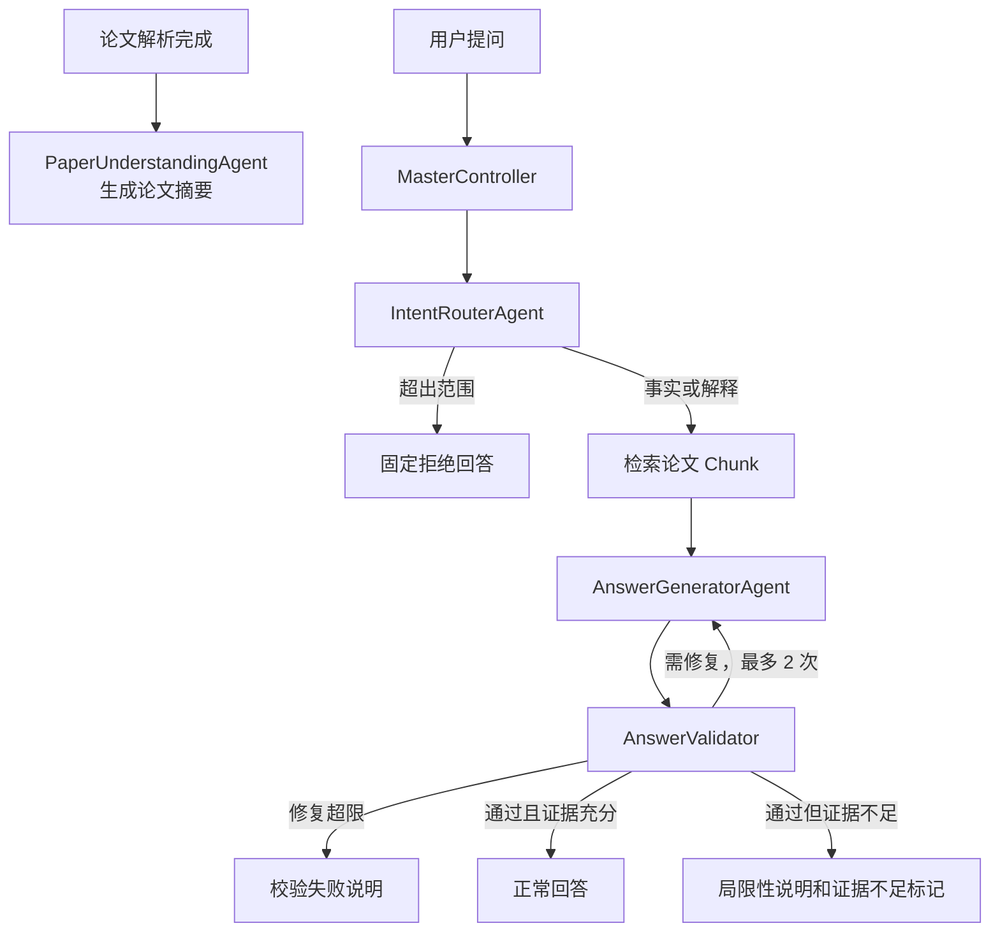
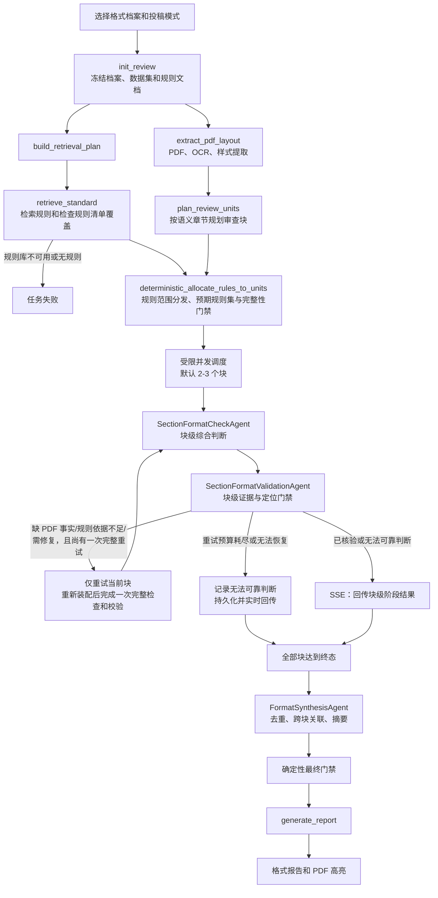

# 科研论文智能阅读与格式审查系统功能说明

| 项目 | 内容 |
| --- | --- |
| 文档版本 | V1.1（章节化异步格式审查方案） |
| 编制日期 | 2026-07-21 |
| 适用范围 | 科研论文智能阅读与格式审查系统 |
| 相关设计 | `论文问答多智能体架构改进方案_V1.0.md`、`格式审查模块详细设计_V1.0.md` |

> 实施状态：本文的格式审查章节定义已确认的 V1.1 目标行为。章节化异步调度、块级 SSE 结果和汇总智能体将在格式审查模块后续改造中实现；论文阅读功能不在本次改造范围内。

## 1. 系统目标

系统帮助用户完成两类任务：

1. 阅读和理解已上传的科研论文，并基于论文原文回答问题。
2. 按目标投稿场所的格式规范，检查论文 PDF 的可观察版式和结构要求。

系统不评价论文创新性、实验质量、结论正确性或语言质量。格式审查中的“投稿场所”同时涵盖会议、期刊和其他投稿渠道；例如 ICML 是会议，不称为期刊。

## 2. 主要功能

| 功能 | 用户操作 | 系统输出 |
| --- | --- | --- |
| 论文上传与解析 | 上传 PDF | 结构化文本、页面、块、图表和参考文献产物 |
| 论文概览 | 等待解析完成 | 论文标题、研究问题、方法、实验设置、主要发现和局限摘要 |
| 论文问答 | 选择论文并提问 | 带原文证据的事实或解释性回答 |
| 格式审查 | 选择论文、投稿场所格式档案和投稿模式 | 按论文顺序出现的已核验阶段发现，以及最终分类结论、规范依据、页码、坐标和修改建议 |
| 原文定位 | 点击回答证据或格式问题 | 跳转至对应 PDF 页面并高亮相关区域 |

## 3. 核心术语

| 术语 | 含义 |
| --- | --- |
| 投稿场所 | 论文计划投递的会议、期刊或其他发布渠道。 |
| 投稿模式 | 同一规范下的提交版本，例如匿名初稿、终稿或预印本；它决定作者信息、致谢、页眉页脚和页数等可能不同的规则。 |
| 格式档案 `format_profile` | 用户可选择的格式规范版本。 |
| 规范规则 | 投稿场所规定的具体要求，例如标题字号、页数上限或图题位置。 |
| 论文事实 | 从用户 PDF 可靠提取的字体、字号、坐标、页面尺寸、文本和结构信息。 |
| 证据闭环 | 规范规则、论文事实、页码/坐标和结论能够相互对应。 |
| 结构化规则范围 | 随格式档案版本保存的规则适用块类型、全篇/跨块属性、适用条件和所需证据类型；系统据此确定规则由哪个审查块检查。 |
| 审查块 | 由标题页、摘要、语义章节、图表/公式区域、参考文献、附录或跨章节版面要求组成的受控审查单元；不是固定 token 切片。 |
| 预期规则集 | 系统根据结构化规则范围分配给某个审查块的完整 `canonical_rule_id` 集合；缺少其中任何已适用规则时，该范围不能输出合规。 |
| 已核验阶段发现 | 某个审查块已通过证据反思门禁的结果，尚未经过全篇去重和汇总，但不是模型原始草稿。 |

## 4. 智能体与组件

### 4.1 区分标准

- **智能体**：需要理解语义并产生领域判断，例如识别问题意图、理解论文内容、判断格式规则是否适用。
- **组件**：提供编排、工具调用、确定性校验、存储或检索能力，不自主作出领域语义判断。
- **LangGraph 节点**：工作流中的一个执行步骤；节点可以是智能体，也可以只是组件调用。

### 4.2 智能体

| 工作流 | 智能体 | 职责 |
| --- | --- | --- |
| 论文问答 | `IntentRouterAgent` | 判断问题是事实、解释还是超出论文问答范围。 |
| 论文问答 | `PaperUnderstandingAgent` | 在论文解析完成后生成论文摘要。 |
| 论文问答 | `AnswerGeneratorAgent` | 基于原文证据生成回答，并判断当前证据是否充分。 |
| 格式审查 | `SectionFormatCheckAgent` | 在一个审查块的完整适用规则和局部 PDF 事实内形成候选发现。 |
| 格式审查 | `SectionFormatValidationAgent` | 对一个块的候选发现审计规则适用性、标准证据、页码坐标和建议；通过后才允许展示。 |
| 格式审查 | `FormatSynthesisAgent` | 仅基于已核验的块结果、覆盖报告和证据 ID 进行去重、跨块关联和报告摘要。 |

### 4.3 共享组件

| 组件 | 职责 |
| --- | --- |
| `MasterController` | 编排工作流、维护状态、控制重试和决定确定性路由。 |
| `AnswerValidator` | 确定性校验回答的引用、数字和证据关联。 |
| `retrieve_standard` | 在指定规则数据集中检索规范，并检查规则清单覆盖。 |
| PDF/OCR/布局工具 | 从 PDF 提取页面、字体、字号、坐标、文本和结构事实。 |
| `AgentRunner` | 渲染 Prompt、通过 HTTP 客户端调用模型、校验结构化输出、重试并记录指标。 |
| `Harness` | 冻结模型配置、控制预算、限制工具、记录追踪并执行评测。 |
| LangGraph | 调度节点、保存状态、执行条件分支和受限回环。 |
| RAGFlow | 存储和检索投稿场所格式规范。 |
| 数据库与对象存储 | 保存任务、快照、证据、报告、解析产物和审计记录。 |

## 5. 论文问答工作流

论文解析完成后，系统先生成一次论文摘要。用户提问时，系统只使用当前论文的结构化原文和摘要，不将格式规范作为问答证据。



回答中的正向事实必须引用论文证据。若系统没有足够证据，回答应说明信息局限，而不是编造论文未提供的内容。

## 6. 格式审查范围模型

格式规则不作为一套全局硬编码规则存在。系统内置的是检查能力，例如测量字号、页边距、页数和图题位置；具体“什么才合规”由用户所选格式档案中的规范数据决定。

每个格式档案固定映射到一个独立规则数据集：

```text
venue_id + format_version -> dataset_id
```

例如，ICML 2026 与 NeurIPS 2020 使用不同数据集。每个数据集内部包含一个共享规则文档及多个投稿模式规则文档。用户提交审查时传递 `paper_id`、`format_profile_id` 与 `submission_mode`；系统冻结对应的数据集、共享规则文档 ID 和所选模式规则文档 ID。检索请求以这两个冻结的文档 ID 作为硬范围，只在其内部使用关键词召回相关规则；不读取其他模式文档，也不将关键词当作模式过滤条件。

规则数据中的 `canonical_rule_id` 标识一条规范规则。它允许系统验证：某个规则类别不仅“检索到了一些内容”，而是已召回该类别应有的全部规则。

格式档案中的每条启用规则还必须保存可校验的结构化范围：`applicable_unit_kinds`、`is_global`、`requires_cross_unit`、`applicability_conditions` 与 `evidence_selector`。管理员创建、导入或启用档案时，系统校验这些字段；缺失或非法的范围配置不能用于 V1.1 格式审查。系统将字段和规则清单版本冻结在审查快照中，而不是依赖 RAGFlow 检索文本临时推断规则范围。

RAGFlow 在一次审查内按冻结档案和投稿模式检索完整适用规则集，并以 `canonical_rule_id` 确认覆盖后，系统才根据上述范围字段和 PDF 结构事实分配规则给审查块。检索可以按规则类别分批，不能按论文章节重复检索同一条规则；全篇规则只检查一次。规则分配是确定性操作，不调用 LLM。对于没有图表等条件不满足的规则，系统会保留相应 PDF 条件证据并显示为 `not_applicable`。

## 7. 格式审查内容

系统审查 PDF 中能够可靠验证的版面要求，包括：

- 页面尺寸、页边距、页码位置和页数。
- 标题、作者、摘要、关键词、正文和章节标题的结构与层级。
- 字体、字号、粗体、斜体和颜色。
- 段落对齐、缩进、行距、段前后间距。
- 图、表、公式的编号、题注、位置及相对关系。
- 参考文献区域、引用编号和著录格式。
- 规范中明确规定且能够从 PDF 可靠验证的其他排版要求，例如双栏布局、页眉页脚或匿名信息。

系统不审查论文创新性、实验质量、结论正确性、语言质量，也不判断无法从 PDF 恢复的 Word 样式、修订记录和文件属性。

## 8. 格式规则的适用与结果

一条规则不是总会被审查。系统按规则的结构化适用条件和 PDF 事实决定结果：

| 场景 | 结果 |
| --- | --- |
| 规则不属于所选格式档案 | 不进入本次审查。 |
| 规则适用条件不满足，例如论文没有图表 | `not_applicable` |
| 规则适用，但 PDF 无法可靠提供所需事实，例如扫描件无法恢复字号 | `unverifiable` |
| 规则适用，规则和 PDF 事实均完整 | `compliant` 或 `non_compliant` |

`compliant` 不能仅表示“没有发现问题”。只有规则清单已完整召回、PDF 事实达到质量门槛、并保留规范和论文双证据时，才能输出合规。任一条件不满足，输出 `unverifiable`。

## 9. 格式审查工作流



PDF 结构提取完成后，规则检索/覆盖检查与审查块规划可以并行；两者汇合后才执行确定性规则分发。因此，每个块启动前已拥有完整的预期规则集，前端与模型均不会把“检索到部分规则”误当成完整规范。`retrieve_standard`、审查块规划、规则分发、并发调度和最终门禁是确定性组件，不调用模型。模型只在块级综合判断、块级证据反思和最后的结构化汇总阶段参与。

论文在前端按从文首到文末的顺序展示，但后台块任务不必严格串行。每个块最多执行两次完整周期：首次“装配 -> 检查 -> 校验”，以及至多一次由校验触发的完整重试。恢复 PDF 事实、澄清规范依据和修复检查结果共用这一次重试预算；第二周期仍无法通过时，保留已核验发现并将未解决范围显示为 `unverifiable`。每个块完成反思校验并持久化后，系统立即发送该块的阶段发现、证据与进度；原始模型候选不会展示。全部块终态后，汇总智能体只读取已核验的结构化结果和证据 ID，不重新读取全文，也不能新增没有块级证据的发现。

## 10. 可靠性与降级原则

1. 规范规则说明“应当如何”，PDF 事实说明“论文实际如何”；两者都可靠时才可判定合规或不合规。
2. 规则类别存在不等于规则完整。系统以版本化规则清单校验 `canonical_rule_id` 召回情况。
3. 模型输入必须记录 token 预算以及纳入、未纳入的规则和事实 ID、审查块 ID 与选择理由；不得静默截断规则。
4. 超出上下文预算时，系统先按语义审查块和跨章节块分批检查；块仍无法完整装配时标为 `unverifiable`。
5. 扫描 PDF 中无法恢复真实字体、字号、颜色或字形时，相关规则必须输出 `unverifiable`。
6. 每个 `non_compliant` 结果必须同时有规范原文证据、论文事实证据、页码和坐标。
7. 格式规则库不可用或未检索到任何规则时，任务失败，不用模型常识代替规范。
8. 每个块最多允许一次完整重试；恢复证据、澄清规则和修复候选共用该预算。超过上限后以 `unverifiable` 结束受影响范围，不进行无界回环。
9. 已核验阶段发现只适用于所在块；最终全篇结论必须等待所有块的确定终态和汇总完成。
10. 阶段事件先持久化、后发送。前端在创建任务成功后立即订阅事件流，按事件 ID 或块序列号去重；断线后从上次事件位置恢复，事件流不可用时从任务与审查详情接口恢复状态。

## 11. 用户看到的结果

格式报告按类别展示：

- 论文顺序的块级进度：等待、检索规则、审查、核验证据、已完成、无法可靠判断或失败。
- 每块反思通过且已持久化后立即出现的阶段发现、规则依据、论文证据和 PDF 定位入口；无需等待全文完成。
- 审查摘要、发现数量和严重程度分布。
- 每项规则的结果、实际情况和修改建议。
- 规范依据与论文证据。
- 可点击的页码和 PDF 高亮区域。
- 无法可靠判断项及其原因。

用户看到的阶段发现已经过块级反思校验，但可能在最终汇总时与相邻块的重复发现合并。页面按论文位置固定排序，即使后面的块先完成也不会改变前面块的位置。系统不会把未核验的模型草稿、Prompt 或思维链回传前端。

问答结果展示回答、引用证据、置信度和证据不足提示。系统不会将格式审查结果混入论文问答会话。

## 12. 验收重点

系统验收至少验证：

- 投稿场所、规范版本和投稿模式之间的规则范围隔离。
- 规则清单召回完整性，缺失规则不得输出 `compliant`。
- 管理员无法创建或启用缺少结构化范围字段的档案；每条启用规则必须分配给至少一个块，或具有 PDF 条件证据的 `not_applicable` 结果。
- 全篇规则只检查一次；每个审查块以预期规则集比对实际检索到的 `canonical_rule_id` 覆盖情况。
- PDF 高亮坐标在原生 PDF、扫描 PDF、多栏和旋转页面中的可用性。
- `non_compliant` 结果的双证据完整性。
- 超预算时不存在静默截断。
- 每个块只允许首次周期和至多一次完整重试；恢复 PDF 事实、澄清规则、修复候选不得绕过共享上限。
- 所有回环都可终止，所有任务均以成功、失败、取消或带 `unverifiable` 的成功结束。
- 同一论文的块任务以 2 至 3 的受限并发执行，前端按论文位置稳定展示；`unit_validated` 仅在结果持久化并通过双证据校验后发出，SSE 断开后可从已持久化块结果恢复且不重复显示。
- 每条阶段发现均先经过块级 `SectionFormatValidationAgent`；汇总智能体不得新增无块级双证据的发现。
