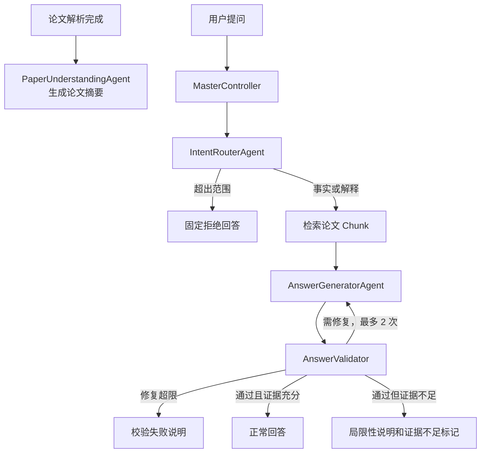
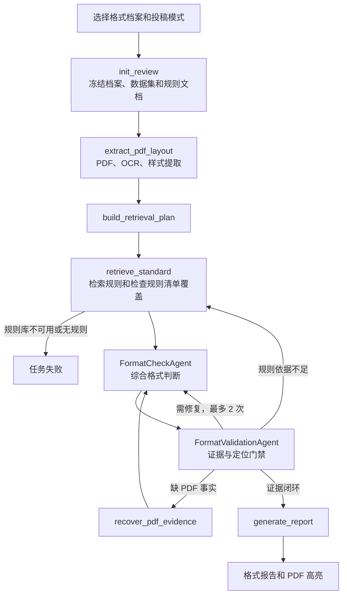

# 科研论文智能阅读与格式审查系统功能说明

| 项目 | 内容 |
| --- | --- |
| 文档版本 | V1.0 |
| 编制日期 | 2026-07-21 |
| 适用范围 | 科研论文智能阅读与格式审查系统 |
| 相关设计 | `论文问答多智能体架构改进方案_V1.0.md`、`格式审查模块详细设计_V1.0.md` |

## 1. 系统目标

系统帮助用户完成两类任务：

1. 阅读和理解已上传的科研论文，并基于论文原文回答问题。
2. 按目标投稿场所的格式规范，检查论文 PDF 的可观察版式和结构要求。

系统不评价论文创新性、实验质量、结论正确性或语言质量。格式审查中的“投稿场所”同时涵盖会议、期刊和其他投稿渠道；例如 ICML 是会议，不称为期刊。

## 2. 主要功能

| 功能 | 用户操作 | 系统输出 |
| --- | --- | --- |
| 论文上传与解析 | 上传 PDF | 结构化文本、页面、块、图表和参考文献产物 |
| 论文概览 | 等待解析完成 | 论文标题、研究问题、方法、实验设置、主要发现和局限摘要 |
| 论文问答 | 选择论文并提问 | 带原文证据的事实或解释性回答 |
| 格式审查 | 选择论文、投稿场所格式档案和投稿模式 | 分类的格式结论、规范依据、页码、坐标和修改建议 |
| 原文定位 | 点击回答证据或格式问题 | 跳转至对应 PDF 页面并高亮相关区域 |

## 3. 核心术语

| 术语 | 含义 |
| --- | --- |
| 投稿场所 | 论文计划投递的会议、期刊或其他发布渠道。 |
| 投稿模式 | 同一规范下的提交版本，例如匿名初稿、终稿或预印本；它决定作者信息、致谢、页眉页脚和页数等可能不同的规则。 |
| 格式档案 `format_profile` | 用户可选择的格式规范版本。 |
| 规范规则 | 投稿场所规定的具体要求，例如标题字号、页数上限或图题位置。 |
| 论文事实 | 从用户 PDF 可靠提取的字体、字号、坐标、页面尺寸、文本和结构信息。 |
| 证据闭环 | 规范规则、论文事实、页码/坐标和结论能够相互对应。 |

## 4. 智能体与组件

### 4.1 区分标准

- **智能体**：需要理解语义并产生领域判断，例如识别问题意图、理解论文内容、判断格式规则是否适用。
- **组件**：提供编排、工具调用、确定性校验、存储或检索能力，不自主作出领域语义判断。
- **LangGraph 节点**：工作流中的一个执行步骤；节点可以是智能体，也可以只是组件调用。

### 4.2 智能体

| 工作流 | 智能体 | 职责 |
| --- | --- | --- |
| 论文问答 | `IntentRouterAgent` | 判断问题是事实、解释还是超出论文问答范围。 |
| 论文问答 | `PaperUnderstandingAgent` | 在论文解析完成后生成论文摘要。 |
| 论文问答 | `AnswerGeneratorAgent` | 基于原文证据生成回答，并判断当前证据是否充分。 |
| 格式审查 | `FormatCheckAgent`（`check_format` 节点） | 理解规范规则和 PDF 事实，形成综合格式判断。 |
| 格式审查 | `FormatValidationAgent`（`reflect_validation` 节点） | 审计结论、证据、定位和建议是否形成闭环。 |

### 4.3 共享组件

| 组件 | 职责 |
| --- | --- |
| `MasterController` | 编排工作流、维护状态、控制重试和决定确定性路由。 |
| `AnswerValidator` | 确定性校验回答的引用、数字和证据关联。 |
| `retrieve_standard` | 在指定规则数据集中检索规范，并检查规则清单覆盖。 |
| PDF/OCR/布局工具 | 从 PDF 提取页面、字体、字号、坐标、文本和结构事实。 |
| `AgentRunner` | 渲染 Prompt、通过 HTTP 客户端调用模型、校验结构化输出、重试并记录指标。 |
| `Harness` | 冻结模型配置、控制预算、限制工具、记录追踪并执行评测。 |
| LangGraph | 调度节点、保存状态、执行条件分支和受限回环。 |
| RAGFlow | 存储和检索投稿场所格式规范。 |
| 数据库与对象存储 | 保存任务、快照、证据、报告、解析产物和审计记录。 |

## 5. 论文问答工作流

论文解析完成后，系统先生成一次论文摘要。用户提问时，系统只使用当前论文的结构化原文和摘要，不将格式规范作为问答证据。



回答中的正向事实必须引用论文证据。若系统没有足够证据，回答应说明信息局限，而不是编造论文未提供的内容。

## 6. 格式审查范围模型

格式规则不作为一套全局硬编码规则存在。系统内置的是检查能力，例如测量字号、页边距、页数和图题位置；具体“什么才合规”由用户所选格式档案中的规范数据决定。

每个格式档案固定映射到一个独立规则数据集：

```text
venue_id + format_version -> dataset_id
```

例如，ICML 2026 与 NeurIPS 2020 使用不同数据集。每个数据集内部包含一个共享规则文档及多个投稿模式规则文档。用户提交审查时传递 `paper_id`、`format_profile_id` 与 `submission_mode`；系统冻结对应的数据集、共享规则文档 ID 和所选模式规则文档 ID。检索请求以这两个冻结的文档 ID 作为硬范围，只在其内部使用关键词召回相关规则；不读取其他模式文档，也不将关键词当作模式过滤条件。

规则数据中的 `canonical_rule_id` 标识一条规范规则。它允许系统验证：某个规则类别不仅“检索到了一些内容”，而是已召回该类别应有的全部规则。

## 7. 格式审查内容

系统审查 PDF 中能够可靠验证的版面要求，包括：

- 页面尺寸、页边距、页码位置和页数。
- 标题、作者、摘要、关键词、正文和章节标题的结构与层级。
- 字体、字号、粗体、斜体和颜色。
- 段落对齐、缩进、行距、段前后间距。
- 图、表、公式的编号、题注、位置及相对关系。
- 参考文献区域、引用编号和著录格式。
- 规范中明确规定且能够从 PDF 可靠验证的其他排版要求，例如双栏布局、页眉页脚或匿名信息。

系统不审查论文创新性、实验质量、结论正确性、语言质量，也不判断无法从 PDF 恢复的 Word 样式、修订记录和文件属性。

## 8. 格式规则的适用与结果

一条规则不是总会被审查。系统按规则的结构化适用条件和 PDF 事实决定结果：

| 场景 | 结果 |
| --- | --- |
| 规则不属于所选格式档案 | 不进入本次审查。 |
| 规则适用条件不满足，例如论文没有图表 | `not_applicable` |
| 规则适用，但 PDF 无法可靠提供所需事实，例如扫描件无法恢复字号 | `unverifiable` |
| 规则适用，规则和 PDF 事实均完整 | `compliant` 或 `non_compliant` |

`compliant` 不能仅表示“没有发现问题”。只有规则清单已完整召回、PDF 事实达到质量门槛、并保留规范和论文双证据时，才能输出合规。任一条件不满足，输出 `unverifiable`。

## 9. 格式审查工作流



`retrieve_standard` 是确定性组件，不调用模型。模型只在综合判断和证据反思阶段参与。所有回环均有次数、超时和预算上限。

## 10. 可靠性与降级原则

1. 规范规则说明“应当如何”，PDF 事实说明“论文实际如何”；两者都可靠时才可判定合规或不合规。
2. 规则类别存在不等于规则完整。系统以版本化规则清单校验 `canonical_rule_id` 召回情况。
3. 模型输入必须记录 token 预算以及纳入、未纳入的规则和事实 ID；不得静默截断。
4. 超出上下文预算时，系统按互不重叠的规则类别分批检查，或将无法完整装配的类别标为 `unverifiable`。
5. 扫描 PDF 中无法恢复真实字体、字号、颜色或字形时，相关规则必须输出 `unverifiable`。
6. 每个 `non_compliant` 结果必须同时有规范原文证据、论文事实证据、页码和坐标。
7. 格式规则库不可用或未检索到任何规则时，任务失败，不用模型常识代替规范。

## 11. 用户看到的结果

格式报告按类别展示：

- 审查摘要、发现数量和严重程度分布。
- 每项规则的结果、实际情况和修改建议。
- 规范依据与论文证据。
- 可点击的页码和 PDF 高亮区域。
- 无法可靠判断项及其原因。

问答结果展示回答、引用证据、置信度和证据不足提示。系统不会将格式审查结果混入论文问答会话。

## 12. 验收重点

系统验收至少验证：

- 投稿场所、规范版本和投稿模式之间的规则范围隔离。
- 规则清单召回完整性，缺失规则不得输出 `compliant`。
- PDF 高亮坐标在原生 PDF、扫描 PDF、多栏和旋转页面中的可用性。
- `non_compliant` 结果的双证据完整性。
- 超预算时不存在静默截断。
- 所有回环都可终止，所有任务均以成功、失败、取消或带 `unverifiable` 的成功结束。
