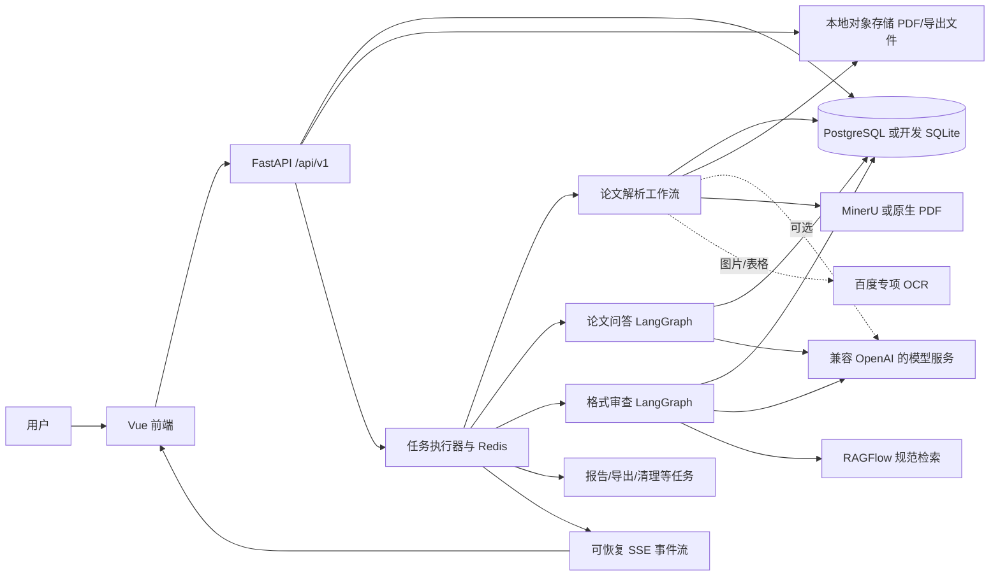
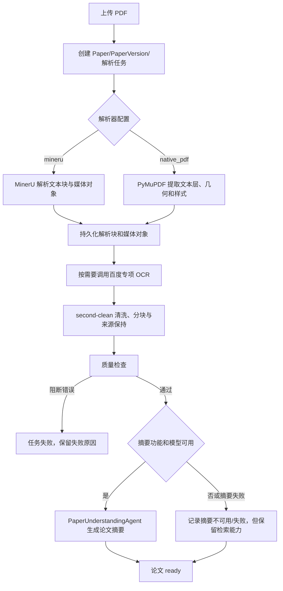
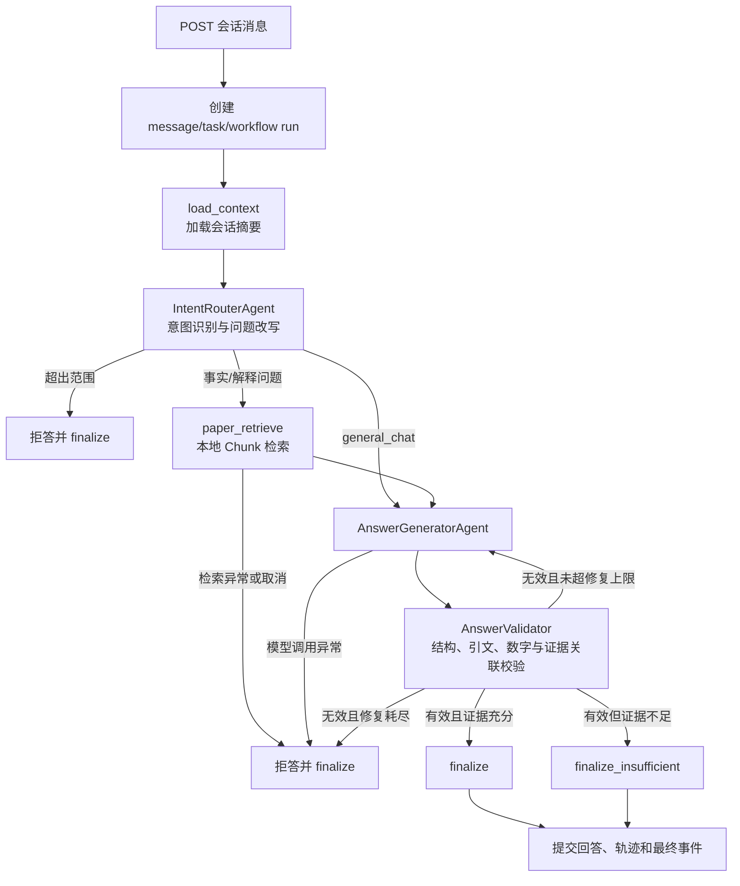
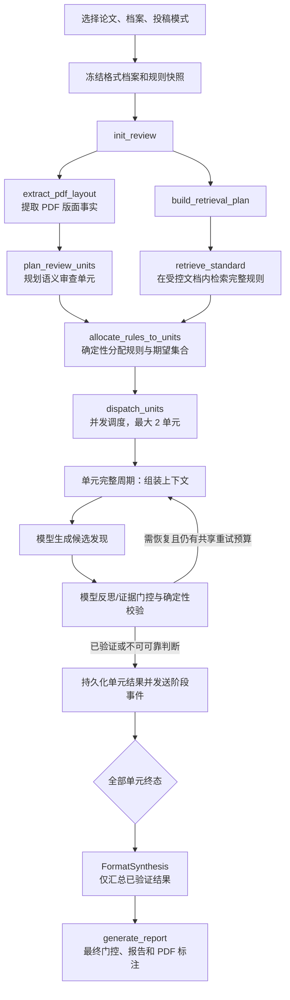

# 科研论文智能阅读与格式审查系统功能说明

| 项目 | 内容 |
| --- | --- |
| 文档版本 | V1.2（依据当前代码实现修订） |
| 编制日期 | 2026-07-24 |
| 适用范围 | 科研论文智能阅读、论文问答、专项分析、对比、阅读报告、格式审查及管理功能 |
| 代码基线 | backend/app、frontend/src、backend/migrations |

> 本文描述已由代码实现的功能和运行边界。未将尚未接入任务执行器的能力描述为可用功能；例如评测任务目前只记录为“等待数据集执行器”，不实际运行外部评测。

## 1. 系统目标与边界

系统面向科研论文 PDF，提供“可追溯阅读”和“可验证格式审查”两类服务：

1. 将用户上传的 PDF 解析为带页码、章节、内容类型和来源定位的结构化论文证据；在此基础上完成论文概览、带引文的问答、专项分析、论文对比和阅读报告。
2. 依据管理员维护的、版本化的投稿规范档案，检查 PDF 中可观察、可定位的版面与结构事实，并输出规则依据、论文证据、页码、坐标和修改建议。

系统不以模型常识替代论文原文或投稿规范。问答中的正向事实须由当前论文证据支持；格式审查中的合规或不合规结论须同时具备规范证据与论文证据。创新性、实验质量、结论正确性、语言质量、Word 样式和修订记录不属于格式审查结论范围。

## 2. 已实现的用户功能

| 功能域 | 用户操作 | 系统处理与输出 |
| --- | --- | --- |
| 账户与会话 | 注册、登录、刷新令牌、创建/重命名/删除会话 | JWT 鉴权、用户隔离的会话和消息历史 |
| 论文管理 | 上传、查看、下载、重试、删除 PDF | 校验 PDF 与大小、去重、异步解析、结构化入库、状态与进度查询 |
| 论文阅读 | 查看论文页、章节和摘要 | 展示原始 PDF、按页排序的结构化章节，以及可选的模型摘要 |
| 论文问答 | 在会话中针对论文提问 | 流式输出带证据的回答；支持一般学术问答、事实检索与解释性问题；证据不足时明确标注 |
| 专项分析 | 对已就绪论文发起指定分析 | 创建异步分析任务并复用论文证据 |
| 论文对比 | 选择多篇已就绪论文 | 创建异步对比任务，按论文证据生成比较结果 |
| 阅读报告与导出 | 选择论文、创建报告、导出 | 从本地结构化证据生成 Markdown 报告，并导出 Markdown、PDF 或 DOCX |
| 格式审查 | 选择论文、格式档案和投稿模式 | 异步生成逐规则审查报告、审查单元进度、证据双链和 PDF 高亮定位 |
| 管理功能 | 管理模型/提示词/检索配置、格式档案、知识库、运行记录和指标 | 版本化配置、受控格式规则清单、工作流轨迹和基础运营指标 |

前端采用 Vue 3、Pinia、Axios、PDF.js，提供论文、问答、格式审查、比较、报告和管理页面；开发模式另有不连接后端服务的演示账号。后端以 FastAPI 在 /api/v1 暴露接口。

## 3. 核心术语

| 术语 | 含义 |
| --- | --- |
| 论文证据 | 从用户 PDF 提取并保存的文本块、图片/表格对象、OCR 结果、PDF 原生文本跨度、页码和坐标等事实。 |
| Chunk | 可检索的论文内容单元，具有稳定 ID、页码、章节、内容类型和来源引用；是问答引用的主要证据载体。 |
| 格式档案 FormatProfile | 服务端维护的投稿规范版本，绑定场所、版本、投稿模式、RAGFlow 数据集、受控规则文档和规则清单。 |
| 规则清单 | 带 canonical_rule_id、来源、适用范围、证据选择器和状态的版本化规则集合；运行时冻结进审查快照。 |
| 审查单元 FormatReviewUnit | 按标题页、摘要、正文、图表、参考文献、附录或全局范围划分的受控审查单位，不是固定长度文本切片。 |
| 工作流状态 | LangGraph 节点之间传递的结构化状态；包含命令、证据、路由、草稿、校验结果、告警、计数器等，不向前端暴露模型思维链。 |
| 任务 | 可异步执行、可查询、可取消的持久化记录。任务状态和进度保存在数据库并镜像到 Redis。 |

## 4. 系统总体工作流



所有写操作使用幂等键；API 先创建并提交任务，再启动内存中的异步执行器。客户端可轮询任务，也可通过 SSE 获得阶段事件。任务取消标记、事件序号和有限长度事件流由 Redis 保存；数据库保存最终业务状态，因而前端可在事件流不可用时回退查询详情接口。

## 5. 论文上传、解析与入库工作流

上传接口只接受有效 PDF，限制单文件大小，按内容 SHA-256 对同一用户去重。新论文、版本和 paper_ingest 任务先持久化，随后由 IngestionTaskExecutor 执行如下流程：



清洗后的 PaperChunk、原始块、媒体、OCR、质量报告和论文版本共同构成后续问答、报告与审查的证据底座。摘要是面向导航的可选增强：摘要调用失败或被关闭不会使已通过质量检查的论文不可用，且摘要本身不能作为问答引文证据。

## 6. 论文问答工作流（当前默认 V3）

当 QA_ARCHITECTURE_V3_ENABLED=true 时，AiWorkflowService 构造 V3 图；每个请求使用 task_id 作为 LangGraph thread_id。问答只从当前用户可访问的论文 Chunk 和会话摘要取材，不读取格式审查规则作为回答证据。



AnswerValidator 不调用模型，确定性检查引用、数值与证据关系。失败后仅允许有限语义修复，策略默认最多两次；无效或取消会走受控拒答，不会无限循环。回答先通过校验并持久化，然后才发送 delta 和 final 事件。evidence_sufficient=false 的含义是“本次检索证据不足”，不等价于“论文不存在该信息”。

兼容保留的旧图由 QA_ARCHITECTURE_V3_ENABLED=false 启用，包含论文理解、双评审和综合节点；它是回滚路径，不是默认生产链路。

## 7. 格式审查工作流

格式审查是独立于问答的 FormatReviewWorkflowService 图。发起时，系统验证论文已 ready、档案已启用、投稿模式合法；将档案版本、RAGFlow 数据集、共享/模式专用规则文档、完整规则清单和运行配置冻结至 FormatReview.profile_snapshot_json。前端传入的规则筛选不会缩小实际审查范围，运行时审查冻结清单的全部可执行规则。



其中 extract_pdf_layout 对已支持场所优先使用“场所专用版面提取器 + MinerU 原始产物”；其他档案使用已保存解析块并以原生 PDF 文本跨度、对象几何和样式补足坐标。retrieve_standard 被严格限制在快照中的共享文档与当前投稿模式专用文档内，规则覆盖以 canonical_rule_id 复核，而非仅凭关键词命中。

规则分配、覆盖检查、并发调度、最终门控和报告持久化均为确定性组件。模型只参与单元的候选判断、反思和最终结构化汇总。每个单元最多两个完整周期：首次检查加最多一次由证据恢复、规则澄清或修复触发的重试；预算耗尽仍无法可靠判断时输出 unverifiable，而不是猜测。每条 non_compliant 结果必须有规范证据、论文证据、页码和可用坐标；条件不满足时标记 not_applicable。

## 8. 智能体、Harness、Loop 与 LangGraph

### 8.1 智能体

智能体是承担语义理解或领域判断的模型调用单元，不等同于任意工作流节点。当前实现的主要智能体如下：

| 智能体/角色 | 代码位置 | 在系统中的关键作用 |
| --- | --- | --- |
| IntentRouterAgent | backend/app/ai/agents/intent_router.py | 判定问答意图、是否超出范围，并产生检索用的问题表达。 |
| AnswerGeneratorAgent | backend/app/ai/agents/answer_generator.py | 基于经检索的论文证据生成结构化回答、引文和证据充分性判断。 |
| PaperUnderstandingAgent | backend/app/ai/agents/paper_understanding.py | 在上传后可选地生成论文摘要；旧架构中还参与论文理解。 |
| ReviewAgentA、ReviewAgentB | backend/app/ai/agents/review.py | 旧版可回滚图中的双评审角色，不是默认 V3 问答必经步骤。 |
| 格式审查单元模型调用 | backend/app/format_review/workflow.py、runner.py | 对一个审查单元的规则和 PDF 事实产生候选发现、反思并形成受结构约束的输出。 |
| FormatSynthesis | backend/app/format_review/workflow.py | 只汇总已验证单元结论，负责去重和跨单元关联，不应引入无单元证据的新发现。 |

MasterController 不是智能体。它明确“不自行发起模型调用”，只编排节点、超时、取消、事件、持久化与确定性分支；这使模型判断和流程控制可独立审计。

### 8.2 Harness

Harness 是围绕模型调用建立的“受控运行外壳”，用于把非确定性的模型能力置于可配置、可约束、可追踪和可恢复的系统内。当前代码没有名为 Harness 的单一类；该能力由以下部分共同实现：

| Harness 要素 | 具体实现 | 作用 |
| --- | --- | --- |
| 版本化提示词 | PromptRepository 与 backend/app/ai/prompts/ | 以名称和版本渲染提示词，避免业务代码拼接提示词。 |
| 模型调用统一入口 | AgentRunner、OpenAICompatibleClient | 调用兼容 OpenAI 的模型服务，要求 Pydantic 结构化输出，可支持流式内容。 |
| 配置快照 | snapshot_from_settings、ConfigurationSnapshot | 将模型、图、提示词、Schema 版本写入任务/审查快照，保证可追溯。 |
| 预算和超时 | WorkflowPolicy、格式审查 token 上限及上下文裁剪 | 限制上下文、模型等待、并发和重试，防止成本与延迟失控。 |
| 输出与证据门控 | AnswerValidationPipeline、格式审查 validators | 将模型草稿转换为可验证结果；不满足证据条件不作为最终结论发布。 |
| 追踪与评测入口 | TraceRecord、WorkflowRun、QaEvaluation | 记录节点耗时、状态、错误、输入/输出摘要和任务配置，支持管理员查看。 |

因此，Harness 的关键价值不在于替模型“做判断”，而在于限定模型可以看到什么、必须返回什么、何时可重试、何时可发布结果以及如何追责。

### 8.3 Loop（受限反馈循环）

Loop 指“生成/判断 - 校验 - 修复”的有边界反馈循环，而不是无限代理自循环。系统有两类：

1. 问答 Loop：generate_answer -> validate -> generate_answer。当结构、引用、数值或证据关系校验失败时才回到生成节点，默认最多两次语义修复；超过上限进入拒答终态。
2. 格式审查单元 Loop：单元上下文装配、候选检查、反思/验证构成一个完整周期。每单元最多两周期，恢复 PDF 事实、澄清规则和修复候选共享一次重试预算；耗尽后终态为 unverifiable。

这两个 Loop 的停止条件、计数和结果均持久化或纳入状态，因此可避免模型自行决定无限重试，也使取消、失败和恢复具有确定边界。

### 8.4 LangGraph

LangGraph 是本系统的有状态图编排框架，并非模型或检索库。代码通过 StateGraph 定义节点、普通边、条件边和 START/END，通过状态对象传递结构化数据：

| 图 | 构建位置 | 状态与作用 |
| --- | --- | --- |
| 默认问答图 | backend/app/ai/graph/qa_builder.py | ReviewGraphState 保存路由、论文证据、草稿、校验、修复次数与事件序号；条件边控制检索、拒答、修复和证据不足分支。 |
| 旧版问答图 | backend/app/ai/graph/builder.py | 保留论文理解、双评审和综合流程，供功能开关回退。 |
| 格式审查图 | backend/app/format_review/workflow.py | FormatReviewState 组织格式快照、版面事实、规则、单元计划、计数器、指标和事件。版面提取与规则检索从 init_review 后并行，汇合后再分配规则。 |

问答图可注入 LangGraph checkpointer，任务 ID 作为图线程 ID；格式审查图同样传入线程 ID 以保持图运行身份。业务级恢复的权威数据仍是 PostgreSQL 的任务、审查、单元和结果记录，Redis 提供短期事件恢复与取消控制。

## 9. 格式审查结果语义

| 结果 | 触发条件 |
| --- | --- |
| compliant | 规则适用、规则覆盖完整、PDF 事实足够可靠，且证据显示符合。 |
| non_compliant | 规则适用且有规范证据、论文证据、页码、坐标和修改建议支撑不符合结论。 |
| not_applicable | 规则适用前提不成立，例如论文不存在相应图表或投稿模式不匹配。 |
| unverifiable | 规则适用但规则覆盖、PDF 事实、坐标或证据可靠性不足，或有限重试仍不能消除缺口。 |

格式审查页面按审查单元稳定排序显示阶段进度和已验证发现；单元完成后可先展示，全部单元终态后再进行去重与总览。点击证据可使用 PDF.js 跳转页码并高亮坐标。系统不向前端发送原始模型草稿、提示词或思维链。

## 10. 数据、外部服务与部署依赖

| 依赖 | 必需性 | 系统作用与配置 |
| --- | --- | --- |
| Python 3.11+ | 必需 | 后端运行时。依赖定义于 backend/pyproject.toml。 |
| Node.js / npm | 必需（前端） | 构建和运行 Vue 3 前端。 |
| PostgreSQL | 生产必需 | 持久化用户、令牌、论文、版本、Chunk、媒体、任务、会话、消息、引文、格式审查、配置、轨迹、报告等。使用 SQLAlchemy asyncpg 与 Alembic 迁移。 |
| SQLite | 仅开发/测试 | 默认可用的本地数据库；开发环境可由 ORM 初始化空库，不能替代生产迁移方案。 |
| Redis | 生产必需 | 保存任务快照、取消标记、带 TTL/长度上限的可恢复 SSE 事件流。开发环境缺失时使用内存回退。 |
| 本地对象存储路径 | 必需 | 保存上传 PDF、MinerU 产物和导出文件，配置项为 OBJECT_STORAGE_PATH。当前实现不是 S3 适配器。 |
| 兼容 OpenAI 的 LLM 服务 | 问答、模型摘要和格式语义判断需要 | LLM_BASE_URL、LLM_API_KEY、LLM_MODEL；支持结构化 JSON 输出。模型未配置时，已通过解析的论文仍可供本地检索，但不能生成问答/模型审查结论。 |
| MinerU 或原生 PDF | 论文解析需要其一 | PAPER_PARSER_BACKEND=mineru/native_pdf。MinerU 模式需要地址和令牌；原生模式使用 PyMuPDF 文本层。 |
| 百度专项 OCR | 含需 OCR 媒体时需要 | 用于图片、表格等媒体识别；需要相应 API 凭证与端点。 |
| RAGFlow | 格式审查需要 | 仅检索管理员绑定的格式规范文档；需 RAGFLOW_BASE_URL 与 RAGFLOW_API_KEY，不承担用户论文问答检索。 |

生产启动时，系统强制要求 DATABASE_URL 为 PostgreSQL、设置 REDIS_URL 和 ACCESS_TOKEN_SECRET；缺失任一条件即拒绝启动。数据库结构由 Alembic 版本迁移创建和升级，生产环境不调用 ORM create_all。推荐启动前执行：

```powershell
cd backend
Copy-Item .env.example .env
python -m pip install -e ".[test]"
python -m alembic upgrade head
python -m alembic check
uvicorn app.main:app --reload --port 8000
```

前端在另一终端执行 npm install、npm run dev，默认把 /api 代理至 http://localhost:8000。必须将密钥仅放在后端环境变量中；前端请求、任务快照和数据库配置记录均不保存 API 密钥。

## 11. 可靠性与安全控制

1. 用户资源均按所有者查询；论文文件、会话、消息、审查和报告不允许跨用户访问。
2. 上传和任务创建使用幂等键与请求指纹，避免网络重试重复创建资源。
3. 任务、审查、节点轨迹、配置快照和证据 ID 被持久化；SSE 通过 Last-Event-ID 或序号续传。
4. 问答和格式审查均有取消检查、超时、有限重试与明确终态，避免无界 Loop。
5. 格式档案按场所、版本和投稿模式隔离；审查任务冻结档案，运行中配置变更不影响已创建任务。
6. 模型输出先经过结构化解析与证据校验，未验证草稿不作为用户可见最终结论。
7. 论文删除由后台清理任务删除原文件及关联解析产物；执行中的格式审查不可直接删除。

## 12. 验收重点

- 上传有效/无效 PDF、重复上传、解析重试、解析失败和摘要服务不可用时的状态是否符合定义。
- 基于论文原文的回答是否具有稳定 Chunk 引文；证据不足是否明确表达而不虚构。
- 路由、检索、校验失败、取消和修复次数耗尽是否进入正确终态，且不会无限循环。
- LangGraph 的默认 V3 路径、旧图开关和 task_id 图线程标识是否可从运行记录追溯。
- 格式档案是否拒绝无效规则范围、错误投稿模式或不完整受控文档映射。
- 规则覆盖不完整、PDF 事实不足、坐标缺失、规则不适用和真实违规是否分别产生 unverifiable、not_applicable、non_compliant 等正确结果。
- 每条不合规结果是否同时具备规范证据、论文证据、页码和 PDF 高亮坐标。
- Redis 事件断开后是否能通过事件序号续传，或通过任务/审查详情恢复前端状态。
- 生产环境在 PostgreSQL、Redis、迁移、对象存储和外部服务凭据准备不足时是否按预期拒绝启动或给出任务失败原因。
