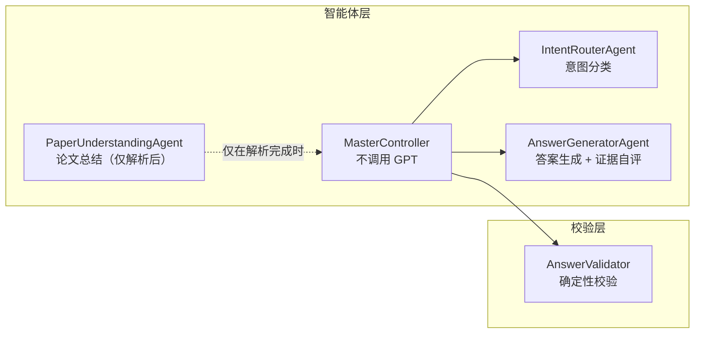
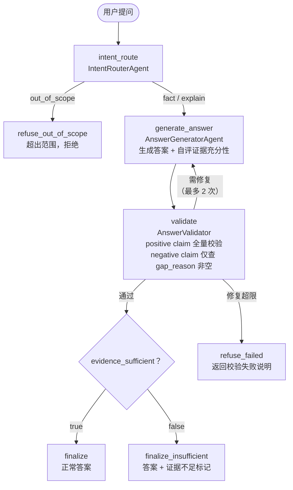
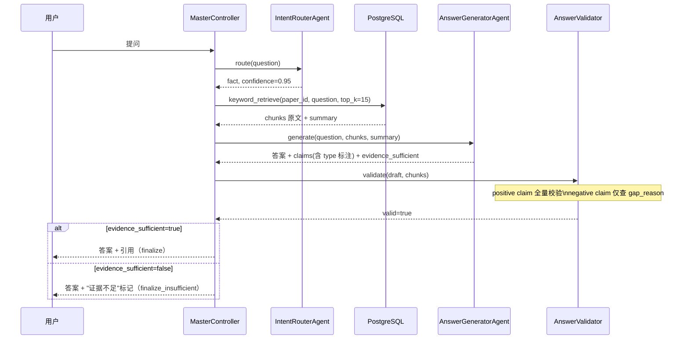
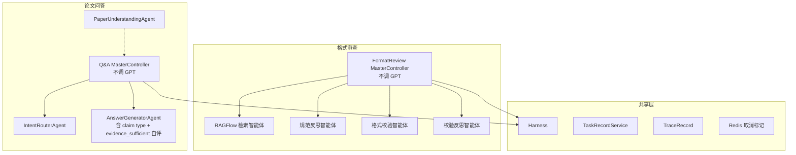

# 论文问答模块多智能体架构改进方案

| 项目 | 内容 |
| --- | --- |
| 文档版本 | V3.0 |
| 编制日期 | 2026-07-21 |
| 状态 | 建议方案 |
| 适用范围 | 科研论文智能阅读与格式审查系统 — 论文问答模块 |
| 相关文档 | `docs/格式审查模块详细设计_V1.0.md` |

## 1. 现状

当前论文问答模块由 8 个 LangGraph 节点组成：

```
load_context → route → paper_retrieve → paper_understand → synthesize → validate → finalize
                                                                   ↑            │
                                                                   └──repair────┘
```

当前智能体与节点对应关系：

| 智能体 | 所在节点 | 职责 | 问题 |
| --- | --- | --- | --- |
| `ControllerAgent` | `route`、`synthesize` | 意图路由 + 答案合成 | 一个类承担两个不同性质的职责（判别 vs 生成），无法独立优化模型和提示词 |
| `PaperUnderstandingAgent` | `paper_understand` | 结构化事实提取 | 输出为 Schema，不是自然语言；且作为独立 LLM 调用延长了问答链路 |
| `ReviewAgentA` / `ReviewAgentB` | `review_a` / `review_b`（条件节点） | 评审意见交叉校验 | 仅评审路由启用；当前业务以阅读为主 |

此外，`ingestion.py` 在 PDF 解析完成后未调用 LLM 生成论文总结，用户无法在提问前查看论文概览。

当前证据链路存在的问题：Chunk → EvidenceItem → PaperUnderstandingAgent（LLM 预读）→ ControllerAgent.synthesize()（LLM 合成）。同一份论文内容被两个模型各处理一遍，增加了延迟和成本，且中间 Schema 转换可能丢失原文细节。

## 2. 目标架构

四个智能体加一个确定性校验器：



| 智能体 | 调用 GPT | 职责 | 输入 | 输出 |
| --- | --- | --- | --- | --- |
| **MasterController** | **否** | 任务编排、关键词检索、状态管理、修复计数、证据充分性路由 | `task_id`、`paper_id`、`question` | `AnswerView` |
| **IntentRouterAgent** | 是 | 识别用户问题意图 | `question` | `RouteDecision` |
| **PaperUnderstandingAgent** | 是 | 仅解析完成后生成论文总结，问答时不参与 | 所有 chunks | 论文总结 Markdown |
| **AnswerGeneratorAgent** | 是 | 阅读 chunks 原文生成答案，同时自评证据充分性 | `question` + `chunks` + `summary` + `route_type` | 答案 + `evidence_sufficient` + `confidence` |
| **AnswerValidator** | **否** | 检查引用存在性、数字一致性 | `draft_answer` + `chunks` | `ValidationResult` |

### 2.1 与当前架构的对比

| 维度 | 当前 | 新架构 |
| --- | --- | --- |
| ControllerAgent | route + synthesize 双职责 | 拆为 IntentRouterAgent + AnswerGeneratorAgent |
| PaperUnderstandingAgent | 问答时做 LLM 预读 | 仅做解析后论文总结 |
| 论文总结 | 无 | 解析完成后自动生成 |
| 证据链路 | Chunk → LLM预读 → Schema → LLM合成 | Chunk 原文 → LLM合成（一次到位） |
| 证据充分性判断 | 无（模型可能编造） | AnswerGeneratorAgent 自评 + MasterController 路由 |
| 问答 LLM 调用 | 3–5 次 | 2 次 |

## 3. LangGraph 图设计



### 3.1 节点说明

| 节点 | 类型 | 说明 |
| --- | --- | --- |
| `intent_route` | LLM 调用 | IntentRouterAgent 分类意图 |
| `generate_answer` | LLM 调用 | AnswerGeneratorAgent 读 chunks 原文 + 组织答案 + 区分 claim 类型（positive/negative） + 自评 `evidence_sufficient` |
| `validate` | 确定性代码 | AnswerValidator：positive claim 校验引用/数字/关联，negative claim 仅校验 `evidence_gap_reason` 非空 |
| `refuse_out_of_scope` | 代码 | 问题超出范围，返回拒绝文案 |
| `refuse_failed` | 代码 | 修复次数超限，返回校验失败说明 |
| `finalize` | 代码 | 正常答案：组装 AnswerView、持久化、发送 SSE |
| `finalize_insufficient` | 代码 | 证据不足：GPT-5.5 已写出完整局限性说明，此处仅附加证据不足标记后输出 |

### 3.2 与当前图的对比

| 维度 | 当前图 | 新图 |
| --- | --- | --- |
| 节点数 | 8（含 1 个通用 safe_refusal） | 6（不含 redundant 文案生成节点） |
| LLM 调用节点 | 3–5 | 2 |
| 条件边 | 5 组 | 5 组（route + validate × 3 + evidence routing） |
| 根本变化 | 无证据充分性判断 | evidence_sufficient 决定最终输出走 finalize 还是 finalize_insufficient；GPT-5.5 产物始终经过校验 |

### 3.3 证据充分性的判断者

`evidence_sufficient` 和 `confidence` 由 **AnswerGeneratorAgent（GPT-5.5）** 在生成答案时同步输出，不是额外的 LLM 调用或独立智能体。

GPT-5.5 读完 chunks 后，能判断这些内容是否真正涉及用户问题。这是一个内嵌在 Prompt 中的自我评估——要求模型在输出答案的同时，必须给出结构化判断，且将每个 claim 标注为 `positive`（可从 chunks 验证）或 `negative`（"论文不涉及 X"类声明，无法从 chunks 直接验证）：

```json
{
  "answer": "本论文未讨论用户询问的强化学习相关实验。论文的核心方法基于监督学习的 Transformer 架构，实验部分涉及图像分类和机器翻译任务，没有涉及任何强化学习设置。如果您想了解该论文的实验设计，我可以详细说明。",
  "claims": [
    {
      "text": "论文的核心方法基于监督学习的 Transformer 架构",
      "type": "positive",
      "evidence_ids": ["c12", "c15"]
    },
    {
      "text": "实验部分涉及图像分类和机器翻译任务",
      "type": "positive",
      "evidence_ids": ["c23", "c28"]
    },
    {
      "text": "论文未讨论任何强化学习设置",
      "type": "negative",
      "evidence_ids": []
    }
  ],
  "evidence_sufficient": false,
  "evidence_gap_reason": "论文实验仅涉及监督学习任务，未讨论任何强化学习设置",
  "confidence": 0.3
}
```

**为什么局限性说明需要经过校验？** GPT-5.5 写的局限性说明通常同时包含两类声明：阳性声明（"论文讨论了 A 和 B"）和否定声明（"未讨论 C"）。阳性声明必须校验，否则模型可能编造"论文涉及 X"来佐证自己的否定结论。否定声明无法从 chunks 直接验证（chunks 只能证明有，不能证明无），但它们的总依据 `evidence_gap_reason` 必须非空——这确保模型不是在偷懒，而是真的检查了 chunks 后才做出否定判断。

**为什么不用独立校验器判断证据充分性？** "chunks 是否足以回答问题"本质上是语义判断，只有读过 chunks 全文并理解问题的模型才能做出。确定性代码 AnswerValidator 做的是第二步：positive claim 全量校验（引用、数字、关联），negative claim 仅校验 gap_reason 完整性。两步分工明确：GPT-5.5 判断"有没有说"和"说了什么"，AnswerValidator 判断"说的对不对"。

### 3.4 拒绝路径的区别

| 拒绝路径 | 触发条件 | 文案来源 | 是否经过校验 | 示例 |
| --- | --- | --- | --- | --- |
| `refuse_out_of_scope` | `route_type = out_of_scope` | MasterController 预设文案 | 否（不需要） | "今天天气怎么样？" |
| `finalize_insufficient` | `evidence_sufficient = false` | **GPT-5.5 直接写好的完整回答** | 是（positive claim 全量校验，negative claim 仅查 gap_reason） | 问"强化学习实验"但论文只涉及监督学习 |
| `refuse_failed` | AnswerValidator 修复 2 次仍不通过 | MasterController 预设文案 | N/A | 模型反复编造不存在的引用 |

关键区别：`finalize_insufficient` 不是 MasterController 代写的拒绝文案——GPT-5.5 已经产出了包含局限性说明的完整自然语言回答，MasterController 只做两件事：(1) 附加 `evidence_sufficient=false` 标记供前端展示提示条，(2) 跳过正常 finalize 中"答案置信度高"的 UI 标识。

### 3.5 数据流



## 4. 智能体详细设计

### 4.1 IntentRouterAgent

路由枚举：

| route_type | 含义 | 示例 |
| --- | --- | --- |
| `fact` | 论文中可查证的事实 | "这篇论文用了什么数据集？" |
| `explain` | 需要推理或解释的问题 | "为什么作者选择 Transformer？" |
| `out_of_scope` | 超出论文问答范围 | "今天天气怎么样？" |

独立 System Prompt，不引用论文内容。可与 AnswerGeneratorAgent 使用不同模型（路由可用 GPT-5.5-mini）。

### 4.2 PaperUnderstandingAgent（仅论文总结）

| 属性 | 内容 |
| --- | --- |
| 触发时机 | PDF 解析 + second_clean 完成后 |
| 输入 | 所有 `PaperChunk.content`，按章节排序拼接 |
| 输出 | Markdown 总结：标题、领域、核心问题、方法、实验设置、主要贡献 |
| 存储 | `Paper.summary_markdown` |
| 调用次数 | 每篇论文仅一次 |

问答链路中不参与。

### 4.3 AnswerGeneratorAgent

| 属性 | 内容 |
| --- | --- |
| 输入 | `question` + `chunks` 原文（含 `chunk_id`、`section_title`、`page_number`）+ `summary` + `route_type` + 可选的 `validation_errors` |
| 输出 | `AnswerDraft { answer, claims[], evidence_sufficient, evidence_gap_reason?, confidence }` |
| Prompt 要点 | "你是论文阅读助手。基于以下片段回答用户问题。每个 claim 标注 type：positive（可从片段验证）或 negative（片段中无此信息）。引用时标注 chunk_id。如果片段不包含足够信息，设置 evidence_sufficient=false 并在 evidence_gap_reason 中说明缺失了什么。绝不编造片段中没有的信息。" |

`claims[]` 中每条包含：

| 字段 | 说明 |
| --- | --- |
| `text` | 声明的自然语言文本 |
| `type` | `positive`（可在 chunks 中验证）或 `negative`（"论文不涉及 X"类声明） |
| `evidence_ids` | positive claim 必须至少 1 个；negative claim 可为空数组 |

`evidence_sufficient` 由 GPT-5.5 自我评估，和答案生成是同一次推理，不是独立的 LLM 调用。

### 4.4 AnswerValidator

| 属性 | 内容 |
| --- | --- |
| 类型 | 确定性代码，不调用 GPT |
| 输入 | `draft_answer` + `chunks` |
| 输出 | `ValidationResult { valid, errors }` |
| 修复上限 | 2 次 |

校验规则：

| 校验项 | 方法 | 失败动作 |
| --- | --- | --- |
| 引用存在性 | `draft` 中引用的 `chunk_id` 均在 `chunks` 中存在 | 返回 `repair` |
| 数字一致性 | `draft` 中数字与 `chunks` 中对应数字一致 | 返回 `repair` |
| claim-evidence 关联 | 每个 claim 至少关联一个 evidence | 返回 `repair` |
| 拒绝理由完整性 | `evidence_sufficient=false` 时 `evidence_gap_reason` 非空 | 返回 `repair` |

## 5. 关键词检索方案与优化建议

### 5.1 当前实现

系统已在 `backend/app/runtime/adapters.py` 中实现了 `_local_relevance` 关键词检索：

```python
latin_terms = set(re.findall(r"[a-z0-9_]{2,}", question.lower()))
chinese_terms = set(re.findall(r"[\u4e00-\u9fff]", question))
terms = latin_terms | chinese_terms
matches = sum(term in content.lower() for term in terms)
return matches / len(terms) if matches else 0.01
```

已有能力：英文术语/中文字符提取、关键词命中计数、按相关度排序、content_type 偏好筛选。

### 5.2 优化建议

四项增强，不改动检索接口签名。

**一、章节角色加权：** 从 `question` 匹配预定义映射表（如"实验"→ `section_role=experiment`），命中时该 chunk 排序权重 ×2。

**二、返回数量自适应：** 命中 ≥ 8 → top 15；命中 < 8 → 全部命中 + 补全至 15；零命中 → 论文总结 + 按页码顺序前 15 个段落 chunk。零命中不做拒绝——GPT-5.5 看到总结和核心段落后有能力判断"不涉及"。

**三、论文总结常驻上下文：** `content_role=paper_summary` 的 chunk 始终包含在检索结果中，不占 top_k 配额。

**四、关键词抽取增强：** 增加数字提取（`\d+\.?\d*`）和专有名词保留（"CNN"、"LSTM" 不做小写化拆分）。

### 5.3 为什么不用 LLM 预读

| 风险 | 说明 |
| --- | --- |
| 延迟翻倍 | LLM 预读 + LLM 合成，两次串行调用 |
| 信息丢失 | 预读可能漏掉特定数字、条件、限制性表述 |
| 幻觉传导 | 预读产生的幻觉作为"证据"输入合成，合成无法核验 |

关键词检索是确定性代码，无幻觉，无遗漏，延迟 <10ms。

## 6. 实施步骤

| 步骤 | 内容 | 影响范围 | 回退方式 |
| --- | --- | --- | --- |
| 1 | 增强 `_local_relevance`（章节加权、数量自适应、常驻总结） | 修改 `adapters.py` | 功能开关 |
| 2 | 新建 `IntentRouterAgent` | 新增 `intent_router.py` | 保留原 `ControllerAgent.route()` |
| 3 | 新建 `AnswerGeneratorAgent`（含 evidence_sufficient 自评 Prompt）和 `AnswerValidator` | 新增 `answer_generator.py`、`answer_validator.py` | 同上 |
| 4 | 新建 `MasterController`（含 evidence 路由逻辑） | 新增 `master_controller.py` | 与旧 Service 共存 |
| 5 | `PaperUnderstandingAgent` 增加 `run_summary` | 修改 `paper_understanding.py` | 默认不触发 |
| 6 | 构建新 LangGraph 图（含 3 条拒绝路径） | 新增 `qa_builder.py` | 旧图继续使用 |
| 7 | `ingestion.py` 调用 `run_summary()` | 修改 `ingestion.py` | 配置开关 |
| 8 | 灰度切换 | 修改 `routes.py` | 关闭开关回退 |
| 9 | 移除旧 ControllerAgent 及旧图 | 清理 | 需确认指标无劣化 |

## 7. 预期收益

| 维度 | 当前 | 新架构 | 收益 |
| --- | --- | --- | --- |
| 智能体职责 | ControllerAgent 双职责 | 四智能体各司其职 | 独立优化模型和提示词 |
| 论文总结 | 无 | 解析后自动生成 | 提问前可概览论文 |
| 问答 LLM 调用 | 3–5 次 | 2 次 | 延迟和成本降低 33%–50% |
| 证据保真度 | Chunk → LLM → Schema → LLM | Chunk → LLM | 无中间信息损失 |
| 证据不足处理 | 无机制，模型可能编造 | evidence_sufficient 自评 + 路由到局限性说明 | 不编造答案 |
| 图复杂度 | 8 节点、5 条件边 | 7 节点、5 条件边 | 拒绝路径语义化 |
| RAGFlow 依赖 | review/score 路由触发 | 完全不依赖 | 减少外部故障面 |

## 8. 与格式审查主控的统一模式



两个主控均不调用 GPT，共享 Harness 层和任务生命周期。