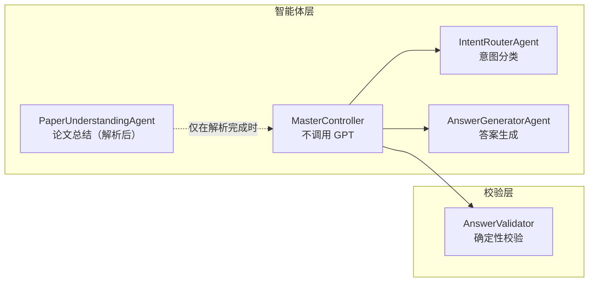
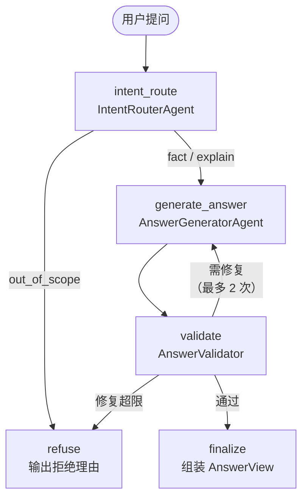
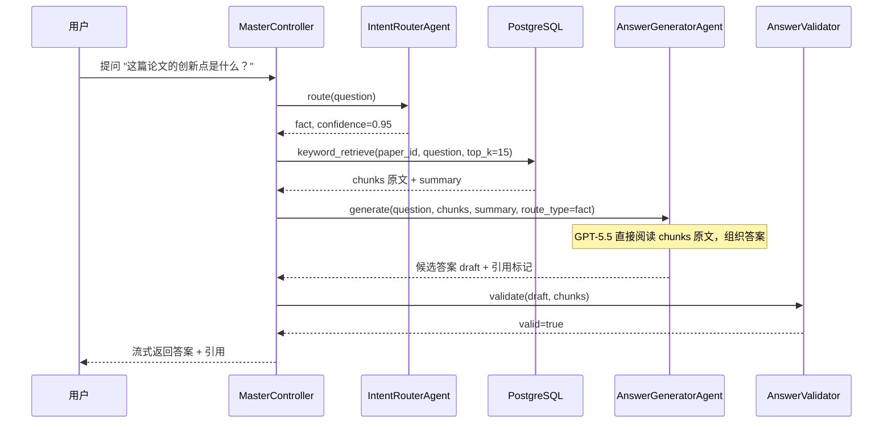
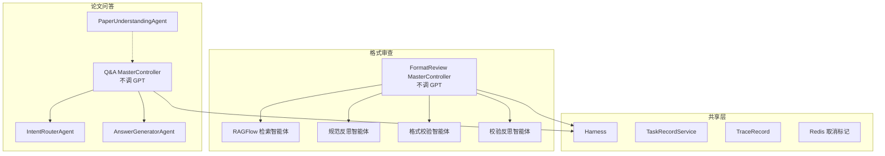

# 论文问答模块多智能体架构改进方案

| 项目 | 内容 |
| --- | --- |
| 文档版本 | V2.0 |
| 编制日期 | 2026-07-21 |
| 状态 | 建议方案 |
| 适用范围 | 科研论文智能阅读与格式审查系统 — 论文问答模块 |
| 相关文档 | `docs/格式审查模块详细设计_V1.0.md` |

## 1. 现状

当前论文问答模块由 8 个 LangGraph 节点组成：

```
load_context → route → paper_retrieve → paper_understand → synthesize → validate → finalize
                                                                   ↑            │
                                                                   └──repair────┘
```

当前智能体与节点对应关系：

| 智能体 | 所在节点 | 职责 | 问题 |
| --- | --- | --- | --- |
| `ControllerAgent` | `route`、`synthesize` | 意图路由 + 答案合成 | 一个类承担两个不同性质的职责（判别 vs 生成），无法独立优化模型和提示词 |
| `PaperUnderstandingAgent` | `paper_understand` | 结构化事实提取 | 输出为 Schema（facts/claims/evidence_ids），不是自然语言；且作为独立 LLM 调用延长了问答链路 |
| `ReviewAgentA` / `ReviewAgentB` | `review_a` / `review_b`（条件节点） | 评审意见交叉校验 | 仅评审路由启用；当前业务以阅读为主 |

此外，`ingestion.py` 在 PDF 解析完成后未调用 LLM 生成论文总结（代码注释为"配置生成模型后可生成理解与总结"），用户无法在提问前查看论文概览。

当前证据链路存在的问题：

```
Chunk → EvidenceItem → PaperUnderstandingAgent（LLM）→ PaperUnderstanding（Schema）
  → ControllerAgent.synthesize()（LLM）→ AnswerDraft
```

论文内容经历了两次 LLM 调用——PaperUnderstandingAgent "预读"一次，ControllerAgent 合成时再"精读"一次。同一份信息被两个模型各处理一遍，增加了延迟和成本，且中间 Schema 转换可能丢失原文细节。

## 2. 目标架构

四个智能体加一个确定性校验器：



| 智能体 | 调用 GPT | 职责 | 输入 | 输出 |
| --- | --- | --- | --- | --- |
| **MasterController** | **否** | 任务编排、关键词检索 chunks、状态管理、修复计数、降级路由 | `task_id`、`paper_id`、`question` | `AnswerView` |
| **IntentRouterAgent** | 是 | 识别用户问题意图，输出路由决策 | `question` | `RouteDecision { effective_route_type: fact / explain / out_of_scope }` |
| **PaperUnderstandingAgent** | 是 | 仅解析完成后生成论文总结，问答时不参与 | 所有 chunks | 论文总结 Markdown |
| **AnswerGeneratorAgent** | 是 | 直接阅读 chunks 原文，组织自然语言答案 | `question` + `chunks`（原文）+ `summary` + `route_type` + 可选的 `validation_errors` | 自然语言答案 + 引用标记 |
| **AnswerValidator** | **否** | 检查引用存在性、数字一致性、claim 与 evidence 对应关系 | `draft_answer` + `chunks` | `ValidationResult { valid, errors }` |

### 2.1 与当前架构的对比

| 维度 | 当前 | 新架构 |
| --- | --- | --- |
| ControllerAgent | route + synthesize 双职责 | 拆为 IntentRouterAgent + AnswerGeneratorAgent |
| PaperUnderstandingAgent | 问答时做 LLM 预读 + 结构化输出 | 仅做解析后论文总结；问答时 chunks 原文直送 AnswerGeneratorAgent |
| 论文总结 | 无 | 解析完成后自动生成 |
| 证据链路 | Chunk → LLM预读 → Schema → LLM合成 | Chunk 原文 → LLM合成（一次到位） |
| 校验 | validate 节点位于 synthesize 之后 | AnswerValidator 位于 AnswerGeneratorAgent 之后，校验失败回到答案生成 |
| RAGFlow | review/score 路由可触发 | 全程不涉及 |
| 问答 LLM 调用 | 3–5 次 | 2 次（route + generate_answer） |

## 3. LangGraph 图设计



### 3.1 节点说明

| 节点 | 类型 | 说明 |
| --- | --- | --- |
| `intent_route` | LLM 调用 | IntentRouterAgent 分类意图 |
| `generate_answer` | LLM 调用 | AnswerGeneratorAgent 直接阅读 chunks 原文并组织答案 |
| `validate` | 确定性代码 | AnswerValidator 校验引用与数字 |
| `refuse` | 代码 | 组装拒绝文案 |
| `finalize` | 代码 | 组装 AnswerView、持久化、发送 SSE |

### 3.2 与当前图的节点对比

| 维度 | 当前图 | 新图 |
| --- | --- | --- |
| 节点数 | 8 | 5 |
| LLM 调用节点 | 3–5（route + paper_understand + synthesize + 可选 review_a/b） | 2（route + generate_answer） |
| 条件边 | 5 组 | 3 组（route 路由 + validate 修复 + 修复超限） |
| 去掉的节点 | load_context、paper_retrieve、paper_understand、standard_retrieve、review_a、review_b | — |

去掉原因：

- **load_context**：MasterController 不需要会话上下文进行路由。IntentRouterAgent 仅根据 `question` 判类。
- **paper_retrieve**：chunk 检索退化为本地关键词查询，不会失败，不需要 LangGraph 管理其状态。
- **paper_understand**：不再作为问答链路的独立 LLM 节点。AnswerGeneratorAgent 自己读 chunks 原文。
- **standard_retrieve / review_a / review_b**：问答不涉及 RAGFlow 和评审。

### 3.3 数据流



## 4. 智能体详细设计

### 4.1 IntentRouterAgent

路由枚举：

| route_type | 含义 | 后续动作 | 示例 |
| --- | --- | --- | --- |
| `fact` | 论文中可查证的事实 | 检索 chunks → 生成答案 | "这篇论文用了什么数据集？" |
| `explain` | 需要推理或解释的问题 | 同上，答案需包含推理 | "为什么作者选择 Transformer？" |
| `out_of_scope` | 超出论文问答范围 | 直接拒绝 | "今天天气怎么样？" |

路由不影响答案质量，仅影响 AnswerGeneratorAgent 的回答风格（事实型简短 vs 解释型展开）。去掉 `follow_up` 路由——MasterController 不依赖会话上下文。

实现要点：独立的 System Prompt，不引用论文内容。可与 AnswerGeneratorAgent 使用不同模型（路由可用 GPT-5.5-mini）。

### 4.2 PaperUnderstandingAgent（仅论文总结）

| 属性 | 内容 |
| --- | --- |
| 触发时机 | PDF 解析 + second_clean 完成后，`Paper.status` 切为 `ready` 之前 |
| 输入 | 所有 `PaperChunk.content`，按章节排序拼接 |
| 输出 | Markdown 总结文本：标题、领域、核心问题、方法、实验设置、主要贡献 |
| 存储位置 | `Paper.summary_markdown` 新字段 |
| Prompt 要点 | "你正在阅读一篇完整的科研论文。请生成一份结构化的论文总结" |
| 调用次数 | 每篇论文仅一次（解析完成时） |

问答链路中此智能体不参与。chunks 原文直接交给 AnswerGeneratorAgent。

### 4.3 AnswerGeneratorAgent

| 属性 | 内容 |
| --- | --- |
| 输入 | `question` + `chunks` 原文（含 `chunk_id`、`section_title`、`page_number`）+ `summary` + `route_type` + 可选的 `validation_errors` |
| 输出 | 自然语言答案 + 引用标记 |
| Prompt 要点 | "你是论文阅读助手。以下是论文的全部相关片段。基于这些片段回答用户问题。引用时标注 chunk_id。不编造片段中没有的信息。" |

与当前 `ControllerAgent.synthesize()` 的核心区别：输入从结构化 `PaperUnderstanding`（facts/claims）改为 chunks 原文，Prompt 更简洁，模型直接阅读理解原文，避免中间 Schema 转换造成的信息损失。

### 4.4 AnswerValidator

| 属性 | 内容 |
| --- | --- |
| 类型 | 确定性代码，不调用 GPT |
| 输入 | `draft_answer` + `chunks` |
| 输出 | `ValidationResult { valid: bool, errors: list[str] }` |
| 修复上限 | 2 次 |

校验规则：

| 校验项 | 方法 | 失败动作 |
| --- | --- | --- |
| 引用存在性 | 检查 `draft` 中引用的 `chunk_id` 均在 `chunks` 中存在 | 返回 `repair`，附缺失 ID 列表 |
| 数字一致性 | 从 `draft` 提取数字，与 `chunks` 中对应数字比对 | 返回 `repair`，附冲突说明 |
| claim-evidence 关联 | 每个 claim 至少关联一个 evidence | 返回 `repair`，附未关联 claim |
| 拒绝理由完整性 | `route_type=out_of_scope` 时必须有 `refusal_reason` | 返回 `repair` |

修复次数达上限后降级为 `refuse`，输出"系统未能生成通过校验的回答"。

## 5. 关键词检索方案与优化建议

### 5.1 当前实现

系统已在 `backend/app/runtime/adapters.py` 中实现了基础关键词检索：

```python
def _local_relevance(content: str, question: str) -> float:
    latin_terms = set(re.findall(r"[a-z0-9_]{2,}", question.lower()))
    chinese_terms = set(re.findall(r"[\u4e00-\u9fff]", question))
    terms = latin_terms | chinese_terms
    normalized = content.lower()
    matches = sum(term in normalized for term in terms)
    return matches / len(terms) if matches else 0.01
```

流程为：拉取所有 indexable chunks → 按 content_type 偏好筛选 → 按关键词命中率排序 → 取 top 6（relaxed 时 top 12）。

### 5.2 已有能力

| 能力 | 状态 |
| --- | --- |
| 英文术语提取 | 已实现 |
| 中文字符提取 | 已实现 |
| 关键词命中计数 | 已实现 |
| 按相关度排序 | 已实现 |
| content_type 偏好筛选 | 已实现（如 `content_preferences` 参数） |

### 5.3 优化建议

建议在现有基础上做四项增强，不改动检索接口签名。

**一、章节角色加权**

从 `question` 中匹配预定义映射表，对命中 chunk 的 `section_role` 加权：

| 用户可能用的词 | 匹配的 section_role |
| --- | --- |
| 摘要、abstract | `abstract` |
| 引言、introduction、背景 | `introduction` |
| 方法、method、模型、算法 | `method` |
| 实验、experiment、结果、result | `experiment` |
| 结论、conclusion | `conclusion` |
| 参考文献、reference | `reference` |

匹配到章节角色时，该 chunk 的排序权重 ×2。不匹配时无惩罚。

**二、返回数量自适应**

| 场景 | 返回数量 |
| --- | --- |
| 关键词命中 ≥ 8 个 chunks | Top 15（当前只用 12，增加到 15 给 GPT-5.5 更充分的上下文） |
| 命中 < 8 个 | 命中的全部 + 补全至 15（补论文总结 chunk + 前 N 个段落 chunk） |
| 零命中 | 15（论文总结 + 按页码顺序的前 15 个段落 chunk） |

零命中不做拒绝——GPT-5.5 看到总结和核心段落后，有能力判断"这个问题论文中没有涉及"。

**三、论文总结作为常驻上下文**

论文总结 chunk（`content_role=paper_summary`）始终包含在检索结果中，不占 top_k 配额。它承担两个角色：帮助 AnswerGeneratorAgent 快速建立论文全局认知；作为零命中场景的证据来源。

**四、关键词抽取增强**

当前只提取英文单词和中文字符。增加：

- 数字提取：匹配 `\d+\.?\d*`，对包含相同数字的 chunk 加权（如"85.3%"匹配实验数据所在 chunk）
- 专有名词保留：连续大写字母缩写（如 "CNN"、"LSTM"）作为整体关键词，不做小写化拆分

### 5.4 为什么不用 LLM 预读

LLM 预读方案（方案 B）在问答链路中增加一次 GPT-5.5 调用：

```
Chunk → LLM 预读（提取证据）→ 证据文本 → LLM 合成（组织答案）
```

问题在于 AnswerGeneratorAgent 本身也是 GPT-5.5，同样能阅读理解 chunks。预读和合成两次调用处理的是同一份文本，预读没有增加新信息，只是把 chunks 改写成了另一种格式，同时引入了三个风险：

| 风险 | 说明 |
| --- | --- |
| 延迟翻倍 | 两次 LLM 串行调用，每次 0.5–2 秒 |
| 信息丢失 | 预读环节可能漏掉细节（如原文中的特定数字、条件、限制性表述），合成环节无法恢复 |
| 幻觉传导 | 预读产生的幻觉会作为"证据"输入合成环节，合成环节无从核验 |

关键词检索是确定性代码，不会产生幻觉，不会遗漏信息，延迟 <10ms。chunks 原文保真度最高，GPT-5.5 自己判断哪些内容相关。

## 6. 实施步骤

本方案不改动现有前端 UI、API 路径、任务模型和数据库 Schema（仅新增 `summary_markdown` 字段）。实施可以在不影响业务的前提下渐进进行。

| 步骤 | 内容 | 影响范围 | 回退方式 |
| --- | --- | --- | --- |
| 1 | 增强 `_local_relevance`，加入章节角色加权、返回数量自适应、常驻总结、关键词抽取增强 | 修改 `adapters.py` | 功能开关，关闭即回退原算法 |
| 2 | 新建 `IntentRouterAgent`，从 `ControllerAgent.route()` 迁移 | 新增 `intent_router.py` | 保留原 `ControllerAgent.route()` |
| 3 | 新建 `AnswerGeneratorAgent` 和 `AnswerValidator` | 新增 `answer_generator.py`、`answer_validator.py` | 同上 |
| 4 | 新建 `MasterController`（不调用 GPT） | 新增 `master_controller.py` | 与旧 `AiWorkflowService` 共存 |
| 5 | `PaperUnderstandingAgent` 增加 `run_summary` 方法 | 修改 `paper_understanding.py` | 默认不触发 |
| 6 | 构建新 LangGraph 图 `build_qa_graph()` | 新增 `qa_builder.py` | 旧图继续使用 |
| 7 | `ingestion.py` 在解析完成后调用 `run_summary()` | 修改 `ingestion.py` | 配置开关 |
| 8 | 灰度切换：新问题走新图，旧会话走旧图 | 修改 `routes.py` | 关闭开关即回退 |
| 9 | 全量验证后移除旧 `ControllerAgent` 及旧图 | 删除 `controller.py` | 需确认指标无劣化后执行 |

## 7. 预期收益

| 维度 | 当前 | 新架构 | 收益 |
| --- | --- | --- | --- |
| 智能体职责 | ControllerAgent 双职责 | 四智能体各司其职 | 独立优化模型、提示词和版本 |
| 论文总结 | 无 | 解析后自动生成 | 用户可在提问前概览论文 |
| 问答 LLM 调用 | 3–5 次 | 2 次 | 延迟和成本降低 33%–50% |
| 证据保真度 | Chunk → LLM → Schema → LLM | Chunk 原文 → LLM | 无中间信息损失 |
| 图复杂度 | 8 节点、5 条条件边 | 5 节点、3 条条件边 | 维护负担减半 |
| 路由依赖 | 需会话上下文 | 仅依赖问题文本 | 路由更快、更可靠 |
| RAGFlow 依赖 | review/score 路由触发 | 完全不依赖 | 减少外部故障面 |
| 检索延迟 | 已 <10ms | <10ms（增量可忽略） | 未增加任何延迟 |

## 8. 与格式审查主控的统一模式



两个主控均不调用 GPT，共享 Harness 层（模型网关、Trace、限额、评测）和任务生命周期（`TaskRecord`、取消标记、断点恢复）。这为后续扩展更多工作流（论文对比、阅读报告）提供了可复用的编排基类。