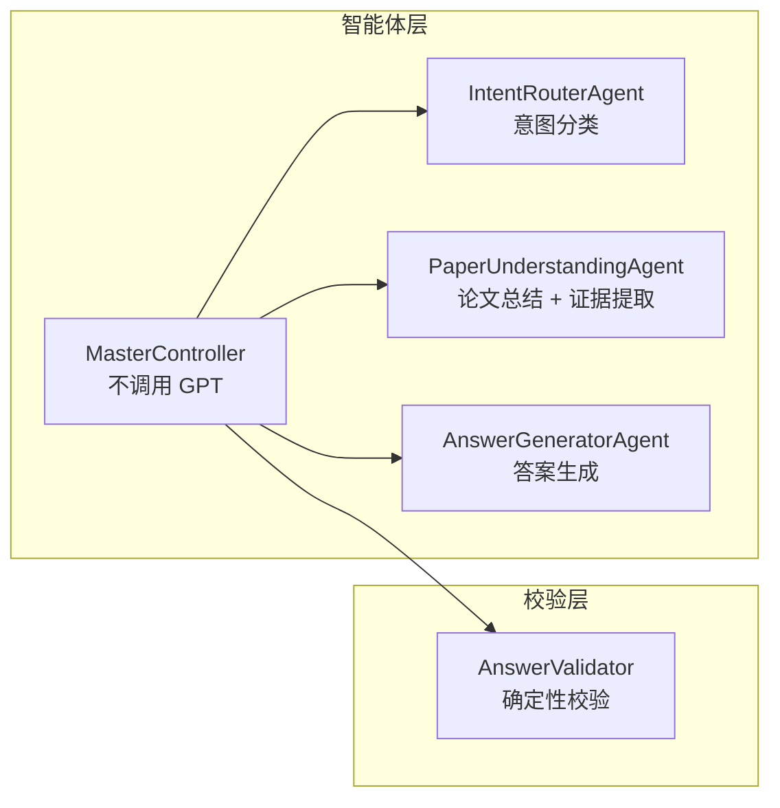
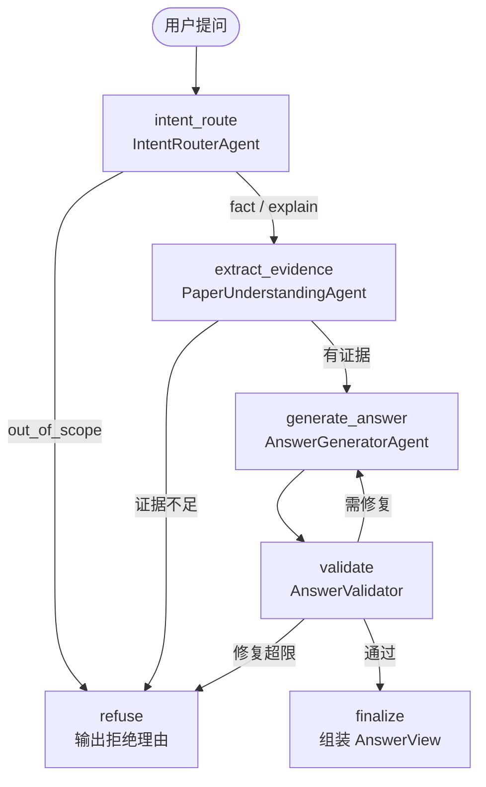
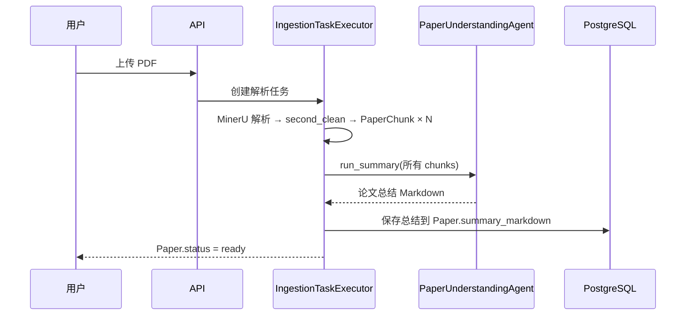
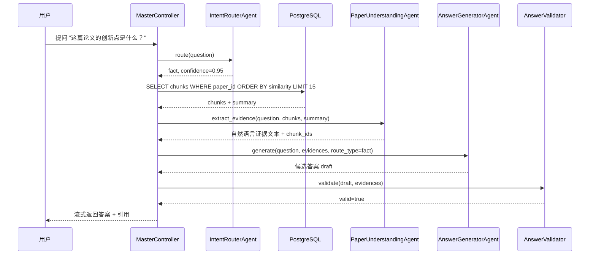
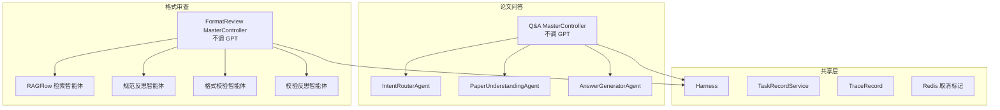

# 论文问答模块多智能体架构改进方案

| 项目 | 内容 |
| --- | --- |
| 文档版本 | V1.0 |
| 编制日期 | 2026-07-21 |
| 状态 | 建议方案 |
| 适用范围 | 科研论文智能阅读与格式审查系统 — 论文问答模块 |
| 相关文档 | `docs/格式审查模块详细设计_V1.0.md` |

## 1. 现状

当前论文问答模块由 8 个 LangGraph 节点组成：

```
load_context → route → paper_retrieve → paper_understand → synthesize → validate → finalize
                                                                   ↑            │
                                                                   └──repair────┘
```

当前智能体与节点对应关系：

| 智能体 | 所在节点 | 职责 | 问题 |
| --- | --- | --- | --- |
| `ControllerAgent` | `route`、`synthesize` | 意图路由 + 答案合成 | 一个类承担两个不同性质的职责（判别 vs 生成），无法独立优化模型和提示词 |
| `PaperUnderstandingAgent` | `paper_understand` | 结构化事实提取 | 输出为 Schema（facts/claims/evidence_ids），不是自然语言证据文本 |
| `ReviewAgentA` / `ReviewAgentB` | `review_a` / `review_b`（条件节点） | 评审意见交叉校验 | 仅评审路由启用；当前业务以阅读为主 |

此外，`ingestion.py` 在 PDF 解析完成后未调用 LLM 生成论文总结（代码注释为"配置生成模型后可生成理解与总结"），用户无法在提问前查看论文概览。

## 2. 目标架构

四个智能体加一个确定性校验器：



### 2.1 智能体职责

| 智能体 | 调用 GPT | 职责 | 输入 | 输出 |
| --- | --- | --- | --- | --- |
| **MasterController** | **否** | 任务编排、chunk 检索、状态管理、修复计数、降级路由 | `task_id`、`paper_id`、`question` | `AnswerView` |
| **IntentRouterAgent** | 是 | 识别用户问题意图，输出路由决策 | `question` | `RouteDecision { effective_route_type: fact / explain / out_of_scope }` |
| **PaperUnderstandingAgent** | 是 | 两个模式：(1) 解析后生成论文总结 (2) 提问时从 chunks 提取自然语言证据 | `question` + `chunks` + `summary` | 自然语言证据文本 + `chunk_id` 来源引用 |
| **AnswerGeneratorAgent** | 是 | 接收证据与问题，组织自然语言答案 | `question` + `evidences` + `route_type` + 可选的 `validation_errors` | 自然语言答案 + 引用标记 |
| **AnswerValidator** | **否** | 检查引用存在性、数字一致性、claim 与 evidence 对应关系 | `draft_answer` + `evidences` | `ValidationResult { valid, errors }` |

### 2.2 与当前架构的对比

| 维度 | 当前 | 新架构 |
| --- | --- | --- |
| ControllerAgent | route + synthesize 双职责 | 拆为 IntentRouterAgent + AnswerGeneratorAgent |
| PaperUnderstandingAgent | 结构化事实提取（`PaperUnderstanding` Schema） | 双模式：总结生成 + 自然语言证据提取 |
| 论文总结 | 无 | 解析完成后自动生成，存入数据库 |
| 校验 | validate 节点位于 synthesize 之后 | AnswerValidator 位于 AnswerGeneratorAgent 之后，校验失败回到答案生成 |
| RAGFlow 公共知识库 | review/score 路由可触发 | 全程不涉及。问答仅使用本地 Chunk |

## 3. LangGraph 图设计



### 3.1 节点说明

| 节点 | 类型 | 说明 |
| --- | --- | --- |
| `intent_route` | LLM 调用 | IntentRouterAgent 分类意图 |
| `extract_evidence` | LLM 调用 | PaperUnderstandingAgent 从 chunks 提取证据 |
| `generate_answer` | LLM 调用 | AnswerGeneratorAgent 生成答案 |
| `validate` | 确定性代码 | AnswerValidator 校验引用与数字 |
| `refuse` | 代码 | 组装拒绝文案 |
| `finalize` | 代码 | 组装 AnswerView、持久化、发送 SSE |

### 3.2 与当前图的节点对比

| 维度 | 当前图 | 新图 |
| --- | --- | --- |
| 节点数 | 8 | 6 |
| LLM 调用节点 | 3–5（route + paper_understand + synthesize + 可选 review_a/b） | 3（intent_route + extract_evidence + generate_answer） |
| 条件边 | 5 组 | 4 组（route 路由 + evidence 检查 + validate 修复 + 修复超限） |
| 去掉的节点 | load_context、paper_retrieve、standard_retrieve、review_a、review_b | — |

去掉原因：

- **load_context**：MasterController 不需要会话上下文进行路由。IntentRouterAgent 仅根据 `question` 判类。
- **paper_retrieve**：chunk 检索退化为本地 SQL 查询，不会失败，不需要 LangGraph 管理其状态。
- **standard_retrieve / review_a / review_b**：问答不涉及 RAGFlow 和评审。

## 4. 智能体详细设计

### 4.1 IntentRouterAgent

路由枚举：

| route_type | 含义 | 后续动作 | 示例 |
| --- | --- | --- | --- |
| `fact` | 论文中可查证的事实 | 提取证据 → 生成答案 | "这篇论文用了什么数据集？" |
| `explain` | 需要推理或解释的问题 | 同上，但答案需包含推理 | "为什么作者选择 Transformer 而不是 LSTM？" |
| `out_of_scope` | 超出论文问答范围 | 直接拒绝 | "今天天气怎么样？" |

路由不影响答案质量，仅影响 AnswerGeneratorAgent 的回答风格（事实型简短 vs 解释型展开）。去掉 `follow_up` 路由——MasterController 不需要会话上下文来路由。

实现要点：独立的 System Prompt，不引用论文内容。与 `AnswerGeneratorAgent` 使用不同的提示词版本和可选的不同模型（如 GPT-5.5-mini）。

### 4.2 PaperUnderstandingAgent — 双模式

两个模式使用同一个 Agent 实例，通过 System Prompt 区分。

#### 模式 A：论文总结（`run_summary`）

| 属性 | 内容 |
| --- | --- |
| 触发时机 | PDF 解析 + second_clean 完成后，`Paper.status` 切为 `ready` 之前 |
| 输入 | 所有 `PaperChunk.content`，按章节排序拼接 |
| 输出 | Markdown 总结文本：标题、领域、核心问题、方法、实验设置、主要贡献 |
| 存储位置 | 新字段 `Paper.summary_markdown`，或 `PaperChunk` 中 `content_role=paper_summary` 的特殊 chunk |
| Prompt 要点 | "你正在阅读一篇完整的科研论文。请生成一份结构化的论文总结"——不针对特定问题 |

#### 模式 B：证据提取（`extract_evidence`）

| 属性 | 内容 |
| --- | --- |
| 触发时机 | 用户提问后，MasterController 检索 Top-K chunks |
| 输入 | `question` + `summary` + Top-K `chunks.content`（含 `chunk_id`、`section_title`、`page_number`） |
| 输出 | 自然语言证据段落 + 每条证据对应的 `chunk_id` 列表 |
| Prompt 要点 | "根据以下论文片段，提取与问题相关的证据。每段证据标注来源块 ID。不确定时注明'未找到直接证据'而不是编造。" |

### 4.3 AnswerGeneratorAgent

| 属性 | 内容 |
| --- | --- |
| 输入 | `question` + `evidences`（自然语言文本）+ `route_type` + 可选的 `validation_errors`（修复重试时） |
| 输出 | 自然语言答案 + 引用标记（`chunk_id` 列表） |
| Prompt 要点 | "你是论文阅读助手。基于提供的证据回答用户问题。引用证据时标注来源。证据不充分时诚实说明。" |

与当前 `ControllerAgent.synthesize()` 的核心区别：输入从结构化 `PaperUnderstanding`（facts/claims）改为自然语言证据文本，Prompt 更简洁，不需要理解复杂的 JSON Schema 再重新表达。

### 4.4 AnswerValidator

| 属性 | 内容 |
| --- | --- |
| 类型 | 确定性代码，不调用 GPT |
| 校验项 | 引用存在性、数字一致性、claim-evidence 关联、拒绝理由完整性 |
| 输出 | `ValidationResult { valid: bool, errors: list[str] }` |
| 修复上限 | 2 次 |

校验规则：

| 校验项 | 方法 | 失败动作 |
| --- | --- | --- |
| 引用存在性 | 检查 `draft` 中引用的 `chunk_id` 均在 `evidences` 中存在 | 返回 `repair`，附缺失 ID 列表 |
| 数字一致性 | 从 `draft` 提取数字，与 `evidences` 中对应数字比对 | 返回 `repair`，附冲突说明 |
| claim-evidence 关联 | 每个 claim 至少关联一个 evidence | 返回 `repair`，附未关联 claim |
| 拒绝理由完整性 | `route_type=out_of_scope` 时必须有 `refusal_reason` | 返回 `repair` |

修复次数达上限 2 次后，降级为 `refuse`，输出"系统未能生成通过校验的回答"。

## 5. 数据流

### 阶段一：PDF 上传 → 解析 → 总结



### 阶段二：用户提问 → 答案



## 6. 实施步骤

本方案不改动现有前端 UI、API 路径、任务模型和数据库 Schema（仅新增 `summary_markdown` 字段）。实施可以在不影响业务的前提下渐进进行。

| 步骤 | 内容 | 影响范围 | 回退方式 |
| --- | --- | --- | --- |
| 1 | 新建 `IntentRouterAgent`，从 `ControllerAgent.route()` 迁移路由逻辑 | 新增 `backend/app/ai/agents/intent_router.py` | 保留原 `ControllerAgent.route()`，图节点暂不切换 |
| 2 | 新建 `AnswerGeneratorAgent` 和 `AnswerValidator`，从 `ControllerAgent.synthesize()` 和 `validate` 节点迁移 | 新增 `answer_generator.py` 和 `answer_validator.py` | 同上 |
| 3 | 新建 `MasterController`（不调用 GPT），封装编排逻辑 | 新增 `backend/app/ai/master_controller.py` | 可先并行运行，与旧 `AiWorkflowService` 共存 |
| 4 | 扩展 `PaperUnderstandingAgent`，增加 `run_summary` 模式 | 修改 `paper_understanding.py`，新增 prompt 模板 | 默认不触发，通过 `ingestion.py` 配置开关启用 |
| 5 | 构建新 LangGraph 图 `build_qa_graph()`，用独立 `thread_id` 命名空间 | 新增 `backend/app/ai/graph/qa_builder.py` | 旧图和旧 `AiWorkflowService` 继续使用 |
| 6 | `ingestion.py` 在解析完成后调用 `PaperUnderstandingAgent.run_summary()` | 修改 `ingestion.py`，通过配置开关启用 | 关闭开关即回退 |
| 7 | 灰度切换：新问题走新图，旧会话走旧图 | 修改 `routes.py`，通过功能开关分流 | 关闭开关即全部回退 |
| 8 | 全量验证后移除旧 `ControllerAgent` 及旧图相关节点注册 | 删除 `controller.py`、清理 `builder.py` | 需确认指标无劣化后执行 |

## 7. 预期收益

| 维度 | 当前 | 新架构 | 收益 |
| --- | --- | --- | --- |
| 智能体职责 | ControllerAgent 承担路由 + 合成，PaperUnderstandingAgent 仅输出结构化事实 | 四个智能体各司其职，职责可独立测试 | 每个智能体可独立优化模型、提示词和版本 |
| 论文总结 | 无 | 解析后自动生成 | 用户可在提问前概览论文 |
| 证据格式 | 结构化 Schema（`PaperUnderstanding`） | 自然语言证据文本 + chunk 引用 | 答案生成智能体可直接引用，无需二次转换 |
| LLM 调用次数 | 3–5 次（含可选 review） | 固定 3 次 | 成本可预测 |
| 图复杂度 | 8 节点、5 条条件边 | 6 节点、4 条条件边 | 减少维护负担 |
| 路由依赖 | 需会话上下文（`load_context`） | 仅依赖问题文本 | 路由更快，不受上下文加载失败影响 |
| RAGFlow 依赖 | review/score 路由需 RAGFlow | 完全不依赖 | 减少外部故障面 |

## 8. 与格式审查主控的统一模式

新架构的论文问答和格式审查设计文档第 4 节定义的格式审查工作流均采用"不调用模型的主控 + 子智能体"模式：



两个主控共享 Harness 层（模型网关、Trace、限额、评测）和任务生命周期（`TaskRecord`、取消标记、断点恢复）。这为后续扩展更多工作流（论文对比、阅读报告）提供了可复用的编排基类。
